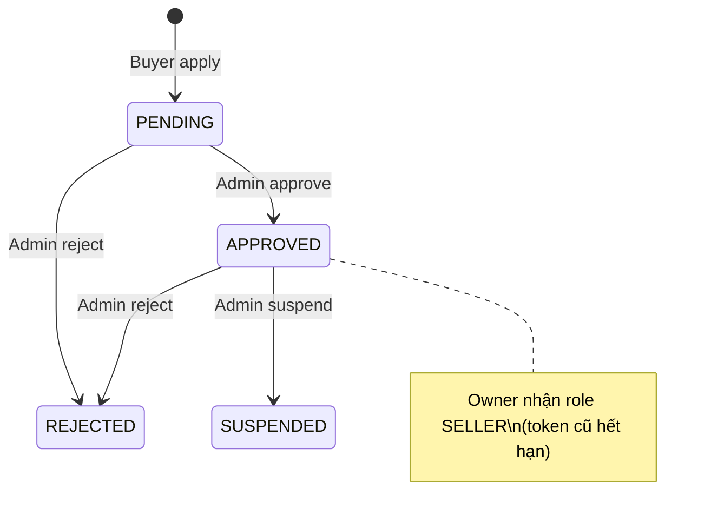
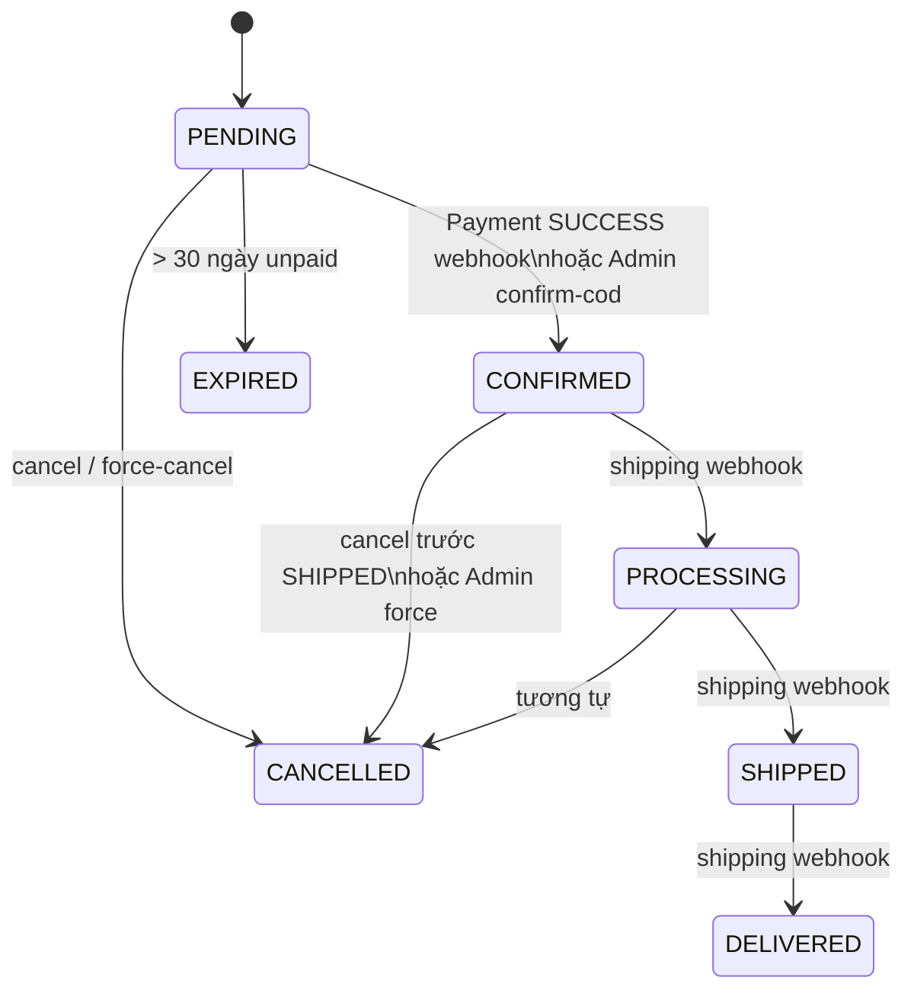
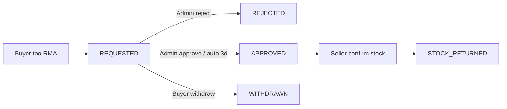

# Frontend Guide — MQ Shopping

> Tài liệu dành cho FE: áp dụng UI **đúng nghiệp vụ đã ship trên BE**.  
> Nguồn API: [API_CATALOG.md](./API_CATALOG.md) · Tiến độ: [PROGRESS.md](./PROGRESS.md) · Plan BA: [plan_mq_shopping.md](./plan_mq_shopping.md)

**Base URL:** `{API_HOST}/api/v1`  
**Auth:** `Authorization: Bearer {accessToken}` (trừ endpoint Public)  
**Cập nhật:** 2026-07-16 (sau Sprint 7)

---

## 0. Quy ước chung (bắt buộc đọc)

### 0.1 Session & token
| Hành vi | FE phải làm |
|---------|-------------|
| Login thành công | Lưu `accessToken` + `refreshToken`; lưu `user.roles[]` + `user.permissions[]` |
| 401 trên API bảo vệ | Gọi `POST /auth/refresh-token` → retry 1 lần; fail → logout về màn Login |
| Logout | `POST /auth/logout` (gửi access token) → xóa token local |
| Đổi password / đổi quyền staff / approve shop (thêm role SELLER) | BE tăng `tokenVersion` → token cũ vô hiệu → bắt login lại |
| Header locale (banner / product search) | Query `locale`: `vi` \| `en` \| `zh-TW` (BE cũng nhận `zh_TW`) |

### 0.2 Roles vs Permissions
- **Roles** (`BUYER` | `SELLER` | `ADMIN` | `SUPER_ADMIN`): multi-role — 1 user có thể có nhiều role cùng lúc (vd Buyer + Seller).
- **Permissions**: chỉ staff (`ADMIN` / `SUPER_ADMIN`) có danh sách permission. `SUPER_ADMIN` bypass hầu hết check.
- FE **không** hard-code menu theo email; render theo `roles` + `permissions`.
- User thường (Buyer/Seller): không có permission list — quyền theo ownership (shop của mình, đơn của mình).

### 0.3 Tiền tệ & điểm
- Tiền hàng: **USD** (string decimal từ API, ví dụ `"12.50"`).
- Ví MLM: **points** (decimal). Tỷ giá điểm↔USD lấy từ `GET /wallet/balance` / commission-stats (`pointUsdRate`).
- **Không** tự quy đổi FX đa tiền tệ — BE chưa có FX (UI chỉ hiển thị USD / points).

### 0.4 LocalizedText (lý do từ chối)
```ts
{ vi: string; en?: string; 'zh-TW'?: string }  // vi bắt buộc, mỗi locale ≤ 150 ký tự
```
Dùng cho: reject shop, reject product, suspend shop.

### 0.5 Hệ thống chỉ ghi nhận (không fintech thật)
UI copy phải rõ:
- Hoàn tiền / chi trả seller / rút ví = **đánh dấu đã xử lý ngoài hệ thống**, không chuyển tiền tự động.
- Không hiện “đã hoàn về thẻ” trừ khi nghiệp vụ ngoài xác nhận.

### 0.6 Out of scope MVP (không làm UI)
- Marketing & Promotion (Module 6)
- PIN cấp 2, OAuth, 2FA
- Upload file multipart → hiện chỉ nhận **URL** (FE upload S3/CDN riêng nếu có, gửi URL lên BE)

---

## 1. Ma trận màn hình theo Role

| Khu vực | BUYER | SELLER (shop owner) | WAREHOUSE_STAFF | ADMIN (theo permission) | SUPER_ADMIN |
|---------|-------|---------------------|-----------------|-------------------------|-------------|
| Đăng ký / Login / Profile | ✅ | ✅ | ✅ | ✅ | ✅ |
| Home banners + search SP | ✅ | ✅ | ✅ | ✅ | ✅ |
| Cart / Checkout / Đơn mua | ✅ | ✅ | ✅ | — | — |
| RMA (tạo / rút / theo dõi) | ✅ | xem đơn shop | — | `MANAGE_RMA` | ✅ |
| Đăng ký Shop | ✅ (chưa có shop active) | xem shop | — | duyệt | ✅ |
| Seller: SP / Kho / Đơn bán | — | ✅ | kho (staff) | — | — |
| Duyệt phiếu kho PENDING | — | ✅ | tạo phiếu | — | — |
| Ví / Affiliate / P2P / Rút | ✅ | ✅ | ✅ | — | — |
| Admin shops/products/orders | — | — | — | theo perm | ✅ |
| Finance payout / gateway | — | xem payout shop | — | theo perm | ✅ |
| CMS Banner / Materials | — | `VIEW_MKT_MAT` | — | quản lý | ✅ |
| Audit / Backup / Anonymize | — | — | — | audit nếu có perm | backup + anonymize |

**Staff kho** không phải Role JWT — là `shops/me/staff` (`WAREHOUSE_STAFF`). FE: user đăng nhập bình thường; nếu là staff của shop → hiện menu Kho của shop đó (API inventory/warehouses đã check membership).

---

## 2. Auth & Account

### 2.1 Flow đăng ký
```
Register → màn nhập OTP email → Verify → Login
```
| API | Body chính |
|-----|------------|
| `POST /auth/register` | `email`, `password` (≥8, có chữ hoa + số); opt: `phone`, `fullName`, `referralCode` |
| `POST /auth/verify-otp` | `email`, `code` |

**UI:**
- Sau register: status `PENDING_VERIFY` — chặn login đến khi verify.
- `referralCode` optional (MLM upline) — lấy từ query `?ref=` trên landing nếu có.

### 2.2 Login
`POST /auth/login` — `identifier` = email **hoặc** phone + `password`.

Chặn login (BE trả 401): `PENDING_VERIFY`, `PENDING_APPROVAL`, `LOCKED`, `DELETED`.

**UI copy gợi ý:**
| Status | Message |
|--------|---------|
| PENDING_VERIFY | Chưa xác thực email |
| PENDING_APPROVAL | Tài khoản staff chờ Super Admin duyệt |
| LOCKED | Tài khoản bị khóa |
| DELETED | Tài khoản đã xóa |

### 2.3 Profile
| API | Mục đích |
|-----|----------|
| `GET /users/me` | Profile + roles + permissions |
| `PUT /users/me/profile` | Cập nhật thông tin |
| `PUT /users/me/password` | Đổi mật khẩu → logout |
| Change email | `request-otp` → `confirm` (OTP email mới) |

**Soft-delete (Admin):** `DELETE /admin/users/:id` → `status=DELETED`, **giữ data**. Khác Anonymization (xóa PII — chỉ Super Admin).

---

## 3. Shop

### 3.1 State machine


**Không có API unsuspend** — nếu cần mở lại: liên hệ ops / chưa ship.

### 3.2 UI Buyer → Seller
1. Form apply: `name`, `taxCode` (1–15 chữ số), `countryCode` (ISO α-2), `pickupAddress`, `legalDocumentUrl` (URL).
2. Sau apply: màn “Chờ duyệt” — poll `GET /shops/me`.
3. `REJECTED`: hiện `rejectionReason` theo locale UI (`vi` / `en` / `zh-TW`).
4. `APPROVED`: **bắt login lại** để JWT có `SELLER`, rồi vào Seller Center.
5. Chỉ **1 shop active** (`PENDING`/`APPROVED`/`SUSPENDED`) / user — apply lần 2 → 409.

### 3.3 Admin Shop
| Action | Permission | UI |
|--------|------------|-----|
| List / detail | `APPROVE_SHOP` | Filter theo `status` |
| Approve | `APPROVE_SHOP` | Confirm |
| Reject | `REJECT_SHOP` | Form reason LocalizedText |
| Suspend | `SUSPEND_SHOP` | Reason LocalizedText (opt) |

---

## 4. Product & Category

### 4.1 State
`PENDING` → `ACTIVE` (Admin approve) | `REJECTED` (Admin reject + reason)  
Seller/Admin có thể `hide` (`isHidden=true`) — ẩn khỏi search public.

### 4.2 Seller UI
- Tạo SP: `categoryId`, `sku` (unique **trong shop**), `priceUsd` ≥ 0.01, `translations[]` (`locale`, `name`, `description?`), `images[]` (`url`, `sortOrder?`), `stockSummary?`.
- Public search chỉ thấy `ACTIVE` + không hidden.
- `isOutOfStock` / `restockingOverlay`: hiện overlay “Đang nhập hàng” khi hết tồn (theo BE).

### 4.3 Admin
Approve / Reject (`REJECT_PRODUCT` + LocalizedText) / Hide (`HIDE_PRODUCT`).

### 4.4 Search public
`GET /products/search?q=&categoryId=&locale=&page=&limit=`  
Categories: `GET /categories` (Public).

---

## 5. Inventory & Warehouse

### 5.1 Nghiệp vụ đã chốt (UI phải khớp)
| Ai tạo phiếu | Kết quả |
|--------------|---------|
| **Seller / Admin** | Auto **APPROVED** + cộng/trừ stock ngay |
| **NV Kho (staff)** | **PENDING** → chỉ **Seller (owner)** duyệt/từ chối |

- **Không** có màn Admin duyệt kho (đã bỏ theo chốt).
- Notify: **in-app only** (`GET /notifications`) — không email.

### 5.2 Seller Center — Kho
| Màn | API | Ghi chú |
|-----|-----|---------|
| Warehouses CRUD | `/warehouses` | |
| Tồn kho | `GET /inventory` | |
| Tạo phiếu | `POST /inventory/requests` | `requestType`: `IN` \| `ADJUST_IN` \| `ADJUST_OUT` |
| Duyệt phiếu staff | `GET/PUT /seller/inventory/requests...` | Chỉ PENDING |
| Mời NV Kho | `POST /shops/me/staff` | Owner only |

### 5.3 Staff UI
- Tạo phiếu → badge “Chờ Seller duyệt”.
- Không hiện nút Approve/Reject (chỉ Seller).

---

## 6. Cart · Checkout · Order

### 6.1 Cart — 1 shop / giỏ
- Thêm SP shop khác → **409** — FE: hỏi xóa giỏ cũ hoặc chặn trước bằng `cart.shopId`.
- APIs: `GET/POST/PUT/DELETE /cart`, `/cart/items/:id`.

### 6.2 Checkout
`POST /checkout`
```ts
{
  paymentMethod: 'COD' | 'BANK_TRANSFER' | 'CARD',
  shippingAddress: string,       // 5–500
  shippingCountry?: string,      // ISO α-2
  cartItemIds?: string[]         // optional subset
}
```
**Lưu ý FE:**
- Phí ship hiện **cố định** từ BE (`DEFAULT_SHIPPING_FEE_USD`) — chưa tích hợp ĐVVC.
- Cổng thanh toán ACTIVE (`GET /payment-gateway-configs`) **chưa bind** checkout — UI chỉ chọn method enum; không giả lập redirect gateway thật.
- Sau checkout: stock đã **reserve**; đơn `PENDING` + `UNPAID` (COD) hoặc chờ webhook (online).

### 6.3 Order state machine


| PaymentStatus | Ý nghĩa UI |
|---------------|------------|
| `UNPAID` | Chưa thanh toán / COD chờ confirm |
| `PAID` | Đã ghi nhận thanh toán |
| `FAILED` | Thanh toán thất bại |
| `REFUND_PENDING` | Cần kế toán xử lý hoàn (report) — **không** auto refund |

### 6.4 Ai được hủy / confirm
| Action | Ai | Điều kiện UI |
|--------|-----|--------------|
| Cancel | Buyer hoặc Seller owner | Trước `SHIPPED` |
| Force-cancel | `FORCE_CANCEL_ORDER` | Mọi lúc |
| Confirm COD | `CONFIRM_ORDER` | Chỉ đơn `COD` + `PENDING` |

**Seller đơn bán:** `GET /seller/orders`  
**Buyer:** `GET /orders/me`, `GET /orders/:id`

---

## 7. RMA (đổi/trả)

### 7.1 Nghiệp vụ đã chốt
1. **Seller không** Approve/Reject RMA — **không vẽ nút** này trên Seller UI.
2. Sau tạo RMA: status `REQUESTED`; **auto APPROVED sau 3 ngày** nếu Admin không xử lý (`autoApproveAt` để countdown UI).
3. Admin có thể Approve/Reject **bất kỳ lúc nào** khi còn `REQUESTED`.
4. Cộng kho **chỉ khi** hàng về Seller: Seller nhập `qty` + `kind` (`RETURNED` \| `NEW`) → Confirm → `STOCK_RETURNED`.

### 7.2 Flow UI


| Role | API / CTA |
|------|-----------|
| Buyer | `POST /orders/:orderId/rma`, `PUT /rma/:id/withdraw`, `GET /rma/me` |
| Seller | `GET /seller/rma` — chỉ **Confirm stock** khi `APPROVED` |
| Admin | `GET /admin/rma`, `PUT /admin/rma/:id/decision` |

**Confirm stock body:**
```ts
{ warehouseId, sku, quantity, kind: 'RETURNED' | 'NEW', note?: string }
```

**Create RMA:** `reason` (5–1000), `evidenceUrls?` (≤10 URL), `refundAccountInfo?`.

---

## 8. Finance (Admin / Seller)

### 8.1 Seller payout batch
Luồng: tạo batch (Admin) → Approve/Reject → **Mark completed** (đã chi ngoài hệ thống).

| Status | UI Admin |
|--------|----------|
| `PENDING` | Approve / Reject |
| `APPROVED` | Mark completed |
| `REJECTED` / `COMPLETED` | Read-only |

Seller: `GET /finance/payout-batches` (isolation shop mình) + `GET /seller/landing-cost`.

Commission override shop: `PUT /admin/shops/:shopId/commission-override` (`SET_COMMISSION_OVERRIDE`).

### 8.2 Payment gateway (maker-checker)
1. Maker (`MANAGE_PAYMENT_GATEWAY`, thường Super Admin): tạo config → `PENDING_REVIEW`.
2. Checker khác (`REVIEW_PAYMENT_GATEWAY`): Approve → `ACTIVE` / Reject.
3. **Người tạo không tự review** (403) — UI ẩn nút Review trên record mình tạo.

`GET /payment-gateway-configs` — không trả secret keys.

### 8.3 Transactions & export
- `GET /transactions` — isolation theo role.
- `POST /transactions/export` — file local phía BE; UI báo “tải báo cáo” (S3 chưa có).
- Daily refund: `GET /admin/finance/daily-refund-report` (`VIEW_REFUND_REPORT`).

---

## 9. Wallet & MLM

### 9.1 Màn bắt buộc
| Màn | API | UI notes |
|-----|-----|----------|
| Affiliate link | `GET /wallet/affiliate-link` | Copy link `?ref={code}` |
| Network tree | `GET /wallet/network-tree` | **Chỉ F1** (không xem sâu hơn) |
| Commission stats | `GET /wallet/commission-stats` | Có `mlmRatesPlaceholder` — **% tạm**, chưa % chính thức |
| Balance | `GET /wallet/balance` | `available` / `frozen` |
| P2P | request-otp → transfer | Xem §9.2 |
| Rút tiền | withdraw + lịch sử me | §9.3 |
| Admin duyệt rút | `/finance/withdraw-requests` | §9.3 |

### 9.2 P2P (đã chốt: password + OTP email, **không PIN**)
```
1. Form: recipient (id|email|phone) + amountPoints
2. POST /wallet/p2p-transfer/request-otp
3. User nhập: password đăng nhập + OTP email
4. POST /wallet/p2p-transfer + idempotencyKey (UUID FE generate, giữ khi retry)
```
**UI:** không có bước PIN. Hiện rõ điểm bị trừ từ `available`.

### 9.3 Rút tiền
```
User tạo lệnh → PENDING (đóng băng điểm)
→ Admin APPROVED | REJECTED (reject = hoàn điểm)
→ Kế toán chi ngoài
→ Admin mark-completed → COMPLETED
```

| Status | CTA Admin | CTA User |
|--------|-----------|----------|
| `PENDING` | Approve / Reject (+ reason) | Chờ |
| `APPROVED` | Mark completed | “Đang chi trả” |
| `REJECTED` | — | Hiện lý do |
| `COMPLETED` | — | Hoàn tất |

### 9.4 Commission lifecycle (hiển thị)
| Status | Ý nghĩa |
|--------|---------|
| `PENDING_CONFIRM` | Tạm giữ ~7 ngày sau đơn CONFIRMED |
| `CONFIRMED` | Cộng available |
| `VOIDED` | Hủy khi đơn cancel/expire |

> **Gap BE đã biết:** RMA approve **chưa** void commission pending — FE không tự trừ; nếu cần copy “hoàn hàng có thể ảnh hưởng hoa hồng” thì ghi chú tạm / chờ BE.

---

## 10. CMS & Marketing materials

### 10.1 Banner
| Audience | API |
|----------|-----|
| Public Home | `GET /banners?locale=` — chỉ active, đã cache Redis |
| Admin | CRUD ` /admin/banners` (`MANAGE_BANNERS`) |

Fields: `imageUrl`, `targetUrl`, `locale` (`vi`\|`en`\|`zh_TW`), `title`, `displayOrder`, `isActive`.

**UI Home:** đổi ngôn ngữ app → gọi lại banners với locale tương ứng (không tự dịch).

### 10.2 Marketing materials
| Ai | Permission | API |
|----|------------|-----|
| Xem / tải folder | `VIEW_MKT_MAT` (Seller thường được seed) | `GET /marketing-materials`, `.../download?folder=` |
| Upload metadata | `MANAGE_MARKETING_MATERIALS` | `POST /admin/marketing-materials` |

Download trả path `tar.gz` (local) — UI: nút “Tải thư mục”, không expect zip browser stream hoàn chỉnh nếu BE chỉ trả JSON path.

**Buyer không** vào khu materials.

---

## 11. Notifications (in-app + realtime)

### REST (vẫn cần)
```
GET  /notifications?unreadOnly=
PUT  /notifications/:id/read
PUT  /notifications/read-all
```
Dùng để load lịch sử / hydrate khi mở app. Persist vẫn ở Postgres.

### Realtime — Socket.IO
| | |
|--|--|
| Tech | NestJS WebSocket + **Socket.IO** |
| Namespace | `{API_HOST}/notifications` (cùng host/port HTTP, **không** prefix `/api/v1`) |
| Auth | Access JWT lúc connect |
| Event nhận | `notification` |
| Event sẵn sàng | `connected` |

**FE connect (ví dụ):**
```ts
import { io } from 'socket.io-client';

const socket = io(`${API_HOST}/notifications`, {
  auth: { token: accessToken }, // hoặc Authorization: Bearer ...
  transports: ['websocket'],
});

socket.on('connected', (data) => {
  // { userId, room }
});

socket.on('notification', (msg) => {
  // {
  //   notification: { id, type, title, body, payload, readAt, createdAt },
  //   unreadCount: number
  // }
  // → cập nhật bell + toast
});

// Khi logout / token hết hạn:
socket.disconnect();
// Sau refresh token: disconnect rồi connect lại với token mới
```

**Auth handshake (BE chấp nhận 1 trong các cách):**
1. `auth: { token: '<accessToken>' }` (khuyến nghị)
2. Header `Authorization: Bearer <accessToken>`
3. Query `?token=<accessToken>` (ít khuyến nghị)

Token phải là **access** JWT, user `ACTIVE`, chưa blacklist / chưa đổi `tokenVersion`.

**UI gợi ý:**
- Bell badge dùng `unreadCount` từ event realtime; lần đầu vẫn `GET /notifications?unreadOnly=true`.
- Click item → REST mark read + deep-link theo `type` / `payload`.
- Không cần poll 30s nữa (có thể giữ poll thưa như fallback nếu WS drop).

Dùng cho: phiếu kho, RMA, backup fail (Super Admin), v.v.  
Kho: **chỉ in-app** (REST + WS), không email.

---

## 12. System Admin (Super Admin nặng)

| Tính năng | Permission | UI |
|-----------|------------|-----|
| Audit logs | `VIEW_AUDIT_LOGS` | Filter: from/to, actorEmail, actionType, ip |
| Backup | `MANAGE_BACKUPS` (**SA only**) | Start `FULL`\|`PARTIAL` → poll job status |
| Anonymization | `MANAGE_ANONYMIZATION` (**SA only**) | Request → Execute; nếu `BLOCKED` hiện `blockedReason` (còn đơn/payout/withdraw mở) |

**Phân biệt:**
- Soft-delete user (Admin `DELETE_USER`): giữ PII, `DELETED`.
- Anonymize: xóa PII → email placeholder — dùng khi cần ẩn danh.

Staff RBAC:
- Tạo staff: `CREATE_STAFF` → thường `PENDING_APPROVAL`.
- Super Admin approve: `APPROVE_STAFF`.
- Gán quyền: `ASSIGN_PERMISSIONS` (không gán vượt quyền mình; 4 quyền SA-only không gán được cho Admin thường).

**Super-Admin-only permissions:** `APPROVE_STAFF`, `MANAGE_BACKUPS`, `MANAGE_ANONYMIZATION`, `MANAGE_PAYMENT_GATEWAY`.

---

## 13. Permission → Menu Admin (checklist FE)

Ẩn/hiện menu theo `user.permissions` (SUPER_ADMIN = full):

| Permission | Menu / CTA |
|------------|------------|
| `LOCK_USER` / `UNLOCK_USER` / `DELETE_USER` | Quản lý user |
| `CREATE_STAFF` / `ASSIGN_PERMISSIONS` | Staff |
| `APPROVE_STAFF` | Duyệt staff |
| `APPROVE_SHOP` / `REJECT_SHOP` / `SUSPEND_SHOP` | Shops |
| `APPROVE_PRODUCT` / `REJECT_PRODUCT` / `HIDE_PRODUCT` | Products |
| `FORCE_CANCEL_ORDER` / `CONFIRM_ORDER` | Orders admin |
| `VIEW_REFUND_REPORT` | Báo cáo hoàn |
| `MANAGE_RMA` | RMA admin |
| `MANAGE_PAYOUT` / `SET_COMMISSION_OVERRIDE` | Payout |
| `MANAGE_PAYMENT_GATEWAY` / `REVIEW_PAYMENT_GATEWAY` | Gateway |
| `MANAGE_WALLET_WITHDRAW` | Duyệt rút ví |
| `MANAGE_BANNERS` / `MANAGE_MARKETING_MATERIALS` / `VIEW_MKT_MAT` | CMS |
| `VIEW_AUDIT_LOGS` | Audit |
| `MANAGE_BACKUPS` / `MANAGE_ANONYMIZATION` | System SA |

**Không làm UI** cho: `CREATE_PROMOTION`, `EDIT_PROMOTION`, … (Module 6 out of scope).  
`APPROVE_INVENTORY` / `REJECT_INVENTORY`: **không dùng** trên Admin UI (Seller duyệt).

---

## 14. Validation phía FE (mirror BE)

| Field | Rule |
|-------|------|
| Password | ≥8, có uppercase + digit |
| Shop taxCode | 1–15 digits |
| countryCode / shippingCountry | ISO 3166-1 alpha-2 |
| priceUsd | ≥ 0.01 |
| Localized reason | `vi` required, ≤150 / locale |
| RMA reason | 5–1000 chars |
| P2P / withdraw amount | > 0, max 6 decimal |
| idempotencyKey P2P | 8–120 chars, unique mỗi lệnh mới |

Lỗi thường gặp: **400** validation, **401** auth/status, **403** perm/ownership, **404** not found, **409** conflict (email, shop, SKU, multi-shop cart, idempotency).

---

## 15. Copy / UX nghiệp vụ cần nhất quán

1. Mọi chỗ “thanh toán / chi trả / hoàn tiền” → nhấn mạnh **ghi nhận**, xử lý tiền ngoài hệ thống.
2. RMA: Seller **chỉ** xác nhận nhập kho, không “duyệt đơn trả”.
3. Kho: Staff **chờ Seller**, không chờ Admin.
4. Ví: không PIN; P2P = mật khẩu + OTP email.
5. Network: chỉ thấy F1 — không UI “xem full downline”.
6. Hoa hồng: label rõ **tỷ lệ đang placeholder** nếu hiện % từ API.
7. Đơn COD: Buyer thấy “Chờ xác nhận”; Admin mới Confirm.
8. Banner theo locale — không machine-translate.

---

## 16. Gap BE — FE cần biết để không “đoán sai”

| Gap | FE nên xử lý |
|-----|----------------|
| % MLM chưa chính thức | Hiện badge “Tạm tính / chờ công bố” |
| Checkout ↔ gateway ACTIVE chưa nối | Chỉ chọn COD/BANK_TRANSFER/CARD; chưa redirect PSP |
| Phí ship flat | Không UI chọn ĐVVC / bảng giá động |
| FX / đa tiền tệ chưa có | Chỉ USD + points |
| RMA chưa void commission | Không tự cập nhật số dư hoa hồng khi RMA |
| Unsuspend shop chưa có | Không nút “Mở khóa shop” |
| Upload file | FE tự host → gửi URL |
| Materials download = tar.gz path | UX tải file theo response BE |
| Promotion Module 6 | Ẩn toàn bộ |

Chi tiết API từng endpoint: **[API_CATALOG.md](./API_CATALOG.md)**.

---

## 17. Gợi ý cấu trúc app FE

```
/                     # Home + banners + search
/auth/*               # login register otp forgot
/account/*            # profile password email
/cart /checkout
/orders /orders/:id /orders/:id/rma
/wallet/*             # balance affiliate p2p withdraw
/seller/*             # shop products inventory orders rma materials
/admin/*              # gated by permissions
/super-admin/*        # backup anonymize (+ audit nếu tách)
```

Multi-role: switcher “Mua sắm” | “Kênh Seller” | “Admin” dựa trên roles (không cần API `activeRole`).
