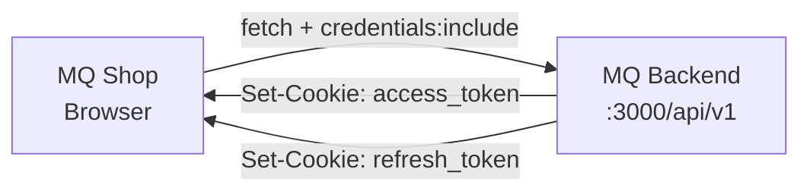
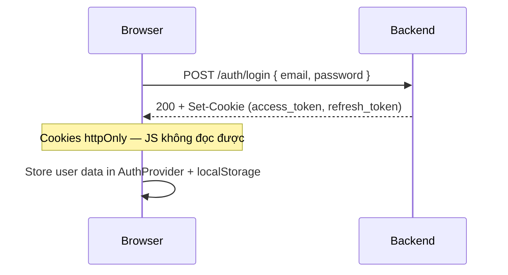
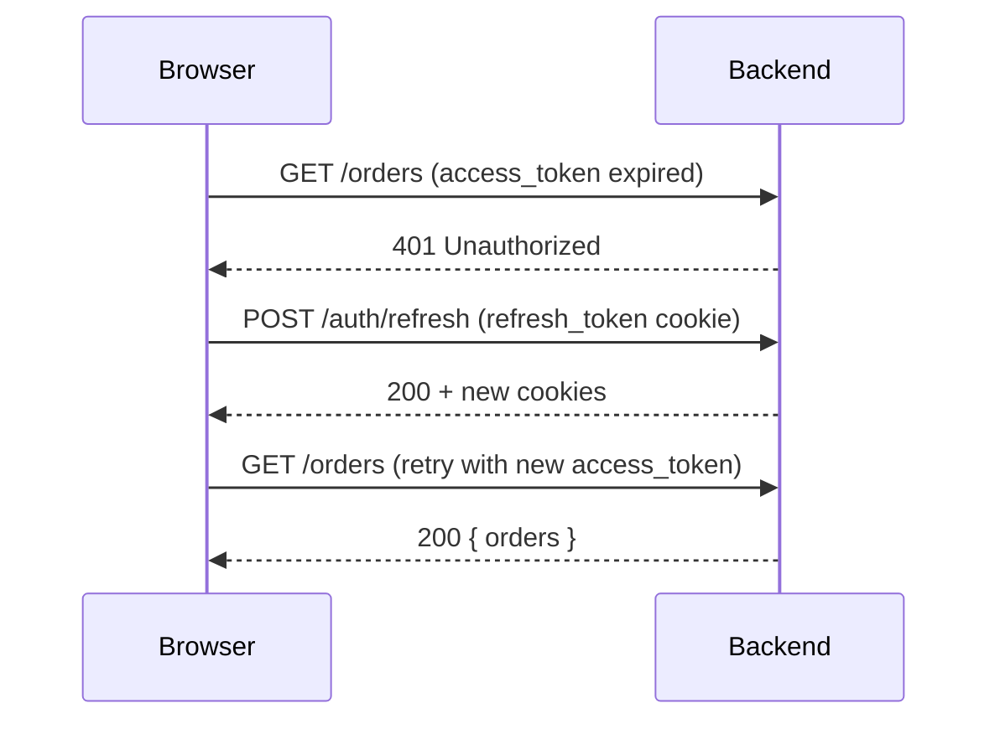

# API Integration — MQ Shop

## 1. Tổng quan

MQ Shop giao tiếp với Backend qua REST API, sử dụng cookie-based authentication (httpOnly JWT).



---

## 2. API Client (`lib/api/client.ts`)

### 2.1 Core Function: `apiRequest<T>()`

```typescript
export async function apiRequest<T>(path: string, options?: RequestOptions): Promise<T>
```

**Features:**
- Base URL từ `NEXT_PUBLIC_API_HOST` env var
- Auto-prefix `/api/v1`
- `credentials: "include"` cho mọi request (cookie auth)
- Auto JSON parse
- Response envelope unwrap (`{ statusCode, data }` → `data`)
- 401 auto-refresh logic
- FormData support cho file upload

### 2.2 Convenience Methods

```typescript
export const api = {
  get: <T>(path, opts?) => apiRequest<T>(path, { method: "GET", ...opts }),
  post: <T>(path, body?, opts?) => apiRequest<T>(path, { method: "POST", body, ...opts }),
  put: <T>(path, body?, opts?) => apiRequest<T>(path, { method: "PUT", body, ...opts }),
  patch: <T>(path, body?, opts?) => apiRequest<T>(path, { method: "PATCH", body, ...opts }),
  delete: <T>(path, opts?) => apiRequest<T>(path, { method: "DELETE", ...opts }),
  postForm: <T>(path, formData, opts?) => apiRequest<T>(path, { method: "POST", formData, ...opts }),
  patchForm: <T>(path, formData, opts?) => apiRequest<T>(path, { method: "PATCH", formData, ...opts }),
  getBlob: (path, opts?) => apiGetBlob(path, opts), // Binary downloads (ZIP)
};
```

### 2.3 Query Parameters

```typescript
// Auto-append query params (filter undefined/null)
api.get<OrderList>("/orders", {
  query: { status: "PENDING", page: 1, pageSize: 20 },
});
// → GET /api/v1/orders?status=PENDING&page=1&pageSize=20
```

### 2.4 Response Envelope Handling

Backend trả response dạng:
```json
{ "statusCode": 200, "data": {...}, "meta": { "page": 1, ... } }
```

Client tự động unwrap:
- Default: trả `data` field
- `withMeta: true`: trả `{ data, meta }` (cho paginated responses)

---

## 3. Authentication Flow

### 3.1 Login



### 3.2 Auto-Refresh (401 Handling)



**Implementation Details:**
- Shared refresh promise (`refreshPromise`) — concurrent 401s chỉ trigger 1 refresh
- Nếu refresh fail → dispatch `mq:auth-logout` custom event → AuthProvider clears user
- `_retried` flag ngăn infinite retry loop

### 3.3 Logout

```typescript
// AuthProvider.logout()
await authApi.logout(); // POST /auth/logout → BE clears cookies
setUser(null);          // Clear local state + localStorage
```

---

## 4. API Modules (`lib/api/`)

| File | Domain | Endpoints chính |
|------|--------|-----------------|
| `auth.ts` | Authentication | login, register, verify-otp, refresh, me |
| `orders.ts` | Orders | checkout, list, detail, cancel, status |
| `wallet.ts` | Wallet | balance, transactions, transfer, payout |
| `mlm.ts` | MLM | network, commissions, leaderboard, referral-link |
| `inventory.ts` | Inventory | warehouses, stock, slips, transfers |
| `promotions.ts` | Promotions | list, create, update |
| `finance.ts` | Finance | config, payouts |
| `reviews.ts` | Reviews | list, create, reply, moderate |
| `notifications.ts` | Notifications | list, read, sse |
| `settlements.ts` | Settlements | list, detail |
| `compliance.ts` | DSAR | requests, process |
| `cs.ts` | Customer Service | queries |
| `staff.ts` | Staff | list, create, update |
| `rbac.ts` | RBAC | permissions, overrides |
| `rbac-groups.ts` | RBAC Groups | group management |
| `admin-dashboard.ts` | Dashboard | stats, charts |
| `seller-dashboard.ts` | Seller Stats | revenue, orders |
| `sse.ts` | SSE | real-time notification stream |
| `idempotency.ts` | Idempotency | key generation utilities |
| `utils.ts` | Utilities | helper functions |

---

## 5. Error Handling

### 5.1 ApiError Class

```typescript
class ApiError extends Error {
  status: number;          // HTTP status code
  body: ApiErrorBody | null; // Parsed response body
  code: string | null;     // Business error code (e.g. "INSUFFICIENT_STOCK")
}
```

### 5.2 Error Code Extraction

Backend trả error theo nhiều format. Client extract code từ:
1. `body.data.code` (preferred)
2. `body.error` (if matches UPPER_CASE pattern)
3. `message` text (if matches UPPER_CASE pattern)

### 5.3 Common Error Codes (FE handling)

| Code | HTTP | Xử lý trên FE |
|------|------|----------------|
| `UNAUTHORIZED` | 401 | Auto-refresh → nếu fail → redirect login |
| `FORBIDDEN` | 403 | Show "Không có quyền" |
| `NOT_FOUND` | 404 | Show 404 page |
| `VALIDATION_ERROR` | 400 | Highlight form fields |
| `INSUFFICIENT_STOCK` | 400 | Show OOS message, suggest update qty |
| `ORDER_NOT_CANCELLABLE` | 400 | Disable cancel button |
| `INSUFFICIENT_BALANCE` | 400 | Show balance warning |
| `WALLET_PIN_REQUIRED` | 400 | Open PIN dialog |
| `RMA_EXPIRED` | 400 | Show expiry message |
| `RATE_LIMIT_EXCEEDED` | 429 | Show "Thử lại sau" |

### 5.4 Error Handling Pattern

```typescript
// In mutation
onError: (error) => {
  if (error instanceof ApiError) {
    switch (error.code) {
      case "INSUFFICIENT_STOCK":
        toast.error("Sản phẩm đã hết hàng");
        break;
      case "WALLET_PIN_REQUIRED":
        openPinDialog();
        break;
      default:
        toast.error(error.message);
    }
  } else {
    toast.error("Lỗi kết nối");
  }
}
```

---

## 6. File Upload

### 6.1 Image Upload Pattern

```typescript
// Using postForm / patchForm
const formData = new FormData();
formData.append("file", file);  // File object from input

const result = await api.postForm<{ url: string }>(
  "/products/:id/images",
  formData,
);
```

### 6.2 Avatar Upload

```typescript
const formData = new FormData();
formData.append("avatar", croppedFile);
await api.postForm("/users/me/avatar", formData);
```

---

## 7. Idempotency (`lib/api/idempotency.ts`)

Cho các operation critical (checkout, financial):

```typescript
import { generateIdempotencyKey } from "@/lib/api/idempotency";

const key = generateIdempotencyKey(); // UUID v4

await api.post("/orders/checkout", payload, {
  headers: { "Idempotency-Key": key },
});
```

**Rules:**
- Mỗi checkout attempt → 1 unique key
- Retry (network error) → cùng key → server trả cached response
- User submit lại (new cart) → new key

---

## 8. Pagination Pattern

### 8.1 Request

```typescript
const { data } = api.get<Paginated<Order>>("/orders", {
  query: { page: 1, pageSize: 20 },
  withMeta: true,
});
```

### 8.2 Response Type

```typescript
type Paginated<T> = {
  items: T[];
  meta?: PageMeta;
};

type PageMeta = {
  page: number;
  pageSize: number;
  total: number;
  totalPages: number;
};
```

---

## 9. Real-time: SSE Notifications

```typescript
// lib/api/sse.ts
function connectSSE(onMessage: (notification) => void) {
  const url = `${getApiBase()}/notifications/sse`;
  const eventSource = new EventSource(url, { withCredentials: true });

  eventSource.onmessage = (event) => {
    const data = JSON.parse(event.data);
    onMessage(data);
  };

  eventSource.onerror = () => {
    // Reconnect logic with backoff
  };

  return () => eventSource.close();
}
```

**Notification Routing** (`lib/notifications/`):
- Parse `notification.type` → determine deep-link target
- `meta` field chứa IDs để navigate (orderId, shopId, etc.)
- `metaNames` chứa human-readable names cho display

---

## 10. Type System (`lib/api/types.ts`)

### Core Types

| Type | Mô tả |
|------|--------|
| `AuthUser` | User profile (id, email, roles, permissions, mlmRank...) |
| `Role` | BUYER, SELLER, WAREHOUSE, CS, ADMIN, SUPER_ADMIN, ACCOUNTANT |
| `PageMeta` | Pagination metadata |
| `ApiErrorBody` | Error response shape |
| `ListingCard` | Product card data (catalog) |
| `PublicProductDetail` | Full PDP data |
| `ProductVariant` | Variant (sku, price, stock, options) |
| `ApiProduct` | Admin product data |
| `ApiShop` | Shop data (admin/seller) |
| `ApiNotification` | Notification with type + meta |
| `NotificationType` | 50+ notification type codes |
| `ApiAuditLog` | Audit log entry |

### Locale Types

```typescript
type Locale = "vi" | "en" | "zh-TW" | "zh_TW";
type LocalizedText = { vi: string; en?: string; zh?: string; "zh-TW"?: string };
```

---

## 11. Environment Configuration

| Variable | Required | Mô tả |
|----------|----------|--------|
| `NEXT_PUBLIC_API_HOST` | Yes | Backend URL (e.g. `http://localhost:3000`) |

**Note**: Chỉ có 1 env var public. Tất cả secrets (JWT, DB) nằm ở Backend.
