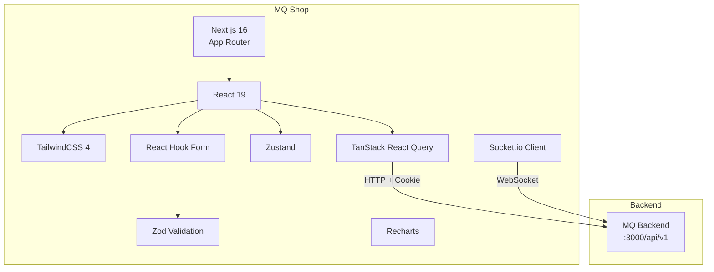
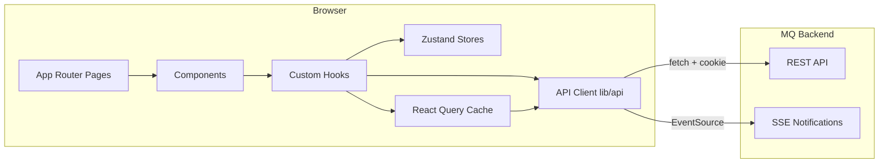

# Kiến trúc — MQ Shop (Frontend)

## 1. Tổng quan

MQ Shop là một Next.js 16 application sử dụng App Router, render phía client (CSR) cho phần lớn trang, kết nối đến MQ Backend qua REST API + Cookie Authentication.

### Mục tiêu kiến trúc

- Server-side rendering tối thiểu (SEO cho public pages)
- Client-side data fetching với caching thông minh (TanStack Query)
- Tách biệt UI components khỏi business logic
- Type-safe end-to-end (TypeScript strict)
- Responsive design (mobile-first với TailwindCSS)

---

## 2. Tech Stack



### Dependencies chính

| Package | Version | Vai trò |
|---------|---------|---------|
| next | 16.2.10 | Framework (App Router, SSR, Image Optimization) |
| react | 19.2.4 | UI library |
| tailwindcss | ^4 | Styling (utility-first) |
| @tanstack/react-query | ^5.101 | Server state management, caching |
| zustand | ^5.0 | Client state management |
| react-hook-form | ^7.81 | Form handling |
| zod | ^4.4 | Schema validation |
| recharts | 3.10 | Charts & data visualization |
| socket.io-client | ^4.8 | Real-time communication |
| lucide-react | ^1.23 | Icon library |
| sonner | ^2.0 | Toast notifications |
| @hookform/resolvers | ^5.4 | Zod ↔ React Hook Form bridge |

---

## 3. High-level Architecture



---

## 4. Folder Structure

```
mq-shop/
├── app/                        # Next.js App Router (pages & layouts)
│   ├── layout.tsx              # Root layout (providers, fonts, shell)
│   ├── page.tsx                # Homepage
│   ├── admin/                  # Admin panel pages
│   │   ├── layout.tsx          # Admin layout (sidebar, auth guard)
│   │   ├── page.tsx            # Admin dashboard
│   │   ├── orders/             # Admin order management
│   │   ├── products/           # Admin product approval
│   │   ├── users/              # User management
│   │   ├── mlm/                # MLM config
│   │   ├── wallet/             # Wallet admin
│   │   ├── finance/            # Finance config
│   │   ├── marketing/          # Banners, promotions
│   │   └── ...                 # 25+ admin sub-pages
│   ├── seller/                 # Seller dashboard pages
│   │   ├── layout.tsx          # Seller layout
│   │   ├── products/           # Product management
│   │   ├── orders/             # Order fulfillment
│   │   ├── inventory/          # Stock management
│   │   └── ...
│   ├── cart/                   # Shopping cart
│   ├── checkout/               # Checkout flow
│   ├── orders/                 # Buyer order list
│   ├── wallet/                 # Wallet pages
│   ├── mlm/                    # MLM network view
│   ├── product/                # Product detail (PDP)
│   ├── shop/                   # Shop listing
│   ├── shops/                  # Shop storefront
│   ├── my-account/             # Login, register, verify OTP
│   └── ...
├── components/                 # React components
│   ├── ui/                     # Shared UI primitives
│   ├── layout/                 # Header, Footer, Sidebar, AppShell
│   ├── providers/              # Context providers
│   ├── guards/                 # Auth/role guards
│   ├── admin/                  # Admin-specific components
│   ├── seller/                 # Seller-specific components
│   ├── cart/                   # Cart components
│   ├── product/                # Product display
│   ├── orders/                 # Order components
│   ├── wallet/                 # Wallet components
│   └── ...
├── lib/                        # Utilities & business logic
│   ├── api/                    # API client functions
│   │   ├── client.ts           # Base fetch wrapper (apiRequest)
│   │   ├── auth.ts             # Auth API calls
│   │   ├── orders.ts           # Orders API
│   │   ├── wallet.ts           # Wallet API
│   │   ├── mlm.ts              # MLM API
│   │   ├── types.ts            # Shared TypeScript types
│   │   └── ...                 # 20+ domain API modules
│   ├── queries/                # TanStack Query hooks (queryKey + queryFn)
│   │   ├── catalog.ts          # Product queries
│   │   ├── orders.ts           # Order queries
│   │   ├── wallet.ts           # Wallet queries
│   │   ├── admin.ts            # Admin queries
│   │   └── ...
│   ├── stores/                 # Zustand stores
│   │   ├── cart-store.ts       # Cart (persisted localStorage)
│   │   └── wishlist-store.ts   # Wishlist (persisted)
│   ├── validations/            # Zod schemas
│   ├── auth/                   # Auth route config
│   ├── cart/                   # Cart utilities
│   ├── data/                   # Data transformers, formatters
│   ├── geo/                    # Country/city data
│   ├── i18n/                   # Internationalization
│   ├── inventory/              # Inventory helpers
│   ├── mlm/                    # MLM tree utilities
│   ├── notifications/          # Notification routing
│   ├── ui/                     # UI utility functions
│   └── utils/                  # General utilities
├── public/                     # Static assets
├── templates/                  # Template files
├── next.config.ts              # Next.js configuration
├── tailwind.config.ts          # TailwindCSS config (implicit v4)
├── tsconfig.json               # TypeScript config
└── Dockerfile                  # Production Docker build
```

---

## 5. Design Patterns

### 5.1 Provider Pattern (Root Layout)

```tsx
// app/layout.tsx — Provider nesting order matters
<QueryProvider>
  <ThemeProvider>
    <LanguageProvider>
      <AuthProvider>
        <NotificationProvider>
          <WishlistProvider>
            <CartProvider>
              <FlyToCartProvider>
                <AppShell>{children}</AppShell>
              </FlyToCartProvider>
            </CartProvider>
          </WishlistProvider>
        </NotificationProvider>
      </AuthProvider>
    </LanguageProvider>
  </ThemeProvider>
</QueryProvider>
```

### 5.2 Data Fetching Pattern

```
Page → useQuery hook → lib/queries/* → lib/api/* → Backend
```

- **lib/api/**: Raw API calls (fetch wrapper)
- **lib/queries/**: TanStack Query hooks (queryKey, staleTime, etc.)
- **Components**: Consume hooks, handle loading/error states

### 5.3 Form Pattern

```
Form Component → React Hook Form + Zod resolver → onSubmit → useMutation → API
```

### 5.4 Auth Guard Pattern

```
Layout/Page → useAuth() → redirect if not authenticated / wrong role
```

---

## 6. Rendering Strategy

| Route | Strategy | Lý do |
|-------|----------|-------|
| `/` (Home) | CSR | Dynamic content (banners, products) |
| `/product/:id` | CSR | Price/stock changes frequently |
| `/shop` | CSR | Filtered catalog |
| `/admin/*` | CSR | Authenticated, dynamic |
| `/seller/*` | CSR | Authenticated, dynamic |
| `/about-us` | Static | Content ít thay đổi |
| `/privacy-policy` | Static | Legal content |

**Note**: Next.js 16 App Router với `output: "standalone"` → optimized Docker production builds.

---

## 7. Internationalization (i18n)

| Locale | Ngôn ngữ |
|--------|----------|
| `vi` | Tiếng Việt |
| `en` | English |
| `zh-TW` | 繁體中文 (Traditional Chinese) |

- Quản lý qua `LanguageProvider`
- Translation helper: `tt("key")` từ `lib/i18n/tt`
- Backend hỗ trợ localized fields (title, description)

---

## 8. Design Decisions & Trade-offs

| Quyết định | Lý do | Trade-off |
|------------|-------|-----------|
| CSR-heavy (ít SSR) | Dashboard/admin pages không cần SEO; simplify auth | First paint chậm hơn cho public pages |
| Zustand cho cart/wishlist | Persist localStorage, đơn giản, no boilerplate | Không sync cross-tab real-time |
| TanStack Query cho server state | Auto cache, refetch, dedup, pagination | Thêm abstraction layer |
| Cookie auth (not localStorage) | httpOnly chống XSS, auto-send | Cần credentials: include |
| App Router (not Pages) | Layouts, loading states, streaming | Next.js 16 specific |
| Zod v4 | Runtime validation, type inference | Bundle size |
| TailwindCSS v4 | Utility-first, fast iteration | Verbose className |
| Standalone Docker output | Minimal image size (~100MB vs 500MB+) | Requires next.config output setting |
