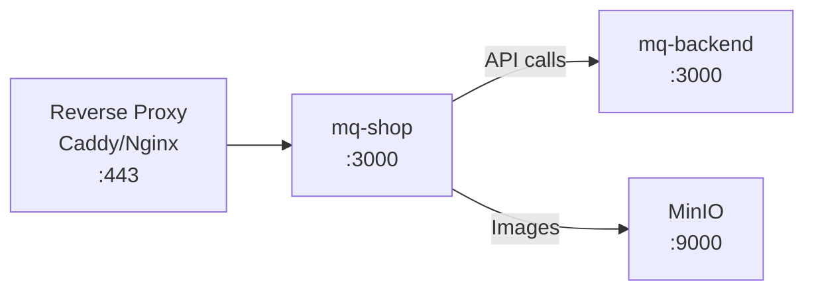
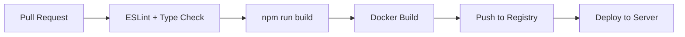

# Deployment — MQ Shop (Frontend)

## 1. Tổng quan

MQ Shop deploy dưới dạng Docker container chạy Next.js standalone server.



---

## 2. Build

### 2.1 Development

```bash
npm run dev
# → http://localhost:3000 (hoặc port Next.js chọn)
```

### 2.2 Production Build

```bash
npm run build
# Output: .next/standalone/ (minimal Node.js server)

npm run start
# Chạy production server
```

### 2.3 Docker Build

```dockerfile
# Multi-stage build (simplified)
FROM node:20-alpine AS builder
WORKDIR /app
COPY package*.json ./
RUN npm ci
COPY . .
RUN npm run build

FROM node:20-alpine AS runner
WORKDIR /app
COPY --from=builder /app/.next/standalone ./
COPY --from=builder /app/.next/static ./.next/static
COPY --from=builder /app/public ./public

EXPOSE 3000
CMD ["node", "server.js"]
```

**Standalone output** (`next.config.ts: output: "standalone"`):
- Chỉ copy files cần thiết để chạy
- Image size ~100-150MB (vs 500MB+ full node_modules)
- Tự bundle dependencies

---

## 3. Docker Compose

### 3.1 Development (local)

```yaml
# mq-shop/docker-compose.yml
services:
  mq-shop:
    build: .
    ports:
      - "3001:3000"
    environment:
      NEXT_PUBLIC_API_HOST: http://mq-backend:3000
```

### 3.2 Production (deploy/docker-compose.yml)

```yaml
services:
  mq-shop:
    image: trantuanhung1209/mq-shop:latest
    container_name: mq-shop
    restart: unless-stopped
    depends_on:
      - mq-backend
    ports:
      - "${FRONTEND_PORT:-4001}:3000"
    environment:
      NODE_ENV: production
      NEXT_PUBLIC_API_HOST: ${NEXT_PUBLIC_API_HOST}
```

---

## 4. Environment Variables

| Variable | Required | Default | Mô tả |
|----------|----------|---------|--------|
| `NEXT_PUBLIC_API_HOST` | Yes | http://localhost:3000 | Backend API URL |
| `NODE_ENV` | No | development | Environment mode |

**Lưu ý quan trọng:**
- `NEXT_PUBLIC_*` được embed vào JS bundle tại build time
- Thay đổi `NEXT_PUBLIC_API_HOST` cần rebuild image
- Production: set giá trị public URL của Backend (có thể qua reverse proxy)

---

## 5. Ports

| Environment | FE Port | BE Port | MinIO API | MinIO Console |
|-------------|---------|---------|-----------|---------------|
| Development | 3000/3001 | 3000 | 9010 | 9011 |
| Production | 4001 | 4000 | 9020 | 9021 |

---

## 6. Reverse Proxy (Production)

### Caddy Example

```
mq-shop.example.com {
    reverse_proxy localhost:4001
}

api.example.com {
    reverse_proxy localhost:4000
}

storage.example.com {
    reverse_proxy localhost:9020
}
```

### Nginx Example

```nginx
server {
    listen 443 ssl;
    server_name mq-shop.example.com;

    location / {
        proxy_pass http://localhost:4001;
        proxy_set_header Host $host;
        proxy_set_header X-Real-IP $remote_addr;
    }
}
```

---

## 7. Image Optimization

### Next.js Image Configuration

```typescript
// next.config.ts
images: {
  formats: ["image/avif", "image/webp"],
  qualities: [60, 70, 75, 80, 82],
  remotePatterns: [
    // MinIO local (development)
    { protocol: "http", hostname: "localhost", port: "9010" },
    // MinIO production
    { protocol: "https", hostname: "**" },
  ],
}
```

**Production:**
- Set `STORAGE_PUBLIC_URL` trên Backend → ảnh serve qua CDN/reverse proxy
- Next.js Image optimizer cache ảnh locally
- AVIF format ưu tiên (nhỏ hơn WebP 20-30%)

---

## 8. Performance Optimization

### 8.1 Bundle Analysis

```bash
# Analyze bundle size
ANALYZE=true npm run build
```

### 8.2 Key Optimizations

| Optimization | Mô tả |
|-------------|--------|
| Standalone output | Minimal runtime (no node_modules copy) |
| Dynamic imports | Lazy-load heavy components (charts, editors) |
| Image formats | AVIF → WebP → JPEG fallback |
| Font optimization | next/font (self-hosted, no CLS) |
| Code splitting | Per-route automatic via App Router |
| Prefetch | `<Link>` auto-prefetch visible links |
| React Query cache | Avoid re-fetching stale data |
| Zustand persist | Cart/wishlist survive page reload |

### 8.3 Core Web Vitals Targets

| Metric | Target | Strategy |
|--------|--------|----------|
| LCP | < 2.5s | Image optimization, font preload |
| FID | < 100ms | Minimal JS on first load |
| CLS | < 0.1 | Reserved space for images, skeletons |

---

## 9. Production Deployment Checklist

| # | Step | Mô tả |
|---|------|--------|
| 1 | Set `NEXT_PUBLIC_API_HOST` | Production backend URL |
| 2 | Build Docker image | `docker build -t mq-shop .` |
| 3 | Push image | `docker push trantuanhung1209/mq-shop:latest` |
| 4 | Deploy via compose | `docker compose up -d mq-shop` |
| 5 | Verify connectivity | FE → BE API accessible |
| 6 | Verify images | MinIO/S3 URLs accessible from browser |
| 7 | Setup reverse proxy | HTTPS termination |
| 8 | Test auth flow | Login → refresh → protected pages |

---

## 10. Monitoring & Debugging

### 10.1 Browser DevTools

| Tab | Dùng cho |
|-----|----------|
| Network | API calls, response times, errors |
| Application → Cookies | Verify httpOnly cookies set |
| Application → Storage | localStorage (cart, user cache) |
| Console | API errors, React warnings |

### 10.2 React Query DevTools

```bash
# Included in dev mode automatically
# Shows: queries, mutations, cache state
```

### 10.3 Production Logging

- Next.js server logs (`docker logs mq-shop`)
- Client-side errors → Browser console (consider Sentry in future)

---

## 11. CI/CD Workflow (Recommended)



### Commands

```bash
# Lint
npm run lint

# Type check
npx tsc --noEmit

# Build (catches build errors)
npm run build

# Docker build
docker build -t mq-shop:latest .

# Push
docker push trantuanhung1209/mq-shop:latest
```

---

## 12. Troubleshooting

| Issue | Cause | Fix |
|-------|-------|-----|
| API 401 loop | Cookie not sent | Check CORS credentials + SameSite |
| Images not loading | MinIO URL mismatch | Check `STORAGE_PUBLIC_URL` + remotePatterns |
| Hydration mismatch | Client/server state diff | Use `skipHydration` for stores |
| CORS error | Origin not whitelisted | Add FE URL to `CORS_ORIGINS` on BE |
| Build OOM | Memory limit | Increase Docker build memory (`--memory 4g`) |
| Slow first load | Large bundle | Check dynamic imports, analyze bundle |
