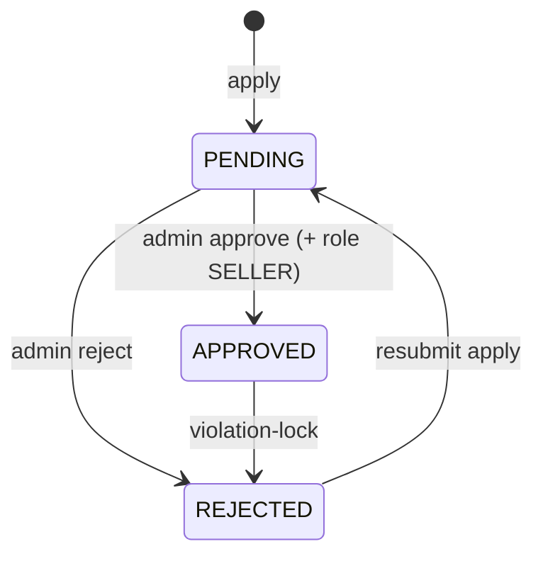
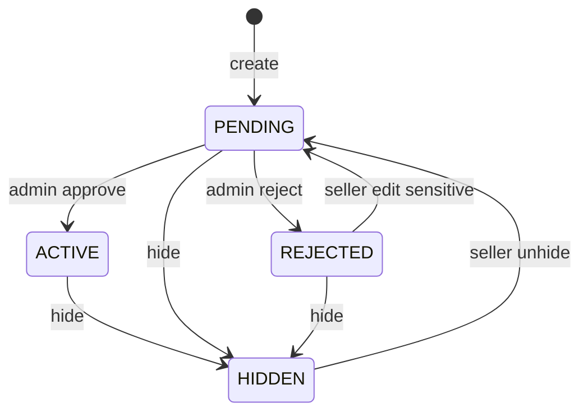

# MQ Backend — Frontend Integration Guide

Tài liệu API cho FE implement UI trên các module đã có trên BE.

- **Base URL:** `/api/v1`
- **Swagger:** `/docs`
- **Auth:** cookie `httpOnly` (ưu tiên) hoặc `Authorization: Bearer <access_token>`
- **Branch stack:** `001-user-account` → `002-shop-onboarding` → `003-product-listing` → `004-warehouse-inventory`

---

## 1. Convention chung

### Success envelope

```json
{
  "statusCode": 200,
  "message": "…",
  "data": {},
  "meta": { "page": 1, "pageSize": 20, "total": 42, "totalPages": 3 }
}
```

| Field | Khi nào có |
|-------|------------|
| `data` | Luôn có (object / array / `null`) |
| `meta` | Chỉ list **có pagination** (đã flatten: `data` = mảng items) |

**Ngoại lệ:** `GET /categories` trả `data: { items: [...] }` (không paginate, không `meta`).

### Error envelope

```json
{
  "statusCode": 400,
  "message": "Human readable message",
  "data": { "code": "VALIDATION_ERROR" }
}
```

FE nên map UI theo `data.code`, không parse `message` cứng.

### Auth cookies

| Cookie | Mục đích |
|--------|----------|
| `access_token` | JWT short-lived (default ~15 phút) |
| `refresh_token` | JWT dài hạn, allowlist Redis; rotate one-time |

- Gửi request với `credentials: 'include'`
- CORS frontend origin phải khớp config BE
- Cookie set: `login`, `register/verify-otp`, `refresh`
- Cookie clear: `logout`, `forgot-password/reset`

### Pagination query

| Param | Default | Constraint |
|-------|---------|------------|
| `page` | `1` | ≥ 1 |
| `pageSize` | `20` | 1–100 |

### Roles (UI gate gợi ý)

| Role | UI chính |
|------|----------|
| `BUYER` | Tài khoản, apply mở shop |
| `SELLER` | Seller center: sản phẩm + kho (shop `APPROVED`, không suspended) |
| `ADMIN` / `SUPER_ADMIN` | Admin: users, shops, products, categories, inventory slips |
| `WAREHOUSE` | Staff kho (permission inventory; không có shop owner) |
| `ACCOUNTANT` | Xem list users (theo matrix) |

`roles` là **mảng** trên profile (user có thể vừa `BUYER` vừa `SELLER`).

---

## 2. Module Auth & User Account (`001`)

### 2.1 Màn hình Auth

| UI | Method | Path | Auth |
|----|--------|------|------|
| Đăng ký — gửi OTP | `POST` | `/auth/register` | Public |
| Đăng ký — verify OTP | `POST` | `/auth/register/verify-otp` | Public → set cookies |
| Đăng ký — resend OTP | `POST` | `/auth/register/resend-otp` | Public |
| Login | `POST` | `/auth/login` | Public → set cookies |
| Logout | `POST` | `/auth/logout` | JWT |
| Refresh session | `POST` | `/auth/refresh` | Cookie `refresh_token` |
| Quên MK — gửi OTP | `POST` | `/auth/forgot-password/request-otp` | Public |
| Quên MK — đặt lại | `POST` | `/auth/forgot-password/reset` | Public → clear cookies |

#### Bodies

```ts
// register
{ email: string; password: string /* min 8 */; fullName?: string }

// verify / resend OTP
{ email: string; otp: string /* 6 digits */ }  // resend: chỉ email

// login
{ email: string; password: string }

// forgot-password/reset
{ email: string; code: string /* 6 digits */; newPassword: string /* min 8 */ }
```

#### Response `data` (login / verify-otp / refresh)

```ts
{
  user: {
    id: string;
    email: string;
    fullName: string | null;
    avatarUrl: string | null;
    status: "ACTIVE" | "LOCKED" | "DELETED";
    roles: Array<"BUYER" | "SELLER" | "ADMIN" | ...>;
  }
}
```

#### Error codes FE cần handle

| Code | UI gợi ý |
|------|----------|
| `EMAIL_ALREADY_IN_USE` | Email đã tồn tại |
| `INVALID_OTP` | OTP sai / hết hạn |
| `REGISTRATION_NOT_FOUND` | Hết session đăng ký → quay lại form register |
| `INVALID_CREDENTIALS` | Sai email/password |
| `ACCOUNT_LOCKED` | Tài khoản bị khóa |
| `TOO_MANY_REQUESTS` | Rate limit OTP |
| `UNAUTHORIZED` | Session hết → gọi refresh hoặc login lại |

**Refresh flow gợi ý:** interceptor 401 → `POST /auth/refresh` (credentials) → retry 1 lần → fail thì redirect login.

> **Breaking:** `/auth/sign-in` / `/auth/sign-out` đã đổi thành `/auth/login` / `/auth/logout`.

---

### 2.2 Profile (`/users/me`)

| UI | Method | Path |
|----|--------|------|
| Xem profile | `GET` | `/users/me` |
| Sửa tên | `PATCH` | `/users/me` `{ fullName? }` |
| Đổi avatar | `POST` | `/users/me/avatar` multipart field **`avatar`** (≤5MB, JPEG/PNG/WebP/GIF) |
| Đổi email — gửi OTP | `POST` | `/users/me/email/request-otp` `{ newEmail }` |
| Đổi email — verify | `POST` | `/users/me/email/verify-otp` `{ email, otp }` |
| Đổi mật khẩu | `PATCH` | `/users/me/password` `{ currentPassword, newPassword }` |

- Avatar / profile / email-verify trả `data` = `UserProfile`
- Đổi password thành công → refresh tokens bị revoke → nên logout hoặc force re-login

| Code | UI |
|------|-----|
| `INVALID_AVATAR` / `AVATAR_TOO_LARGE` | File avatar không hợp lệ |
| `INCORRECT_PASSWORD` | Sai mật khẩu hiện tại |
| `EMAIL_ALREADY_IN_USE` | Email mới đã dùng |
| `INVALID_OTP` | OTP đổi email sai |

---

### 2.3 Admin Users

| UI | Method | Path | Permission |
|----|--------|------|------------|
| Danh sách user | `GET` | `/admin/users?page&pageSize&status?=ACTIVE\|LOCKED` | `VIEW_USERS` |
| Khóa | `POST` | `/admin/users/:userId/lock` | `DELETE_ACCOUNT` |
| Mở khóa | `POST` | `/admin/users/:userId/unlock` | `DELETE_ACCOUNT` |
| Xóa mềm | `DELETE` | `/admin/users/:userId` | `DELETE_ACCOUNT` |

List: `data: UserProfile[]` + `meta`.

---

### 2.4 Admin Audit logs

Audit **đổi hệ thống** lưu file JSONL (`logs/audit/audit-YYYY-MM-DD.jsonl`), tách khỏi HTTP/dev log.  
Admin đọc qua API — response đã có **English title/summary** sẵn, FE không cần map `action` code.

| UI | Method | Path | Permission |
|----|--------|------|------------|
| Audit activity list | `GET` | `/admin/audit-logs` | `VIEW_AUDIT_LOG` |

Auth: JWT cookie (login admin / accountant / superadmin).  
Roles có quyền: `ACCOUNTANT`, `ADMIN`, `SUPER_ADMIN`.

#### Query

| Param | Ý nghĩa |
|-------|---------|
| `page` / `pageSize` | Pagination (default 1 / 20) |
| `action` | Substring match trên code (vd `admin.shop`) |
| `actorId` | UUID người thực hiện |
| `outcome` | `success` \| `failure` \| `denied` |
| `resourceType` | vd `product`, `shop`, `user` |
| `from` / `to` | ISO date; mặc định ~30 ngày gần nhất |

#### Response item (`data[]`)

```ts
{
  id: string;
  ts: string;                 // ISO — FE format: "21 Jul 2026, 12:05"
  level: "info" | "warn" | "error";
  action: string;             // machine code — dùng filter, không hiện primary
  title: string;              // English headline — PRIMARY list text
  summary: string;            // English one-line explanation
  category: string;           // Account | Users | Shops | Products | Catalog | Other
  outcome: "success" | "failure" | "denied";
  outcomeLabel: string;       // Succeeded | Failed | Denied
  actor: { id: string | null; email: string | null };
  resource: { type: string | null; id: string | null };
  reason: string | null;      // reject / lock reason — show when present
  meta?: Record<string, unknown>;
}
```

Envelope list: `data: AuditLogView[]` + `meta: { page, pageSize, total, totalPages }`.

#### Example

```json
{
  "statusCode": 200,
  "message": "Audit logs retrieved successfully",
  "data": [
    {
      "id": "…",
      "ts": "2026-07-21T05:10:00.000Z",
      "level": "info",
      "action": "admin.shop.approve",
      "title": "Shop approved",
      "summary": "Admin approved a shop and granted Seller role",
      "category": "Shops",
      "outcome": "success",
      "outcomeLabel": "Succeeded",
      "actor": { "id": "…", "email": "admin@example.com" },
      "resource": { "type": "shop", "id": "…" },
      "reason": null
    }
  ],
  "meta": { "page": 1, "pageSize": 20, "total": 1, "totalPages": 1 }
}
```

#### UI implement (FE)

1. **List row (đủ đọc):**  
   `[category badge]` **`title`** · `outcomeLabel` · `actor.email` · formatted `ts`
2. **Expand / detail:** `summary` + `reason` (nếu có) + optional `resource.type` / `resource.id`
3. **Badge màu `outcomeLabel`:** Succeeded = green, Failed = red, Denied = amber
4. **Filters:** `outcome`, `action` (substring), date `from`/`to`; optional client filter theo `category`
5. **Không** hiện raw `action` làm title — chỉ dùng cho debug / filter query

#### Title map (English, BE đã trả sẵn)

| `action` | `title` |
|----------|---------|
| `admin.shop.approve` | Shop approved |
| `admin.shop.reject` | Shop rejected |
| `admin.shop.violation_lock` | Shop suspended |
| `admin.product.approve` | Product approved |
| `admin.product.reject` | Product rejected |
| `admin.product.hide` | Product hidden by admin |
| `product.create` / `update` / `hide` / `unhide` | Product created / updated / hidden / unhidden by seller |
| `product.images.upload` | Product images uploaded |
| `product.variant.create` | Product variant added by seller |
| `product.variant.images.upload` | Variant images uploaded |
| `inventory.warehouse.create` | Warehouse created |
| `inventory.variant.create` | Inventory variant created |
| `inventory.slip.create` / `approve` / `reject` | Inventory slip created / approved / rejected |
| `admin.inventory.slip.approve` / `reject` | Admin approved / rejected inventory slip |
| `admin.user.lock` / `unlock` / `delete` | Account locked / unlocked / deleted |
| `admin.category.create` / `update` | Category created / updated |
| `shop.apply` | Shop application submitted |
| `user.password.change` | Password changed |
| `auth.logout` | Signed out |

Unknown actions: BE fallback humanize (`custom.thing_done` → readable title) + `category: "Other"`.

**Có trong API:** lock/unlock/delete user, profile/email/password, shop apply/approve/reject/violation, product+variant CRUD/images, inventory warehouses/slips/ledger, category create/update, logout, password-reset success.

**Không có:** login/refresh/register OTP noise, mail notify failures.

---

### 2.5 Notifications

| UI | Method | Path | Ghi chú |
|----|--------|------|---------|
| List + badge | `GET` | `/notifications` | Lịch sử gần đây (tối đa 50) + `unreadCount` |
| Đánh dấu 1 đã đọc | `POST` | `/notifications/:id/read` | |
| Đánh dấu tất cả đã đọc | `POST` | `/notifications/read-all` | |
| Realtime | `GET` (SSE) | `/notifications/stream` | **Không** replay lịch sử |

`GET /notifications` response `data`:

```ts
{
  items: Array<{ id, userId, title, body, readAt, createdAt }>,
  unreadCount: number
}
```

SSE event payload (khi có noti **mới** trong lúc đang connect):

```ts
{ id, userId, title, body, readAt, createdAt }
```

**FE gợi ý:** login → `GET /notifications` (badge + list) → mở `EventSource` `/notifications/stream` (with credentials) để toast realtime.

Shop apply gửi noti tới user `ACTIVE` có role `ADMIN` hoặc `SUPER_ADMIN`.

---

## 3. Module Shop Onboarding (`002`)

### 3.1 Buyer — Apply shop

| UI | Method | Path | Gate |
|----|--------|------|------|
| Nộp / nộp lại hồ sơ | `POST` | `/shops/apply` | Role có `BUYER`; multipart |
| Xem shop của tôi | `GET` | `/shops/me` | JWT |
| Upload logo | `POST` | `/shops/me/logo` | `EDIT_SHOP`; multipart field `logo` |
| Upload banner | `POST` | `/shops/me/banner` | `EDIT_SHOP`; multipart field `banner` |

#### Multipart fields (`shops/apply`)

| Field | Constraint |
|-------|------------|
| `name` | 2–100 |
| `taxId` | 1–15 chữ số |
| `countryCode` | 2 chữ (vd `VN`) |
| `document` | file ≤5MB: JPEG/PNG/WebP/PDF |

#### Logo / banner (`shops/me/logo`, `shops/me/banner`)

| | |
|--|--|
| Điều kiện | Shop `APPROVED`, không suspended, role `SELLER` |
| Format | JPEG/PNG/WebP/GIF → lưu MinIO **WebP** |
| Size | ≤5MB |
| Logo | Crop vuông ~512×512 (`cover`) |
| Banner | Crop ~1600×400 (`cover`) |
| Response | `ShopView` (cập nhật `logoUrl` / `bannerUrl`); object cũ bị xoá |

Field name: `logo` / `banner` (một file mỗi request).

#### ShopView (`data`)

```ts
{
  id: string;
  ownerId: string;
  name: string;
  taxId: string;
  countryCode: string;
  documentUrl: string;
  logoUrl: string | null;
  bannerUrl: string | null;
  status: "PENDING" | "APPROVED" | "REJECTED";
  rejectionReason: string | null;
  violationFlag: boolean;
  isSuspended: boolean;
  contactAdminRequired: boolean; // === violationFlag
  createdAt: string;
  updatedAt: string;
}
```

#### UI state theo `status`



| Status | UI gợi ý |
|--------|----------|
| `PENDING` | “Đang chờ duyệt”, disable apply lại |
| `APPROVED` | Vào Seller center; check `isSuspended` |
| `REJECTED` | Hiện `rejectionReason`; cho apply lại (trừ khi `isSuspended`) |
| `violationFlag` / `contactAdminRequired` | Banner “Liên hệ admin” |

| Code | UI |
|------|-----|
| `SHOP_ALREADY_EXISTS` | Đã có shop (không phải REJECTED) |
| `SHOP_NAME_TAKEN` / `TAX_ID_TAKEN` | Trùng tên / MST |
| `INVALID_SHOP_DOCUMENT` / `SHOP_DOCUMENT_TOO_LARGE` | File sai |
| `FORBIDDEN` | Không phải BUYER |
| `SHOP_NOT_FOUND` | Chưa apply (`GET /shops/me`) |

---

### 3.2 Admin — Review shops

| UI | Method | Path | Permission |
|----|--------|------|------------|
| Queue | `GET` | `/admin/shops?page&pageSize&status?` | `APPROVE_SELLER` |
| Chi tiết | `GET` | `/admin/shops/:shopId` | `APPROVE_SELLER` |
| Duyệt | `POST` | `/admin/shops/:shopId/approve` | `APPROVE_SELLER` |
| Từ chối | `POST` | `/admin/shops/:shopId/reject` | `APPROVE_SELLER` body `{ reason }` (1–150) |
| Violation lock | `POST` | `/admin/shops/:shopId/violation-lock` | `SUSPEND_SHOP` body `{ reason? }` (≤150) |

| Code | UI |
|------|-----|
| `SHOP_NOT_PENDING` | Approve/reject khi không còn PENDING |
| `SHOP_NOT_APPROVED` | Violation-lock khi chưa APPROVED |

---

## 4. Module Product Listing (`003`) — Product ↔ Variant redesign

### FE rename map (bắt buộc sửa type / form)

| Cũ (FE đang có) | Mới |
|-----------------|-----|
| `variant.price` | `variant.sellingPrice` |
| `variant.unitPrice` | `variant.costPrice` |
| Create/update variant body `price` | `sellingPrice` |
| Inventory create variant `unitPrice` | `costPrice` |
| Slip body flat `{ sku, quantity, unitCost }` | `{ type, items:[{ sku, quantity, unitCost? }] }` + response `code`, `items[]` |

**Product list/PDP card** vẫn có `price` / `minPrice` / `maxPrice` — đó là **derived** từ `min/max(sellingPrice)`, không phải cột DB, không editable.


> **Breaking (FE phải sửa):**
> - 1 Product = N Variants; **giá bán = `variant.sellingPrice`**; **tồn = `variant.availableStock`**
> - Product **không còn** `price` / `stock` / `sku`
> - Create bắt buộc `variants: [{ sku, sellingPrice, options? }, …]` (min 1)
> - Ảnh **không** gửi URL trong JSON create — upload multipart sau create (giống avatar)
> - Listing `price` = min variant; `stock` = sum variant; thêm `minPrice` / `maxPrice`
> - Public PDP: `GET /products/listing/:productId`

### Mental model

```
Product (title, description, category, images[], status, attributes)
  └── Variant[] (sku, sellingPrice, options?, images[], availableStock)
```

- SP đơn giản (không options UI): vẫn tạo **1 default variant** với `sku` + `sellingPrice`
- Ảnh variant trống → FE fallback `product.images`
- Checkout / PDP: dùng **selected `variant.sellingPrice`**, không dùng product-level `price`

---

### 4.1 Categories (giữ nguyên)

| UI | Method | Path | Auth |
|----|--------|------|------|
| Dropdown / filter | `GET` | `/categories` | Public |
| Tạo category | `POST` | `/admin/categories` | `MANAGE_CONTENT` |
| Sửa category | `PATCH` | `/admin/categories/:categoryId` | `MANAGE_CONTENT` |

```ts
// GET /categories → data
{ items: Array<{ id: string; slug: string; name: string; nameVi: string; parentId: string | null }> }
```

Seed: `cat-electronics`, `cat-fashion`, `cat-home-living`, `cat-beauty`, `cat-toys`.

---

### 4.2 Seller — Product + variants + images

**Gate:** JWT + permission + role `SELLER` + shop `APPROVED` + `!isSuspended`.  
`shopId` **không** gửi từ FE.

| UI | Method | Path | Permission |
|----|--------|------|------------|
| Tạo SP + variants | `POST` | `/products` | `CREATE_PRODUCT` |
| List SP | `GET` | `/products?page&pageSize&status?` | `VIEW_PROD_BKG` |
| Chi tiết | `GET` | `/products/:productId` | `VIEW_PROD_BKG` |
| Sửa metadata | `PATCH` | `/products/:productId` | `EDIT_PRODUCT` |
| Ẩn | `POST` | `/products/:productId/hide` | `EDIT_PRODUCT` |
| Bỏ ẩn → PENDING | `POST` | `/products/:productId/unhide` | `EDIT_PRODUCT` |
| Thêm variant | `POST` | `/products/:productId/variants` | `EDIT_PRODUCT` |
| Sửa variant (giá/options) | `PATCH` | `/products/:productId/variants/:variantId` | `EDIT_PRODUCT` |
| Upload gallery SP | `POST` | `/products/:productId/images` | `EDIT_PRODUCT` multipart |
| Xóa ảnh SP | `DELETE` | `/products/:productId/images` | `EDIT_PRODUCT` `{ urls }` |
| Upload ảnh variant | `POST` | `/products/:productId/variants/:variantId/images` | `EDIT_PRODUCT` multipart |
| Xóa ảnh variant | `DELETE` | `/products/:productId/variants/:variantId/images` | `EDIT_PRODUCT` `{ urls }` |

**Pagination list:** envelope flatten — `data: ProductView[]` + `meta`.

#### Flow tạo SP (khuyến nghị)

```
1. POST /products
   { title, description, categoryId, attributes?, variants: [{ sku, sellingPrice, options? }, ...] }
   → status PENDING, images=[], stock variants = 0

2. POST /products/:productId/images   (multipart field "images")
   → append gallery URLs

3. (optional) POST /products/:id/variants/:variantId/images
```

**Không còn** `POST /products/images` (upload trước rồi nhét URL vào create).

#### Create body

```ts
{
  title: string;              // 3–200
  description: string;
  categoryId: string;         // "cat-{slug}"
  attributes?: object;
  variants: Array<{           // min 1
    sku: string;              // unique trong shop
    sellingPrice: number;     // giá bán ≥ 0
    options?: Record<string, string>;  // vd { size: "M", color: "black" }
  }>;
}
// KHÔNG gửi: price, stock, sku, images ở root product
```

#### Update product body (partial — metadata only)

```ts
{
  title?: string;
  description?: string;
  categoryId?: string;
  attributes?: object | null;
}
// KHÔNG gửi: price, stock, images, variants
```

#### Add / update variant

```ts
// POST /products/:productId/variants
{ sku: string; sellingPrice: number; options?: Record<string, string> }

// PATCH /products/:productId/variants/:variantId
{ sellingPrice?: number; options?: Record<string, string> | null }
```

Tồn kho **không** sửa ở đây — dùng inventory slips (module `004` bên dưới).

#### Images (avatar-style multipart)

| | |
|--|--|
| Field | **`images`** (1–10 files) |
| Max / file | 5MB |
| Types | JPEG/PNG/WebP/GIF → WebP |
| Path | `products/{shopId}/{uuid}.webp` |

```ts
const fd = new FormData();
files.forEach((f) => fd.append("images", f));
await api.post(`/products/${productId}/images`, fd);
// DELETE
await api.delete(`/products/${productId}/images`, { data: { urls: string[] } });
```

| Code | UI |
|------|-----|
| `INVALID_PRODUCT_IMAGE` | File không hợp lệ / thiếu file |
| `PRODUCT_IMAGE_TOO_LARGE` | > 5MB |
| `FILE_TOO_LARGE` | Multer reject |

#### ProductView / VariantView (seller & admin)

```ts
type ProductVariantView = {
  id: string;
  productId: string;
  shopId: string;
  sku: string;
  sellingPrice: number;          // sell price SoT
  availableStock: number;
  options: Record<string, string> | null;
  images: string[];
  costPrice: number | null;        // giá nhập hiện tại trên SKU
  isEnrollmentPackage: boolean;
  createdAt: string;
  updatedAt: string;
};

type ProductView = {
  id: string;
  shopId: string;
  title: string;
  description: string;
  categoryId: string;
  price: number;                 // derived = minPrice
  minPrice: number;
  maxPrice: number;
  stock: number;                 // derived = sum(availableStock)
  images: string[];
  attributes: Record<string, unknown> | null;
  status: "PENDING" | "ACTIVE" | "REJECTED" | "HIDDEN";
  rejectionReason: string | null;
  variants: ProductVariantView[];
  createdAt: string;
  updatedAt: string;
};
```

**Lưu ý nhanh cho FE**

| Việc | Đúng | Sai |
|------|------|-----|
| Sửa **giá bán** | `PATCH /products/:id/variants/:variantId` `{ sellingPrice }` | `PATCH /products/:id` với `price` (field đã bỏ) |
| Sửa **tồn kho** | Inventory slip `POST /inventory/slips` rồi approve | Đổi `stock` / `availableStock` trên product PATCH |
| Hiện giá trên list | Dùng `price` (= min) hoặc `minPrice`–`maxPrice` | Coi `product.price` là SoT checkout |
| Checkout / chọn SKU | Dùng `variant.id` + `variant.sellingPrice` | Dùng product-level `price` |
| Ảnh theo màu/size | `variant.images` nếu có, không thì `product.images` | Bắt buộc mọi variant có ảnh |
| `costPrice` | Chỉ seller/admin (giá nhập trên SKU) | Hiện cho khách trên PDP |
| Nhập hàng có giá | Slip `items[].unitCost` (per unit) | Chỉ ghi `costPrice` trên variant mà không qua slip |
| Public PDP | Type riêng — **không** có `costPrice`, `status`, `rejectionReason` | Reuse nguyên `ProductView` seller |

`product.price` / `product.stock` trên response là **derived** (min giá / tổng tồn) — tiện UI list, không phải field editable.

#### Status & UI



| Status | UI Seller |
|--------|-----------|
| `PENDING` | Chờ duyệt |
| `ACTIVE` | Đang bán |
| `REJECTED` | Hiện `rejectionReason`; sửa field nhạy cảm → PENDING |
| `HIDDEN` | Nút Unhide → `PENDING` |

**Sensitive → REJECTED về PENDING:**  
product: `title`, `description`, `categoryId`, `attributes`, **images**  
variant: **`sellingPrice`**

| Code | UI |
|------|-----|
| `SHOP_NOT_ELIGIBLE` | Shop chưa duyệt / suspended |
| `CATEGORY_NOT_FOUND` | categoryId sai |
| `VARIANT_SKU_TAKEN` | SKU trùng trong shop |
| `VARIANT_NOT_FOUND` | Variant không thuộc product/shop |
| `PRODUCT_NOT_FOUND` | Không thuộc shop / không tồn tại |
| `PRODUCT_NOT_HIDDEN` | Unhide khi chưa HIDDEN |

---

### 4.3 Admin — Product review

| UI | Method | Path | Permission |
|----|--------|------|------------|
| Queue | `GET` | `/admin/products?page&pageSize&status?` | `APPROVE_PRODUCT` |
| Duyệt | `POST` | `/admin/products/:productId/approve` | `APPROVE_PRODUCT` |
| Từ chối | `POST` | `/admin/products/:productId/reject` | `APPROVE_PRODUCT` `{ reason }` (1–500) |
| Ẩn | `POST` | `/admin/products/:productId/hide` | `APPROVE_PRODUCT` (không body reason) |

List trả `ProductView` (đã kèm `variants`). Approve/reject chỉ `PENDING` → `PRODUCT_NOT_PENDING`.

---

### 4.4 Customer — Listing + PDP

| UI | Method | Path | Auth |
|----|--------|------|------|
| Browse / search | `GET` | `/products/listing?q&categoryId&page&pageSize` | Public |
| **Product detail (PDP)** | `GET` | `/products/listing/:productId` | Public |

Chỉ `ACTIVE` + shop `APPROVED` + `!isSuspended`. Không public → `404 PRODUCT_NOT_FOUND`.

#### Listing card

```ts
{
  id: string;
  title: string;
  price: number;          // = minPrice
  minPrice: number;
  maxPrice: number;
  thumbnailUrl: string | null;
  stock: number;          // sum variants
  displayMode: "NORMAL" | "OUT_OF_STOCK_WATERMARK";
  watermarkText: null | { vi: string; zh: string; en: string };
}
```

| `stock` | FE |
|---------|-----|
| `> 0` | `NORMAL` |
| `≤ 0` | watermark theo locale |

Nếu `minPrice !== maxPrice` → hiện range / “Từ {minPrice}”.

#### PDP (`GET /products/listing/:productId`)

```ts
{
  id: string;
  shopId: string;
  title: string;
  description: string;
  categoryId: string;
  price: number;
  minPrice: number;
  maxPrice: number;
  stock: number;
  images: string[];
  attributes: Record<string, unknown> | null;
  variants: Array<{
    id: string;
    productId: string;
    sku: string;
    sellingPrice: number;
    availableStock: number;
    options: Record<string, string> | null;
    images: string[];
    isEnrollmentPackage: boolean;
  }>;
  displayMode: "NORMAL" | "OUT_OF_STOCK_WATERMARK";
  watermarkText: null | { vi: string; zh: string; en: string };
  createdAt: string;
  updatedAt: string;
}
```

**PDP rules:**

1. User chọn variant → hiện `variant.sellingPrice` + `availableStock`
2. Ảnh: `variant.images.length ? variant.images : product.images`
3. Checkout dùng `variant.id` / `variant.sellingPrice`
4. Public **không** có `costPrice`, `status`, `rejectionReason`

---

## 5. Module Warehouse Inventory (`004`)

Stock SoT = `variant.availableStock` — **chỉ đổi khi slip được APPROVE**.

### 5.1 Seller inventory APIs

| UI | Method | Path | Permission |
|----|--------|------|------------|
| Tạo kho | `POST` | `/inventory/warehouses` | `ADD_INVENTORY` `{ code, address? }` |
| List kho | `GET` | `/inventory/warehouses` | `VIEW_INVENTORY` |
| Tạo variant (alt) | `POST` | `/inventory/variants` | `ADD_INVENTORY` |
| List variants | `GET` | `/inventory/variants?q&productId&page&pageSize` | `VIEW_INVENTORY` |
| Tạo phiếu | `POST` | `/inventory/slips` | `ADD_INVENTORY` |
| List phiếu | `GET` | `/inventory/slips?status&page&pageSize` | `VIEW_INVENTORY` |
| Chi tiết phiếu | `GET` | `/inventory/slips/:slipId` | `VIEW_INVENTORY` |
| Duyệt phiếu | `POST` | `/inventory/slips/:slipId/approve` | `EDIT_INVENTORY` |
| Từ chối phiếu | `POST` | `/inventory/slips/:slipId/reject` | `EDIT_INVENTORY` |
| Sổ cái | `GET` | `/inventory/ledger?sku&from&to&page&pageSize` | `VIEW_INVENTORY` |

#### Create variant (inventory shortcut)

```ts
{
  productId: string;   // bắt buộc — thuộc shop
  sku: string;
  sellingPrice: number; // sell price bắt buộc
  options?: Record<string, string>;
  costPrice?: number | null;    // giá nhập trên SKU
  isEnrollmentPackage?: boolean;
}
// availableStock luôn bắt đầu 0 — nhập hàng bằng slip
```

> Ưu tiên tạo variant cùng product form (`POST /products` / `POST /products/:id/variants`).

#### Create slip

```ts
{
  type: "IN" | "ADJUST_IN" | "ADJUST_OUT";  // áp dụng cả phiếu
  warehouseCode?: string;
  locationNote?: string;
  items: Array<{
    sku: string;                 // phải tồn tại trong shop
    quantity: number;            // ≥ 1
    unitCost?: number | null;    // giá nhập / unit của dòng (thường dùng cho IN)
  }>; // min 1, không trùng SKU
}
```

> Header: `code` (auto `PN-YYYYMMDD-XXXX`), `createdByUserId`, `type`, `status`, kho/ghi chú.  
> `unitCost` trên **từng item**. Approve **all-or-nothing**; mỗi item → 1 dòng `stock_ledger` (`slipItemId`). Khi approve `IN` / `ADJUST_IN` có `unitCost`, BE cập nhật `variant.costPrice` theo dòng.


```
PENDING ──approve──► APPROVED  (stock ± tất cả items + N ledger rows)
PENDING ──reject───► REJECTED  (stock không đổi)
```

| Code | UI |
|------|-----|
| `WAREHOUSE_CODE_TAKEN` | Trùng mã kho |
| `WAREHOUSE_NOT_FOUND` | warehouseCode sai |
| `VARIANT_NOT_FOUND` | SKU chưa có |
| `VARIANT_SKU_TAKEN` | Trùng SKU |
| `INVENTORY_SLIP_DUPLICATE_SKU` | Trùng SKU trong `items` |
| `INVENTORY_SLIP_ALREADY_PROCESSED` | Approve/reject lại |
| `INSUFFICIENT_STOCK` | ADJUST_OUT vượt tồn (rollback cả phiếu) |
| `SHOP_NOT_ELIGIBLE` | Shop không đủ điều kiện |

### 5.2 Admin inventory

| UI | Method | Path | Permission |
|----|--------|------|------------|
| Inbox slips | `GET` | `/admin/inventory/slips?status&page&pageSize` | `VIEW_INVENTORY` |
| Chi tiết | `GET` | `/admin/inventory/slips/:slipId` | `VIEW_INVENTORY` |
| Approve | `POST` | `/admin/inventory/slips/:slipId/approve` | `EDIT_INVENTORY` |
| Reject | `POST` | `/admin/inventory/slips/:slipId/reject` | `EDIT_INVENTORY` |

### 5.2b Admin gán NV shop (`MANAGE_STAFF` / `ASSIGN_ROLES`)

Admin **sàn** (không phải seller) tạo/gán NV kho / CSKH / kế toán gắn `shopId`.

| UI | Method | Path | Permission |
|----|--------|------|------------|
| Tạo NV | `POST` | `/admin/staff` | `MANAGE_STAFF` body `{ email, fullName?, role, shopId }` → `{ user, temporaryPassword }` |
| List NV | `GET` | `/admin/staff?shopId&role&page&pageSize` | `MANAGE_STAFF` |
| Gán/đổi role | `PATCH` | `/admin/staff/:userId/roles` | `ASSIGN_ROLES` `{ roles, shopId? }` |
| Lock | `POST` | `/admin/staff/:userId/lock` | `MANAGE_STAFF` |
| Unlock | `POST` | `/admin/staff/:userId/unlock` | `MANAGE_STAFF` |
| Xoá | `DELETE` | `/admin/staff/:userId` | `MANAGE_STAFF` |

`role` / `roles[]`: chỉ `WAREHOUSE` | `CS` | `ACCOUNTANT`. Shop phải `APPROVED`.

Khi tạo/gán role: **email** `STAFF_ROLE_ASSIGNED` + **in-app notification** (shop name + role). Temp password chỉ trả lúc create.

NV kho login → `/inventory/*` resolve shop qua `user.shopId` (không cần là owner).

### 5.3 Flow nhập hàng điển hình

```
1. POST /products (+ variants) hoặc POST /products/:id/variants
2. POST /products/:id/images
3. (optional) POST /inventory/warehouses { code: "KHO-HN" }
4. POST /inventory/slips { type: "IN", items: [{ sku, quantity, unitCost? }, …], warehouseCode? }
5. POST /inventory/slips/:id/approve   → availableStock tăng
6. GET /inventory/ledger?sku=…
7. GET /products/listing  → stock = SUM(variants)
```

---

## 6. Checklist màn hình FE theo module

### Buyer / Guest

- [ ] Register + OTP / Login / Logout / refresh
- [ ] Profile + avatar + email/password
- [ ] Apply shop + `GET /shops/me`
- [ ] Listing `GET /products/listing` (minPrice/maxPrice + OOS watermark)
- [ ] **PDP** `GET /products/listing/:id` — chọn variant → giá/tồn/ảnh
- [ ] SSE notifications (optional)

### Seller (shop APPROVED)

- [ ] Gate theo shop status / suspended
- [ ] Product list theo status
- [ ] Rename FE types: `sellingPrice` / `costPrice` (bỏ `variant.price` / `unitPrice`)
- [ ] Create: `variants[]` bắt buộc với `sellingPrice`; **không** root price/stock/images URL
- [ ] Slip multi-SKU: `{ type, items:[{sku,quantity,unitCost?}] }` (min 1)
- [ ] Slip nhập hàng: gửi `unitCost` trên từng dòng khi biết giá nhập
- [ ] Sau create: multipart `POST …/images`
- [ ] Edit metadata `PATCH`; edit giá = `PATCH …/variants/:id`
- [ ] Add SKU `POST …/variants`
- [ ] Hide / unhide
- [ ] REJECTED + rejectionReason + resubmit (đổi sensitive / upload ảnh / đổi variant.sellingPrice)
- [ ] Inventory: warehouses, slips create/approve, ledger
- [ ] Không sửa stock qua product PATCH

### Admin

- [ ] Users lock/unlock/delete
- [ ] **Staff shop:** `POST/GET /admin/staff`, `PATCH …/roles`, lock/unlock/delete (`MANAGE_STAFF` / `ASSIGN_ROLES`)
- [ ] Shops approve/reject/violation-lock
- [ ] Products queue approve/reject/hide (xem nested variants)
- [ ] Categories create/update
- [ ] Inventory slips inbox approve/reject
- [ ] Audit logs (`title` / `outcomeLabel`)

---

## 7. Gợi ý client setup

```ts
const api = axios.create({
  baseURL: "http://localhost:3000/api/v1",
  withCredentials: true,
});

type Page<T> = {
  statusCode: number;
  message: string;
  data: T[];
  meta: { page: number; pageSize: number; total: number; totalPages: number };
};

type ApiError = {
  statusCode: number;
  message: string;
  data: { code: string };
};
```

Multipart: `FormData`, **không** set `Content-Type` thủ công.

| Endpoint | Field | Max |
|----------|-------|-----|
| `POST /users/me/avatar` | `avatar` | 5MB |
| `POST /shops/apply` | `document` | 5MB |
| `POST /shops/me/logo` | `logo` | 5MB |
| `POST /shops/me/banner` | `banner` | 5MB |
| `POST /products/:id/images` | `images` (1–10) | 5MB / file |
| `POST /products/:id/variants/:vid/images` | `images` (1–10) | 5MB / file |

### Seed demo (`pnpm seed:demo`)

| Account | Password | Dùng để |
|---------|----------|---------|
| `seller@example.com` | `Seed123456!` | Catalog + inventory |
| `warehouse@example.com` | `Seed123456!` | Inventory staff (`shopId` = Seed Electronics) |
| `admin@example.com` | `Admin123!` | Review products + slips + **assign staff** |

Shop **Seed Electronics Store**: mouse/keyboard/tee/lamp + `KHO-HN`/`KHO-HCM` + slips PENDING.

---

## 8. Ngoài scope hiện tại (chưa có BE)

- Delete product / delete variant
- Update / delete warehouse
- Public shop storefront page
- Cart / order (`005`)
- Auto-delete / export CSV audit files
