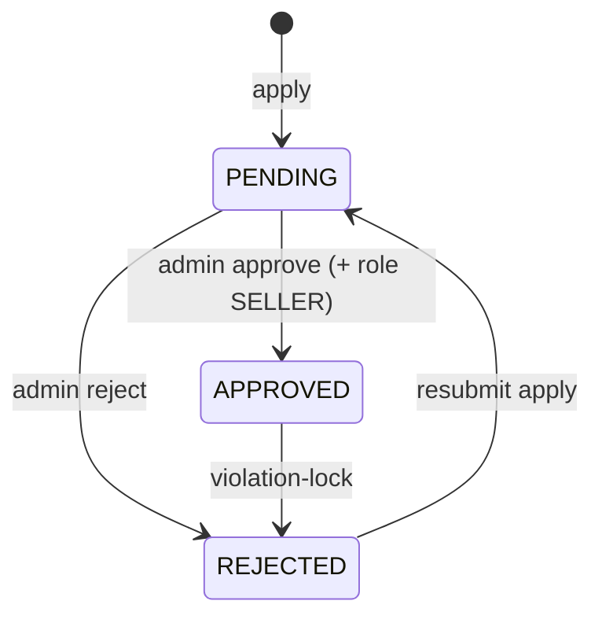
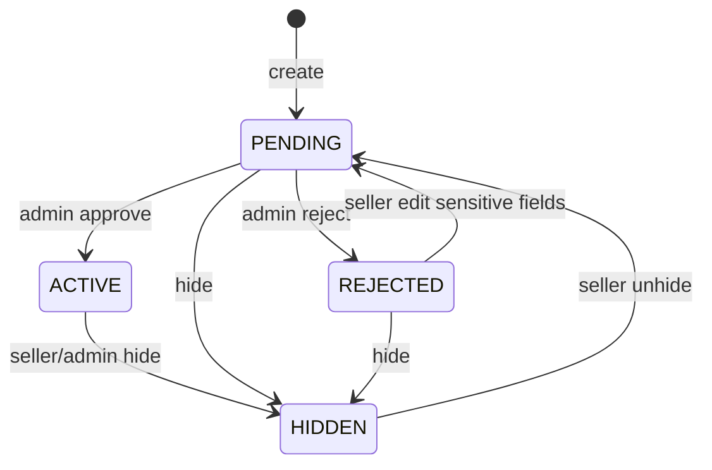

# MQ Backend — Frontend Integration Guide

Tài liệu API cho FE implement UI trên các module đã có trên BE.

- **Base URL:** `/api/v1`
- **Swagger:** `/docs`
- **Auth:** cookie `httpOnly` (ưu tiên) hoặc `Authorization: Bearer <access_token>`
- **Branch stack:** `001-user-account` → `002-shop-onboarding` → `003-product-listing`

---

## 1. Convention chung

### Success envelope

```json
{
  "statusCode": 200,
  "message": "…",
  "data": {},
  "meta": { "page": 1, "pageSize": 20, "total": 42, "totalPages": 3 }
}
```

| Field | Khi nào có |
|-------|------------|
| `data` | Luôn có (object / array / `null`) |
| `meta` | Chỉ list **có pagination** (đã flatten: `data` = mảng items) |

**Ngoại lệ:** `GET /categories` trả `data: { items: [...] }` (không paginate, không `meta`).

### Error envelope

```json
{
  "statusCode": 400,
  "message": "Human readable message",
  "data": { "code": "VALIDATION_ERROR" }
}
```

FE nên map UI theo `data.code`, không parse `message` cứng.

### Auth cookies

| Cookie | Mục đích |
|--------|----------|
| `access_token` | JWT short-lived (default ~15 phút) |
| `refresh_token` | JWT dài hạn, allowlist Redis; rotate one-time |

- Gửi request với `credentials: 'include'`
- CORS frontend origin phải khớp config BE
- Cookie set: `login`, `register/verify-otp`, `refresh`
- Cookie clear: `logout`, `forgot-password/reset`

### Pagination query

| Param | Default | Constraint |
|-------|---------|------------|
| `page` | `1` | ≥ 1 |
| `pageSize` | `20` | 1–100 |

### Roles (UI gate gợi ý)

| Role | UI chính |
|------|----------|
| `BUYER` | Tài khoản, apply mở shop |
| `SELLER` | Seller center: sản phẩm (cần shop `APPROVED` + không suspended) |
| `ADMIN` / `SUPER_ADMIN` | Admin: users, shops, products, categories |
| `ACCOUNTANT` | Xem list users (theo matrix) |

`roles` là **mảng** trên profile (user có thể vừa `BUYER` vừa `SELLER`).

---

## 2. Module Auth & User Account (`001`)

### 2.1 Màn hình Auth

| UI | Method | Path | Auth |
|----|--------|------|------|
| Đăng ký — gửi OTP | `POST` | `/auth/register` | Public |
| Đăng ký — verify OTP | `POST` | `/auth/register/verify-otp` | Public → set cookies |
| Đăng ký — resend OTP | `POST` | `/auth/register/resend-otp` | Public |
| Login | `POST` | `/auth/login` | Public → set cookies |
| Logout | `POST` | `/auth/logout` | JWT |
| Refresh session | `POST` | `/auth/refresh` | Cookie `refresh_token` |
| Quên MK — gửi OTP | `POST` | `/auth/forgot-password/request-otp` | Public |
| Quên MK — đặt lại | `POST` | `/auth/forgot-password/reset` | Public → clear cookies |

#### Bodies

```ts
// register
{ email: string; password: string /* min 8 */; fullName?: string }

// verify / resend OTP
{ email: string; otp: string /* 6 digits */ }  // resend: chỉ email

// login
{ email: string; password: string }

// forgot-password/reset
{ email: string; code: string /* 6 digits */; newPassword: string /* min 8 */ }
```

#### Response `data` (login / verify-otp / refresh)

```ts
{
  user: {
    id: string;
    email: string;
    fullName: string | null;
    avatarUrl: string | null;
    status: "ACTIVE" | "LOCKED" | "DELETED";
    roles: Array<"BUYER" | "SELLER" | "ADMIN" | ...>;
  }
}
```

#### Error codes FE cần handle

| Code | UI gợi ý |
|------|----------|
| `EMAIL_ALREADY_IN_USE` | Email đã tồn tại |
| `INVALID_OTP` | OTP sai / hết hạn |
| `REGISTRATION_NOT_FOUND` | Hết session đăng ký → quay lại form register |
| `INVALID_CREDENTIALS` | Sai email/password |
| `ACCOUNT_LOCKED` | Tài khoản bị khóa |
| `TOO_MANY_REQUESTS` | Rate limit OTP |
| `UNAUTHORIZED` | Session hết → gọi refresh hoặc login lại |

**Refresh flow gợi ý:** interceptor 401 → `POST /auth/refresh` (credentials) → retry 1 lần → fail thì redirect login.

> **Breaking:** `/auth/sign-in` / `/auth/sign-out` đã đổi thành `/auth/login` / `/auth/logout`.

---

### 2.2 Profile (`/users/me`)

| UI | Method | Path |
|----|--------|------|
| Xem profile | `GET` | `/users/me` |
| Sửa tên | `PATCH` | `/users/me` `{ fullName? }` |
| Đổi avatar | `POST` | `/users/me/avatar` multipart field **`avatar`** (≤5MB, JPEG/PNG/WebP/GIF) |
| Đổi email — gửi OTP | `POST` | `/users/me/email/request-otp` `{ newEmail }` |
| Đổi email — verify | `POST` | `/users/me/email/verify-otp` `{ email, otp }` |
| Đổi mật khẩu | `PATCH` | `/users/me/password` `{ currentPassword, newPassword }` |

- Avatar / profile / email-verify trả `data` = `UserProfile`
- Đổi password thành công → refresh tokens bị revoke → nên logout hoặc force re-login

| Code | UI |
|------|-----|
| `INVALID_AVATAR` / `AVATAR_TOO_LARGE` | File avatar không hợp lệ |
| `INCORRECT_PASSWORD` | Sai mật khẩu hiện tại |
| `EMAIL_ALREADY_IN_USE` | Email mới đã dùng |
| `INVALID_OTP` | OTP đổi email sai |

---

### 2.3 Admin Users

| UI | Method | Path | Permission |
|----|--------|------|------------|
| Danh sách user | `GET` | `/admin/users?page&pageSize&status?=ACTIVE\|LOCKED` | `VIEW_USERS` |
| Khóa | `POST` | `/admin/users/:userId/lock` | `DELETE_ACCOUNT` |
| Mở khóa | `POST` | `/admin/users/:userId/unlock` | `DELETE_ACCOUNT` |
| Xóa mềm | `DELETE` | `/admin/users/:userId` | `DELETE_ACCOUNT` |

List: `data: UserProfile[]` + `meta`.

---

### 2.4 Admin Audit logs

Audit **đổi hệ thống** được lưu file JSONL (`logs/audit/audit-YYYY-MM-DD.jsonl`), tách khỏi HTTP/dev log. Admin đọc qua API.

| UI | Method | Path | Permission |
|----|--------|------|------------|
| Danh sách audit | `GET` | `/admin/audit-logs` | `VIEW_AUDIT_LOG` |

Query: `?page&pageSize&action?&actorId?&outcome?&resourceType?&from?&to?`

| Param | Ý nghĩa |
|-------|---------|
| `action` | Substring match (vd `admin.shop`) |
| `actorId` | UUID người thực hiện |
| `outcome` | `success` \| `failure` \| `denied` |
| `resourceType` | vd `product`, `shop`, `user` |
| `from` / `to` | ISO date; mặc định cửa sổ retention (~30 ngày) |

#### Card (`data[]`)

```ts
{
  id: string;
  ts: string;                 // ISO
  level: "info" | "warn" | "error";
  action: string;             // technical code for filters, e.g. "admin.shop.approve"
  outcome: "success" | "failure" | "denied";
  title: string;              // e.g. "Shop approved"
  summary: string;            // e.g. "Admin approved a shop and granted Seller role"
  category: string;           // e.g. "Shops"
  outcomeLabel: string;       // "Succeeded" | "Failed" | "Denied"
  actor: { id: string | null; email: string | null };
  resource: { type: string | null; id: string | null };
  reason: string | null;
  meta?: Record<string, unknown>;
}
```

**FE display:** `title` + `outcomeLabel` + `actor.email` + `ts`; expand for `summary` / `reason`. Filter vẫn dùng `action`.
**Có trong file/API:** lock/unlock/delete user, đổi profile/email/password, shop apply/approve/reject/violation, product CRUD/hide/approve/reject, category create/update, logout, password-reset success.

**Không lưu file:** `auth.login`, `auth.refresh`, register/OTP, forgot-password request, mail notify failure.

Roles: ACCOUNTANT / ADMIN / SUPER_ADMIN (`VIEW_AUDIT_LOG`).

---

### 2.5 Notifications

| UI | Method | Path | Auth |
|----|--------|------|------|
| Inbox list + unreadCount | `GET` | `/notifications` | JWT |
| Mark one read | `POST` | `/notifications/:id/read` | JWT |
| Mark all read | `POST` | `/notifications/read-all` | JWT |
| Live events (open tab) | `GET` | `/notifications/stream` | Cookie JWT · SSE |

**List:** call on login / entering admin (or when opening the bell). Do **not** rely on SSE for history.

**SSE:** `EventSource(..., { withCredentials: true })` — new events only while connected. Toast + prepend to inbox.

Event / item shape:

```ts
{ id, userId?, title, body, readAt: string | null, createdAt }
```

**FE:**
- `GET /notifications` → panel history + badge `unreadCount`
- Mark-read via REST (optimistic UI, rollback on error)
- SSE supplements live updates only

Mail may still send in parallel for some actions.

---

## 3. Module Shop Onboarding (`002`)

### 3.1 Buyer — Apply shop

| UI | Method | Path | Gate |
|----|--------|------|------|
| Nộp / nộp lại hồ sơ | `POST` | `/shops/apply` | Role có `BUYER`; multipart |
| Xem shop của tôi | `GET` | `/shops/me` | JWT |
| Upload logo | `POST` | `/shops/me/logo` | `EDIT_SHOP`; shop `APPROVED`, not suspended; multipart field `logo` |
| Upload banner | `POST` | `/shops/me/banner` | `EDIT_SHOP`; shop `APPROVED`, not suspended; multipart field `banner` |

#### Multipart fields (`shops/apply`)

| Field | Constraint |
|-------|------------|
| `name` | 2–100 |
| `taxId` | 1–15 chữ số |
| `countryCode` | 2 chữ (vd `VN`) |
| `document` | file ≤5MB: JPEG/PNG/WebP/PDF |

#### Logo / banner upload (`/shops/me/logo`, `/shops/me/banner`)

| Field | Constraint |
|-------|------------|
| `logo` | ≤5MB JPEG/PNG/WebP/GIF → MinIO WebP (~512×512); replaces previous object |
| `banner` | ≤5MB JPEG/PNG/WebP/GIF → MinIO WebP (~1600×400); replaces previous object |

Response: `ShopView` (`logoUrl` / `bannerUrl` updated).

#### ShopView (`data`)

```ts
{
  id: string;
  ownerId: string;
  name: string;
  taxId: string;
  countryCode: string;
  documentUrl: string;
  logoUrl: string | null;
  bannerUrl: string | null;
  status: "PENDING" | "APPROVED" | "REJECTED";
  rejectionReason: string | null;
  violationFlag: boolean;
  isSuspended: boolean;
  contactAdminRequired: boolean; // === violationFlag
  createdAt: string;
  updatedAt: string;
}
```

#### UI state theo `status`



| Status | UI gợi ý |
|--------|----------|
| `PENDING` | “Đang chờ duyệt”, disable apply lại |
| `APPROVED` | Vào Seller center; check `isSuspended` |
| `REJECTED` | Hiện `rejectionReason`; cho apply lại (trừ khi `isSuspended`) |
| `violationFlag` / `contactAdminRequired` | Banner “Liên hệ admin” |

| Code | UI |
|------|-----|
| `SHOP_ALREADY_EXISTS` | Đã có shop (không phải REJECTED) |
| `SHOP_NAME_TAKEN` / `TAX_ID_TAKEN` | Trùng tên / MST |
| `INVALID_SHOP_DOCUMENT` / `SHOP_DOCUMENT_TOO_LARGE` | File sai |
| `FORBIDDEN` | Không phải BUYER |
| `SHOP_NOT_FOUND` | Chưa apply (`GET /shops/me`) |

---

### 3.2 Admin — Review shops

| UI | Method | Path | Permission |
|----|--------|------|------------|
| Queue | `GET` | `/admin/shops?page&pageSize&status?` | `APPROVE_SELLER` |
| Chi tiết | `GET` | `/admin/shops/:shopId` | `APPROVE_SELLER` |
| Duyệt | `POST` | `/admin/shops/:shopId/approve` | `APPROVE_SELLER` |
| Từ chối | `POST` | `/admin/shops/:shopId/reject` | `APPROVE_SELLER` body `{ reason }` (1–150) |
| Violation lock | `POST` | `/admin/shops/:shopId/violation-lock` | `SUSPEND_SHOP` body `{ reason? }` (≤150) |

| Code | UI |
|------|-----|
| `SHOP_NOT_PENDING` | Approve/reject khi không còn PENDING |
| `SHOP_NOT_APPROVED` | Violation-lock khi chưa APPROVED |

---

## 4. Module Product Listing (`003`)

### 4.1 Categories (catalog nền tảng — Admin định nghĩa)

| UI | Method | Path | Auth |
|----|--------|------|------|
| Dropdown / filter (chung Seller + Customer) | `GET` | `/categories` | Public |
| Tạo category | `POST` | `/admin/categories` | `MANAGE_CONTENT` |
| Sửa category | `PATCH` | `/admin/categories/:categoryId` | `MANAGE_CONTENT` |

Seller **không** tạo category — chỉ chọn `categoryId` từ `GET /categories`.

```ts
// GET /categories → data
{
  items: Array<{
    id: string;      // "cat-electronics"
    slug: string;
    name: string;
    nameVi: string;
    parentId: string | null;
  }>
}
```

Seed mặc định: `cat-electronics`, `cat-fashion`, `cat-home-living`, `cat-beauty`, `cat-toys`.

```ts
// POST /admin/categories
{ name: string; nameVi?: string; slug?: string; parentId?: string | null }

// PATCH
{ name?: string; nameVi?: string | null; parentId?: string | null }
```

---

### 4.2 Seller — Product CRUD

**Gate:** JWT + permission + role `SELLER` + shop `APPROVED` + `!isSuspended`.  
`shopId` **không** gửi từ FE — BE tự bind từ owner.

| UI | Method | Path | Permission |
|----|--------|------|------------|
| Tạo SP | `POST` | `/products` | `CREATE_PRODUCT` |
| List SP của shop | `GET` | `/products?page&pageSize&status?` | `VIEW_PROD_BKG` |
| Chi tiết | `GET` | `/products/:productId` | `VIEW_PROD_BKG` |
| Sửa | `PATCH` | `/products/:productId` | `EDIT_PRODUCT` |
| Ẩn | `POST` | `/products/:productId/hide` | `EDIT_PRODUCT` |
| Bỏ ẩn | `POST` | `/products/:productId/unhide` | `EDIT_PRODUCT` |

#### Create body

```ts
{
  title: string;           // 3–200
  description: string;
  categoryId: string;      // "cat-{slug}"
  price: number;           // ≥ 0, max 2 decimals
  stock?: number;          // ≥ 0, default 0
  images: string[];        // 1–10 URL
  attributes?: object;
  sku?: string;            // optional, unique trong shop
}
// KHÔNG có field brand
```

#### Update body (partial)

Cùng field như create; `sku` / `attributes` có thể `null`.  
`stock` đổi **không** đưa REJECTED về PENDING.

#### ProductView

```ts
{
  id: string;
  shopId: string;
  title: string;
  description: string;
  categoryId: string;
  price: number;
  stock: number;
  sku: string | null;
  images: string[];
  attributes: Record<string, unknown> | null;
  status: "PENDING" | "ACTIVE" | "REJECTED" | "HIDDEN";
  rejectionReason: string | null;
  createdAt: string;
  updatedAt: string;
}
```

#### Status & UI



| Status | UI Seller |
|--------|-----------|
| `PENDING` | Badge **Pending review** |
| `ACTIVE` | Đang bán / hiện listing |
| `REJECTED` | Hiện `rejectionReason`; sửa field nhạy cảm → submit lại (PENDING) |
| `HIDDEN` | Đã ẩn — nút **Unhide** → về PENDING (queue admin) |

**Sensitive fields** (REJECTED + đổi → PENDING):  
`title`, `description`, `categoryId`, `price`, `images`, `attributes`, `sku`

| Code | UI |
|------|-----|
| `SHOP_NOT_ELIGIBLE` | Shop chưa duyệt / bị khóa — redirect shop status |
| `CATEGORY_NOT_FOUND` | categoryId sai |
| `PRODUCT_SKU_TAKEN` | SKU trùng trong shop |
| `PRODUCT_NOT_FOUND` | Không thuộc shop / không tồn tại |
| `PRODUCT_NOT_HIDDEN` | Unhide khi status ≠ HIDDEN |

---

### 4.3 Admin — Product review

| UI | Method | Path | Permission |
|----|--------|------|------------|
| Queue | `GET` | `/admin/products?page&pageSize&status?` | `APPROVE_PRODUCT` |
| Duyệt | `POST` | `/admin/products/:productId/approve` | `APPROVE_PRODUCT` |
| Từ chối | `POST` | `/admin/products/:productId/reject` | `APPROVE_PRODUCT` `{ reason }` (1–500) |
| Ẩn | `POST` | `/admin/products/:productId/hide` | `APPROVE_PRODUCT` |

Approve/reject chỉ khi `PENDING` → lỗi `PRODUCT_NOT_PENDING`.  
Seller nhận mail + SSE notify.

---

### 4.4 Customer — Public listing

| UI | Method | Path | Auth |
|----|--------|------|------|
| Browse / search | `GET` | `/products/listing` | **Public** |

Query: `?q=&categoryId=&page=&pageSize=`

Chỉ trả product `ACTIVE` của shop `APPROVED` và `!isSuspended`.

#### Listing card (`data[]`)

```ts
{
  id: string;
  title: string;
  price: number;
  thumbnailUrl: string | null;
  stock: number;
  displayMode: "NORMAL" | "OUT_OF_STOCK_WATERMARK";
  watermarkText: null | { vi: string; zh: string; en: string };
}
```

| `stock` | FE render |
|---------|-----------|
| `> 0` | `NORMAL`, không watermark |
| `≤ 0` | `OUT_OF_STOCK_WATERMARK` + overlay text theo locale (`vi` / `zh` / `en`) |

BE không vẽ watermark — chỉ trả đủ data cho FE.

---

## 5. Checklist màn hình FE theo module

### Buyer / Guest

- [ ] Register + OTP
- [ ] Login / Logout / silent refresh
- [ ] Forgot password
- [ ] Profile + avatar + đổi email/password
- [ ] Apply shop + theo dõi `GET /shops/me`
- [ ] Listing public + filter category + search `q`
- [x] SSE toast (optional)

### Seller (sau shop APPROVED)

- [ ] Seller dashboard gate theo shop status / suspended
- [ ] Product list filter theo status
- [ ] Create / edit product (category dropdown từ `/categories`)
- [ ] Hide product
- [ ] UX REJECTED + `rejectionReason` + resubmit

### Admin

- [x] Users lock/unlock/delete
- [x] Shops queue approve/reject/violation-lock
- [x] Products queue approve/reject/hide
- [x] Categories create/update
- [x] Audit log viewer (`GET /admin/audit-logs`)
- [ ] SSE / mail side-effect: seller nhận notify (không bắt buộc admin UI)

---

## 6. Gợi ý client setup

```ts
const api = axios.create({
  baseURL: "http://localhost:3000/api/v1",
  withCredentials: true,
});

// Pagination response
type Page<T> = {
  statusCode: number;
  message: string;
  data: T[];
  meta: { page: number; pageSize: number; total: number; totalPages: number };
};

// Error
type ApiError = {
  statusCode: number;
  message: string;
  data: { code: string };
};
```

Multipart: dùng `FormData`, **không** set `Content-Type` thủ công (browser tự boundary).

---

## 7. Ngoài scope hiện tại (chưa có BE)

- Upload ảnh product multipart (hiện truyền URL)
- Product brand field (đã bỏ — shop = brand store)
- Inventory / SKU variant thật (`004`)
- Cart / order (`005`)
- Auto-delete / export CSV audit files (query đã giới hạn retention window)
