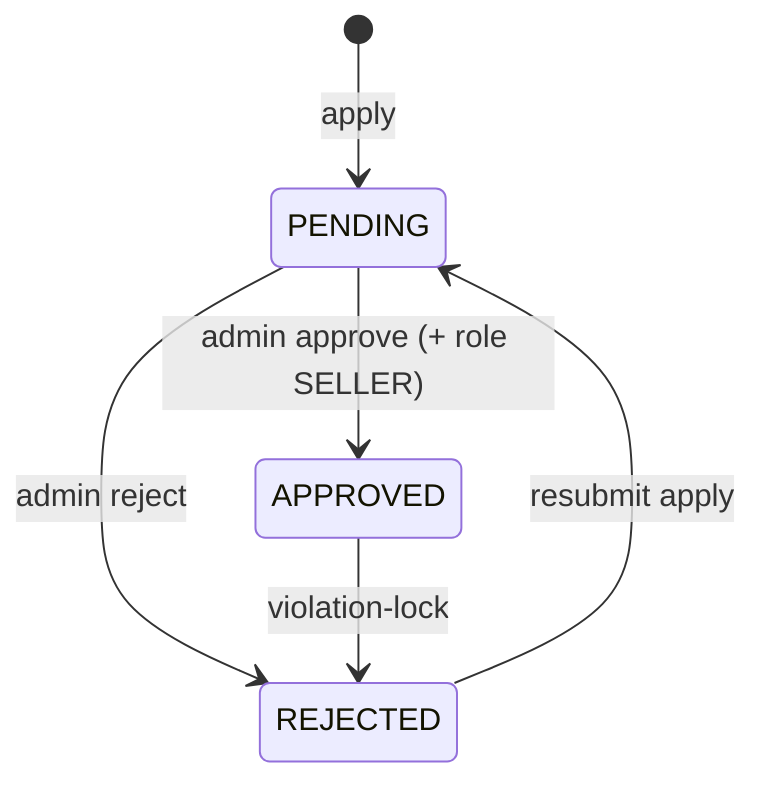
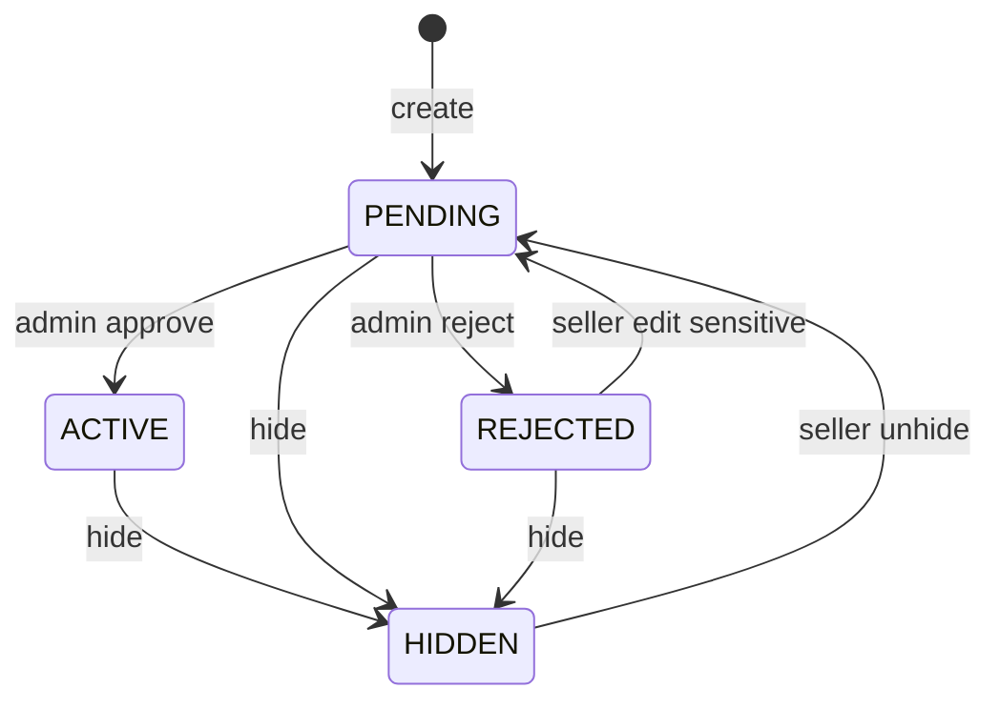

# MQ Backend — Frontend Integration Guide

Tài liệu API cho FE implement UI trên các module đã có trên BE.

- **Base URL:** `/api/v1`
- **Swagger:** `/docs`
- **Auth:** cookie `httpOnly` (ưu tiên) hoặc `Authorization: Bearer <access_token>`
- **Branch stack:** `001` → `002` → `003` → `004` → `005-order-flow` → `006-marketing` (`feat/009`) → `007-payment-finance` (`feat/010`) → **`011-mlm-wallet`** → **`012-commission-calculation`** → `022-seller-dashboard`
- **Module FE guides (chi tiết):**
  - Wallet / MLM network: `specs/009-mlm-wallet/contracts/fe-guide-mlm-wallet.md`
  - Commission: `specs/010-commission-calculation/contracts/fe-guide-commission.md`
  - Finance: `specs/007-payment-finance/contracts/fe-guide-payment-finance.md`

---

## 1. Convention chung

### Success envelope

```json
{
  "statusCode": 200,
  "message": "…",
  "data": {},
  "meta": { "page": 1, "pageSize": 20, "total": 42, "totalPages": 3 }
}
```

| Field | Khi nào có |
|-------|------------|
| `data` | Luôn có (object / array / `null`) |
| `meta` | Chỉ list **có pagination** (đã flatten: `data` = mảng items) |

**Ngoại lệ:** `GET /categories` trả `data: { items: [...] }` (không paginate, không `meta`).

### Error envelope

```json
{
  "statusCode": 400,
  "message": "Human readable message",
  "data": { "code": "VALIDATION_ERROR" }
}
```

FE nên map UI theo `data.code`, không parse `message` cứng.

### Auth cookies

| Cookie | Mục đích |
|--------|----------|
| `access_token` | JWT short-lived (default ~15 phút) |
| `refresh_token` | JWT dài hạn, allowlist Redis; rotate one-time |

- Gửi request với `credentials: 'include'`
- CORS frontend origin phải khớp config BE
- Cookie set: `login`, `register/verify-otp`, `refresh`
- Cookie clear: `logout`, `forgot-password/reset`

### Pagination query

| Param | Default | Constraint |
|-------|---------|------------|
| `page` | `1` | ≥ 1 |
| `pageSize` | `20` | 1–100 |

### Roles (UI gate gợi ý)

| Role | UI chính |
|------|----------|
| `BUYER` | Tài khoản, apply mở shop, **ví / P2P / withdraw / MLM tree** |
| `SELLER` | Seller center: sản phẩm + kho + KM + media download + settlements/TX (+ ví MLM như buyer) |
| `ADMIN` / `SUPER_ADMIN` | Admin: users, shops, products, categories, inventory, **promotions / banners / media**, **seller payouts**, **wallet payouts approve** |
| `SUPER_ADMIN` | Submit **finance config** (`CONFIG_FEE` ALL); **CONFIG_MLM** set rank |
| `ACCOUNTANT` | Approve finance config + create/approve **seller payouts** + reports + **approve/process wallet withdraw** |
| `WAREHOUSE` | Staff kho (permission inventory; không có shop owner) |
| `CS` | CS + calc landing cost / xem media |

`roles` là **mảng** trên profile (user có thể vừa `BUYER` vừa `SELLER`).

---

## 2. Module Auth & User Account (`001`)

### 2.1 Màn hình Auth

| UI | Method | Path | Auth |
|----|--------|------|------|
| Đăng ký — gửi OTP | `POST` | `/auth/register` | Public |
| Đăng ký — verify OTP | `POST` | `/auth/register/verify-otp` | Public → set cookies |
| Đăng ký — resend OTP | `POST` | `/auth/register/resend-otp` | Public |
| Login | `POST` | `/auth/login` | Public → set cookies |
| Logout | `POST` | `/auth/logout` | JWT |
| Refresh session | `POST` | `/auth/refresh` | Cookie `refresh_token` |
| Quên MK — gửi OTP | `POST` | `/auth/forgot-password/request-otp` | Public |
| Quên MK — đặt lại | `POST` | `/auth/forgot-password/reset` | Public → clear cookies |

#### Bodies

```ts
// register
{ email: string; password: string /* min 8 */; fullName?: string }

// verify / resend OTP
{ email: string; otp: string /* 6 digits */ }  // resend: chỉ email

// login
{ email: string; password: string }

// forgot-password/reset
{ email: string; code: string /* 6 digits */; newPassword: string /* min 8 */ }
```

#### Response `data` (login / verify-otp / refresh)

```ts
{
  user: {
    id: string;
    email: string;
    fullName: string | null;
    avatarUrl: string | null;
    status: "ACTIVE" | "LOCKED" | "DELETED";
    roles: Array<"BUYER" | "SELLER" | "ADMIN" | ...>;
  }
}
```

#### Error codes FE cần handle

| Code | UI gợi ý |
|------|----------|
| `EMAIL_ALREADY_IN_USE` | Email đã tồn tại |
| `INVALID_OTP` | OTP sai / hết hạn |
| `REGISTRATION_NOT_FOUND` | Hết session đăng ký → quay lại form register |
| `INVALID_CREDENTIALS` | Sai email/password |
| `ACCOUNT_LOCKED` | Tài khoản bị khóa |
| `TOO_MANY_REQUESTS` | Rate limit OTP |
| `UNAUTHORIZED` | Session hết → gọi refresh hoặc login lại |

**Refresh flow gợi ý:** interceptor 401 → `POST /auth/refresh` (credentials) → retry 1 lần → fail thì redirect login.

> **Breaking:** `/auth/sign-in` / `/auth/sign-out` đã đổi thành `/auth/login` / `/auth/logout`.

---

### 2.2 Profile (`/users/me`)

| UI | Method | Path |
|----|--------|------|
| Xem profile | `GET` | `/users/me` |
| Sửa tên | `PATCH` | `/users/me` `{ fullName? }` |
| Đổi avatar | `POST` | `/users/me/avatar` multipart field **`avatar`** (≤5MB, JPEG/PNG/WebP/GIF) |
| Đổi email — gửi OTP | `POST` | `/users/me/email/request-otp` `{ newEmail }` |
| Đổi email — verify | `POST` | `/users/me/email/verify-otp` `{ email, otp }` |
| Đổi mật khẩu | `PATCH` | `/users/me/password` `{ currentPassword, newPassword }` |

- Avatar / profile / email-verify trả `data` = `UserProfile`
- Đổi password thành công → refresh tokens bị revoke → nên logout hoặc force re-login

| Code | UI |
|------|-----|
| `INVALID_AVATAR` / `AVATAR_TOO_LARGE` | File avatar không hợp lệ |
| `INCORRECT_PASSWORD` | Sai mật khẩu hiện tại |
| `EMAIL_ALREADY_IN_USE` | Email mới đã dùng |
| `INVALID_OTP` | OTP đổi email sai |

---

### 2.3 Admin Users

| UI | Method | Path | Permission |
|----|--------|------|------------|
| Danh sách user | `GET` | `/admin/users?page&pageSize&status?=ACTIVE\|LOCKED` | `VIEW_USERS` |
| Khóa | `POST` | `/admin/users/:userId/lock` | `DELETE_ACCOUNT` |
| Mở khóa | `POST` | `/admin/users/:userId/unlock` | `DELETE_ACCOUNT` |
| Xóa mềm | `DELETE` | `/admin/users/:userId` | `DELETE_ACCOUNT` |

List: `data: UserProfile[]` + `meta`.

---

### 2.4 Admin Audit logs

Audit **đổi hệ thống** lưu file JSONL (`logs/audit/audit-YYYY-MM-DD.jsonl`), tách khỏi HTTP/dev log.  
Admin đọc qua API — response đã có **English title/summary** sẵn, FE không cần map `action` code.

| UI | Method | Path | Permission |
|----|--------|------|------------|
| Audit activity list | `GET` | `/admin/audit-logs` | `VIEW_AUDIT_LOG` |

Auth: JWT cookie (login admin / accountant / superadmin).  
Roles có quyền: `ACCOUNTANT`, `ADMIN`, `SUPER_ADMIN`.

#### Query

| Param | Ý nghĩa |
|-------|---------|
| `page` / `pageSize` | Pagination (default 1 / 20) |
| `action` | Substring match trên code (vd `admin.shop`) |
| `actorId` | UUID người thực hiện |
| `outcome` | `success` \| `failure` \| `denied` |
| `resourceType` | vd `product`, `shop`, `user` |
| `from` / `to` | ISO date; mặc định ~30 ngày gần nhất |

#### Response item (`data[]`)

```ts
{
  id: string;
  ts: string;                 // ISO — FE format: "21 Jul 2026, 12:05"
  level: "info" | "warn" | "error";
  action: string;             // machine code — dùng filter, không hiện primary
  title: string;              // English headline — PRIMARY list text
  summary: string;            // English one-line explanation
  category: string;           // Account | Users | Shops | Products | Catalog | Other
  outcome: "success" | "failure" | "denied";
  outcomeLabel: string;       // Succeeded | Failed | Denied
  actor: { id: string | null; email: string | null };
  resource: { type: string | null; id: string | null };
  reason: string | null;      // reject / lock reason — show when present
  meta?: Record<string, unknown>;
}
```

Envelope list: `data: AuditLogView[]` + `meta: { page, pageSize, total, totalPages }`.

#### Example

```json
{
  "statusCode": 200,
  "message": "Audit logs retrieved successfully",
  "data": [
    {
      "id": "…",
      "ts": "2026-07-21T05:10:00.000Z",
      "level": "info",
      "action": "admin.shop.approve",
      "title": "Shop approved",
      "summary": "Admin approved a shop and granted Seller role",
      "category": "Shops",
      "outcome": "success",
      "outcomeLabel": "Succeeded",
      "actor": { "id": "…", "email": "admin@example.com" },
      "resource": { "type": "shop", "id": "…" },
      "reason": null
    }
  ],
  "meta": { "page": 1, "pageSize": 20, "total": 1, "totalPages": 1 }
}
```

#### UI implement (FE)

1. **List row (đủ đọc):**  
   `[category badge]` **`title`** · `outcomeLabel` · `actor.email` · formatted `ts`
2. **Expand / detail:** `summary` + `reason` (nếu có) + optional `resource.type` / `resource.id`
3. **Badge màu `outcomeLabel`:** Succeeded = green, Failed = red, Denied = amber
4. **Filters:** `outcome`, `action` (substring), date `from`/`to`; optional client filter theo `category`
5. **Không** hiện raw `action` làm title — chỉ dùng cho debug / filter query

#### Title map (English, BE đã trả sẵn)

| `action` | `title` |
|----------|---------|
| `admin.shop.approve` | Shop approved |
| `admin.shop.reject` | Shop rejected |
| `admin.shop.violation_lock` | Shop suspended |
| `admin.product.approve` | Product approved |
| `admin.product.reject` | Product rejected |
| `admin.product.hide` | Product hidden by admin |
| `product.create` / `update` / `hide` / `unhide` | Product created / updated / hidden / unhidden by seller |
| `product.images.upload` | Product images uploaded |
| `product.variant.create` | Product variant added by seller |
| `product.variant.images.upload` | Variant images uploaded |
| `inventory.warehouse.create` | Warehouse created |
| `inventory.variant.create` | Inventory variant created |
| `inventory.slip.create` / `approve` / `reject` | Inventory slip created / approved / rejected |
| `admin.inventory.slip.approve` / `reject` | Admin approved / rejected inventory slip |
| `admin.user.lock` / `unlock` / `delete` | Account locked / unlocked / deleted |
| `admin.category.create` / `update` | Category created / updated |
| `shop.apply` | Shop application submitted |
| `user.password.change` | Password changed |
| `auth.logout` | Signed out |

Unknown actions: BE fallback humanize (`custom.thing_done` → readable title) + `category: "Other"`.

**Có trong API:** lock/unlock/delete user, profile/email/password, shop apply/approve/reject/violation, product+variant CRUD/images, inventory warehouses/slips/ledger, category create/update, logout, password-reset success.

**Không có:** login/refresh/register OTP noise, mail notify failures.

---

### 2.5 Notifications

| UI | Method | Path | Ghi chú |
|----|--------|------|---------|
| List + badge | `GET` | `/notifications` | Lịch sử gần đây (tối đa 50) + `unreadCount` |
| Đánh dấu 1 đã đọc | `POST` | `/notifications/:id/read` | |
| Đánh dấu tất cả đã đọc | `POST` | `/notifications/read-all` | |
| Realtime | `GET` (SSE) | `/notifications/stream` | **Không** replay lịch sử |

`GET /notifications` response `data`:

```ts
{
  items: Array<{ id, userId, title, body, readAt, createdAt }>,
  unreadCount: number
}
```

SSE event payload (khi có noti **mới** trong lúc đang connect):

```ts
{ id, userId, title, body, readAt, createdAt }
```

**FE gợi ý:** login → `GET /notifications` (badge + list) → mở `EventSource` `/notifications/stream` (with credentials) để toast realtime.

Shop apply gửi noti tới user `ACTIVE` có role `ADMIN` hoặc `SUPER_ADMIN`.

---

## 3. Module Shop Onboarding (`002`)

### 3.1 Buyer — Apply shop

| UI | Method | Path | Gate |
|----|--------|------|------|
| Nộp / nộp lại hồ sơ | `POST` | `/shops/apply` | Role có `BUYER`; multipart |
| Xem shop của tôi | `GET` | `/shops/me` | JWT |
| Upload logo | `POST` | `/shops/me/logo` | `EDIT_SHOP`; multipart field `logo` |
| Upload banner | `POST` | `/shops/me/banner` | `EDIT_SHOP`; multipart field `banner` |

#### Multipart fields (`shops/apply`)

| Field | Constraint |
|-------|------------|
| `name` | 2–100 |
| `taxId` | 1–15 chữ số |
| `countryCode` | 2 chữ (vd `VN`) |
| `document` | file ≤5MB: JPEG/PNG/WebP/PDF |

#### Logo / banner (`shops/me/logo`, `shops/me/banner`)

| | |
|--|--|
| Điều kiện | Shop `APPROVED`, không suspended, role `SELLER` |
| Format | JPEG/PNG/WebP/GIF → lưu MinIO **WebP** |
| Size | ≤5MB |
| Logo | Crop vuông ~512×512 (`cover`) |
| Banner | Crop ~1600×400 (`cover`) |
| Response | `ShopView` (cập nhật `logoUrl` / `bannerUrl`); object cũ bị xoá |

Field name: `logo` / `banner` (một file mỗi request).

#### ShopView (`data`)

```ts
{
  id: string;
  ownerId: string;
  name: string;
  taxId: string;
  countryCode: string;
  documentUrl: string;
  logoUrl: string | null;
  bannerUrl: string | null;
  status: "PENDING" | "APPROVED" | "REJECTED";
  rejectionReason: string | null;
  violationFlag: boolean;
  isSuspended: boolean;
  contactAdminRequired: boolean; // === violationFlag
  createdAt: string;
  updatedAt: string;
}
```

#### UI state theo `status`



| Status | UI gợi ý |
|--------|----------|
| `PENDING` | “Đang chờ duyệt”, disable apply lại |
| `APPROVED` | Vào Seller center; check `isSuspended` |
| `REJECTED` | Hiện `rejectionReason`; cho apply lại (trừ khi `isSuspended`) |
| `violationFlag` / `contactAdminRequired` | Banner “Liên hệ admin” |

| Code | UI |
|------|-----|
| `SHOP_ALREADY_EXISTS` | Đã có shop (không phải REJECTED) |
| `SHOP_NAME_TAKEN` / `TAX_ID_TAKEN` | Trùng tên / MST |
| `INVALID_SHOP_DOCUMENT` / `SHOP_DOCUMENT_TOO_LARGE` | File sai |
| `FORBIDDEN` | Không phải BUYER |
| `SHOP_NOT_FOUND` | Chưa apply (`GET /shops/me`) |

---

### 3.2 Admin — Review shops

| UI | Method | Path | Permission |
|----|--------|------|------------|
| Queue | `GET` | `/admin/shops?page&pageSize&status?` | `APPROVE_SELLER` |
| Chi tiết | `GET` | `/admin/shops/:shopId` | `APPROVE_SELLER` |
| Duyệt | `POST` | `/admin/shops/:shopId/approve` | `APPROVE_SELLER` |
| Từ chối | `POST` | `/admin/shops/:shopId/reject` | `APPROVE_SELLER` body `{ reason }` (1–150) |
| Violation lock | `POST` | `/admin/shops/:shopId/violation-lock` | `SUSPEND_SHOP` body `{ reason? }` (≤150) |

| Code | UI |
|------|-----|
| `SHOP_NOT_PENDING` | Approve/reject khi không còn PENDING |
| `SHOP_NOT_APPROVED` | Violation-lock khi chưa APPROVED |

---

## 4. Module Product Listing (`003`) — Product ↔ Variant redesign

### FE rename map (bắt buộc sửa type / form)

| Cũ (FE đang có) | Mới |
|-----------------|-----|
| `variant.price` | `variant.sellingPrice` |
| `variant.unitPrice` | `variant.costPrice` |
| Create/update variant body `price` | `sellingPrice` |
| Inventory create variant `unitPrice` | `costPrice` |
| Slip body flat `{ sku, quantity, unitCost }` | `{ type, items:[{ sku, quantity, unitCost? }] }` + response `code`, `items[]` |

**Product list/PDP card** vẫn có `price` / `minPrice` / `maxPrice` — đó là **derived** từ `min/max(sellingPrice)`, không phải cột DB, không editable.


> **Breaking (FE phải sửa):**
> - 1 Product = N Variants; **giá bán = `variant.sellingPrice`**; **tồn = `variant.availableStock`**
> - Product **không còn** `price` / `stock` / `sku`
> - Create bắt buộc `variants: [{ sku, sellingPrice, options? }, …]` (min 1)
> - Ảnh **không** gửi URL trong JSON create — upload multipart sau create (giống avatar)
> - Listing `price` = min variant; `stock` = sum variant; thêm `minPrice` / `maxPrice`
> - Public PDP: `GET /products/listing/:productId`

### Mental model

```
Product (title, description, category, images[], status, attributes)
  └── Variant[] (sku, sellingPrice, options?, images[], availableStock)
```

- SP đơn giản (không options UI): vẫn tạo **1 default variant** với `sku` + `sellingPrice`
- Ảnh variant trống → FE fallback `product.images`
- Checkout / PDP: dùng **selected `variant.sellingPrice`**, không dùng product-level `price`

---

### 4.1 Categories (giữ nguyên)

| UI | Method | Path | Auth |
|----|--------|------|------|
| Dropdown / filter | `GET` | `/categories` | Public |
| Tạo category | `POST` | `/admin/categories` | `MANAGE_CONTENT` |
| Sửa category | `PATCH` | `/admin/categories/:categoryId` | `MANAGE_CONTENT` |

```ts
// GET /categories → data
{ items: Array<{ id: string; slug: string; name: string; nameVi: string; parentId: string | null }> }
```

Seed: `cat-electronics`, `cat-fashion`, `cat-home-living`, `cat-beauty`, `cat-toys`.

---

### 4.2 Seller — Product + variants + images

**Gate:** JWT + permission + role `SELLER` + shop `APPROVED` + `!isSuspended`.  
`shopId` **không** gửi từ FE.

| UI | Method | Path | Permission |
|----|--------|------|------------|
| Tạo SP + variants | `POST` | `/products` | `CREATE_PRODUCT` |
| List SP | `GET` | `/products?page&pageSize&status?` | `VIEW_PROD_BKG` |
| Chi tiết | `GET` | `/products/:productId` | `VIEW_PROD_BKG` |
| Sửa metadata | `PATCH` | `/products/:productId` | `EDIT_PRODUCT` |
| Ẩn | `POST` | `/products/:productId/hide` | `EDIT_PRODUCT` |
| Bỏ ẩn → PENDING | `POST` | `/products/:productId/unhide` | `EDIT_PRODUCT` |
| Thêm variant | `POST` | `/products/:productId/variants` | `EDIT_PRODUCT` |
| Sửa variant (giá/options) | `PATCH` | `/products/:productId/variants/:variantId` | `EDIT_PRODUCT` |
| Upload gallery SP | `POST` | `/products/:productId/images` | `EDIT_PRODUCT` multipart |
| Xóa ảnh SP | `DELETE` | `/products/:productId/images` | `EDIT_PRODUCT` `{ urls }` |
| Upload ảnh variant | `POST` | `/products/:productId/variants/:variantId/images` | `EDIT_PRODUCT` multipart |
| Xóa ảnh variant | `DELETE` | `/products/:productId/variants/:variantId/images` | `EDIT_PRODUCT` `{ urls }` |

**Pagination list:** envelope flatten — `data: ProductView[]` + `meta`.

#### Flow tạo SP (khuyến nghị)

```
1. POST /products
   { title, description, categoryId, attributes?, variants: [{ sku, sellingPrice, options? }, ...] }
   → status PENDING, images=[], stock variants = 0

2. POST /products/:productId/images   (multipart field "images")
   → append gallery URLs

3. (optional) POST /products/:id/variants/:variantId/images
```

**Không còn** `POST /products/images` (upload trước rồi nhét URL vào create).

#### Create body

```ts
{
  title: string;              // 3–200
  description: string;
  categoryId: string;         // "cat-{slug}"
  attributes?: object;
  variants: Array<{           // min 1
    sku: string;              // unique trong shop
    sellingPrice: number;     // giá bán ≥ 0
    options?: Record<string, string>;  // vd { size: "M", color: "black" }
  }>;
}
// KHÔNG gửi: price, stock, sku, images ở root product
```

#### Update product body (partial — metadata only)

```ts
{
  title?: string;
  description?: string;
  categoryId?: string;
  attributes?: object | null;
}
// KHÔNG gửi: price, stock, images, variants
```

#### Add / update variant

```ts
// POST /products/:productId/variants
{ sku: string; sellingPrice: number; options?: Record<string, string> }

// PATCH /products/:productId/variants/:variantId
{ sellingPrice?: number; options?: Record<string, string> | null }
```

Tồn kho **không** sửa ở đây — dùng inventory slips (module `004` bên dưới).

#### Images (avatar-style multipart)

| | |
|--|--|
| Field | **`images`** (1–10 files) |
| Max / file | 5MB |
| Types | JPEG/PNG/WebP/GIF → WebP |
| Path | `products/{shopId}/{uuid}.webp` |

```ts
const fd = new FormData();
files.forEach((f) => fd.append("images", f));
await api.post(`/products/${productId}/images`, fd);
// DELETE
await api.delete(`/products/${productId}/images`, { data: { urls: string[] } });
```

| Code | UI |
|------|-----|
| `INVALID_PRODUCT_IMAGE` | File không hợp lệ / thiếu file |
| `PRODUCT_IMAGE_TOO_LARGE` | > 5MB |
| `FILE_TOO_LARGE` | Multer reject |

#### ProductView / VariantView (seller & admin)

```ts
type ProductVariantView = {
  id: string;
  productId: string;
  shopId: string;
  sku: string;
  sellingPrice: number;          // sell price SoT
  availableStock: number;
  options: Record<string, string> | null;
  images: string[];
  costPrice: number | null;        // giá nhập hiện tại trên SKU
  isEnrollmentPackage: boolean;
  createdAt: string;
  updatedAt: string;
};

type ProductView = {
  id: string;
  shopId: string;
  title: string;
  description: string;
  categoryId: string;
  price: number;                 // derived = minPrice
  minPrice: number;
  maxPrice: number;
  stock: number;                 // derived = sum(availableStock)
  images: string[];
  attributes: Record<string, unknown> | null;
  status: "PENDING" | "ACTIVE" | "REJECTED" | "HIDDEN";
  rejectionReason: string | null;
  variants: ProductVariantView[];
  createdAt: string;
  updatedAt: string;
};
```

**Lưu ý nhanh cho FE**

| Việc | Đúng | Sai |
|------|------|-----|
| Sửa **giá bán** | `PATCH /products/:id/variants/:variantId` `{ sellingPrice }` | `PATCH /products/:id` với `price` (field đã bỏ) |
| Sửa **tồn kho** | Inventory slip `POST /inventory/slips` rồi approve | Đổi `stock` / `availableStock` trên product PATCH |
| Hiện giá trên list | Dùng `price` (= min) hoặc `minPrice`–`maxPrice` | Coi `product.price` là SoT checkout |
| Checkout / chọn SKU | Dùng `variant.id` + `variant.sellingPrice` | Dùng product-level `price` |
| Ảnh theo màu/size | `variant.images` nếu có, không thì `product.images` | Bắt buộc mọi variant có ảnh |
| `costPrice` | Chỉ seller/admin (giá nhập trên SKU) | Hiện cho khách trên PDP |
| Nhập hàng có giá | Slip `items[].unitCost` (per unit) | Chỉ ghi `costPrice` trên variant mà không qua slip |
| Public PDP | Type riêng — **không** có `costPrice`, `status`, `rejectionReason` | Reuse nguyên `ProductView` seller |

`product.price` / `product.stock` trên response là **derived** (min giá / tổng tồn) — tiện UI list, không phải field editable.

#### Status & UI



| Status | UI Seller |
|--------|-----------|
| `PENDING` | Chờ duyệt |
| `ACTIVE` | Đang bán |
| `REJECTED` | Hiện `rejectionReason`; sửa field nhạy cảm → PENDING |
| `HIDDEN` | Nút Unhide → `PENDING` |

**Sensitive → REJECTED về PENDING:**  
product: `title`, `description`, `categoryId`, `attributes`, **images**  
variant: **`sellingPrice`**

| Code | UI |
|------|-----|
| `SHOP_NOT_ELIGIBLE` | Shop chưa duyệt / suspended |
| `CATEGORY_NOT_FOUND` | categoryId sai |
| `VARIANT_SKU_TAKEN` | SKU trùng trong shop |
| `VARIANT_NOT_FOUND` | Variant không thuộc product/shop |
| `PRODUCT_NOT_FOUND` | Không thuộc shop / không tồn tại |
| `PRODUCT_NOT_HIDDEN` | Unhide khi chưa HIDDEN |

---

### 4.3 Admin — Product review

| UI | Method | Path | Permission |
|----|--------|------|------------|
| Queue | `GET` | `/admin/products?page&pageSize&status?` | `APPROVE_PRODUCT` |
| Duyệt | `POST` | `/admin/products/:productId/approve` | `APPROVE_PRODUCT` |
| Từ chối | `POST` | `/admin/products/:productId/reject` | `APPROVE_PRODUCT` `{ reason }` (1–500) |
| Ẩn | `POST` | `/admin/products/:productId/hide` | `APPROVE_PRODUCT` (không body reason) |

List trả `ProductView` (đã kèm `variants`). Approve/reject chỉ `PENDING` → `PRODUCT_NOT_PENDING`.

---

### 4.4 Customer — Listing + PDP

| UI | Method | Path | Auth |
|----|--------|------|------|
| Browse / search | `GET` | `/products/listing?q&categoryId&page&pageSize` | Public |
| **Product detail (PDP)** | `GET` | `/products/listing/:productId` | Public |

Chỉ `ACTIVE` + shop `APPROVED` + `!isSuspended`. Không public → `404 PRODUCT_NOT_FOUND`.

#### Listing card

```ts
{
  id: string;
  title: string;
  price: number;          // = minPrice
  minPrice: number;
  maxPrice: number;
  thumbnailUrl: string | null;
  stock: number;          // sum variants
  displayMode: "NORMAL" | "OUT_OF_STOCK_WATERMARK";
  watermarkText: null | { vi: string; zh: string; en: string };
}
```

| `stock` | FE |
|---------|-----|
| `> 0` | `NORMAL` |
| `≤ 0` | watermark theo locale |

Nếu `minPrice !== maxPrice` → hiện range / “Từ {minPrice}”.

#### PDP (`GET /products/listing/:productId`)

```ts
{
  id: string;
  shopId: string;
  title: string;
  description: string;
  categoryId: string;
  price: number;
  minPrice: number;
  maxPrice: number;
  stock: number;
  images: string[];
  attributes: Record<string, unknown> | null;
  variants: Array<{
    id: string;
    productId: string;
    sku: string;
    sellingPrice: number;
    availableStock: number;
    options: Record<string, string> | null;
    images: string[];
    isEnrollmentPackage: boolean;
  }>;
  displayMode: "NORMAL" | "OUT_OF_STOCK_WATERMARK";
  watermarkText: null | { vi: string; zh: string; en: string };
  createdAt: string;
  updatedAt: string;
}
```

**PDP rules:**

1. User chọn variant → hiện `variant.sellingPrice` + `availableStock`
2. Ảnh: `variant.images.length ? variant.images : product.images`
3. Checkout dùng `variant.id` / `variant.sellingPrice`
4. Public **không** có `costPrice`, `status`, `rejectionReason`

---

## 5. Module Warehouse Inventory (`004`)

Stock SoT = `variant.availableStock` — **chỉ đổi khi slip được APPROVE**.

### 5.1 Seller inventory APIs

| UI | Method | Path | Permission |
|----|--------|------|------------|
| Tạo kho | `POST` | `/inventory/warehouses` | `ADD_INVENTORY` `{ code, address? }` |
| List kho | `GET` | `/inventory/warehouses` | `VIEW_INVENTORY` |
| Tạo variant (alt) | `POST` | `/inventory/variants` | `ADD_INVENTORY` |
| List variants | `GET` | `/inventory/variants?q&productId&page&pageSize` | `VIEW_INVENTORY` |
| Tạo phiếu | `POST` | `/inventory/slips` | `ADD_INVENTORY` |
| List phiếu | `GET` | `/inventory/slips?status&page&pageSize` | `VIEW_INVENTORY` |
| Chi tiết phiếu | `GET` | `/inventory/slips/:slipId` | `VIEW_INVENTORY` |
| Duyệt phiếu | `POST` | `/inventory/slips/:slipId/approve` | `EDIT_INVENTORY` |
| Từ chối phiếu | `POST` | `/inventory/slips/:slipId/reject` | `EDIT_INVENTORY` |
| Sổ cái | `GET` | `/inventory/ledger?sku&from&to&page&pageSize` | `VIEW_INVENTORY` |

#### Create variant (inventory shortcut)

```ts
{
  productId: string;   // bắt buộc — thuộc shop
  sku: string;
  sellingPrice: number; // sell price bắt buộc
  options?: Record<string, string>;
  costPrice?: number | null;    // giá nhập trên SKU
  isEnrollmentPackage?: boolean;
}
// availableStock luôn bắt đầu 0 — nhập hàng bằng slip
```

> Ưu tiên tạo variant cùng product form (`POST /products` / `POST /products/:id/variants`).

#### Create slip

```ts
{
  type: "IN" | "ADJUST_IN" | "ADJUST_OUT";  // áp dụng cả phiếu
  warehouseCode?: string;
  locationNote?: string;
  items: Array<{
    sku: string;                 // phải tồn tại trong shop
    quantity: number;            // ≥ 1
    unitCost?: number | null;    // giá nhập / unit của dòng (thường dùng cho IN)
  }>; // min 1, không trùng SKU
}
```

> Header: `code` (auto `PN-YYYYMMDD-XXXX`), `createdByUserId`, `type`, `status`, kho/ghi chú.  
> `unitCost` trên **từng item**. Approve **all-or-nothing**; mỗi item → 1 dòng `stock_ledger` (`slipItemId`). Khi approve `IN` / `ADJUST_IN` có `unitCost`, BE cập nhật `variant.costPrice` theo dòng.


```
PENDING ──approve──► APPROVED  (stock ± tất cả items + N ledger rows)
PENDING ──reject───► REJECTED  (stock không đổi)
```

| Code | UI |
|------|-----|
| `WAREHOUSE_CODE_TAKEN` | Trùng mã kho |
| `WAREHOUSE_NOT_FOUND` | warehouseCode sai |
| `VARIANT_NOT_FOUND` | SKU chưa có |
| `VARIANT_SKU_TAKEN` | Trùng SKU |
| `INVENTORY_SLIP_DUPLICATE_SKU` | Trùng SKU trong `items` |
| `INVENTORY_SLIP_ALREADY_PROCESSED` | Approve/reject lại |
| `INSUFFICIENT_STOCK` | ADJUST_OUT vượt tồn (rollback cả phiếu) |
| `SHOP_NOT_ELIGIBLE` | Shop không đủ điều kiện |

### 5.2 Admin inventory

| UI | Method | Path | Permission |
|----|--------|------|------------|
| Inbox slips | `GET` | `/admin/inventory/slips?status&page&pageSize` | `VIEW_INVENTORY` |
| Chi tiết | `GET` | `/admin/inventory/slips/:slipId` | `VIEW_INVENTORY` |
| Approve | `POST` | `/admin/inventory/slips/:slipId/approve` | `EDIT_INVENTORY` |
| Reject | `POST` | `/admin/inventory/slips/:slipId/reject` | `EDIT_INVENTORY` |

### 5.2b Admin gán NV shop (`MANAGE_STAFF` / `ASSIGN_ROLES`)

Admin **sàn** (không phải seller) tạo/gán NV kho / CSKH / kế toán gắn `shopId`.

| UI | Method | Path | Permission |
|----|--------|------|------------|
| Tạo NV | `POST` | `/admin/staff` | `MANAGE_STAFF` body `{ email, fullName?, role, shopId }` → `{ user, temporaryPassword }` |
| List NV | `GET` | `/admin/staff?shopId&role&page&pageSize` | `MANAGE_STAFF` |

`GET /admin/staff` trả về pool gán quyền:
- **BUYER** (không có `SELLER`) — ứng viên chưa/không phải chủ shop
- **WAREHOUSE** / **CS** / **ACCOUNTANT** — staff đã gán
- **Không** lấy user có role `SELLER` (chủ shop)

`role` filter: `BUYER` | `WAREHOUSE` | `CS` | `ACCOUNTANT`.  
`shopId` filter: staff thuộc shop đó **hoặc** BUYER chưa có `shopId` (ứng viên).

Gán role cho BUYER có sẵn: `PATCH /admin/staff/:userId/roles` `{ roles: ["WAREHOUSE"], shopId }` (không cần `POST` tạo user mới).

| Gán/đổi role | `PATCH` | `/admin/staff/:userId/roles` | `ASSIGN_ROLES` `{ roles, shopId? }` |
| Lock | `POST` | `/admin/staff/:userId/lock` | `MANAGE_STAFF` |
| Unlock | `POST` | `/admin/staff/:userId/unlock` | `MANAGE_STAFF` |
| Xoá | `DELETE` | `/admin/staff/:userId` | `MANAGE_STAFF` |

`role` / `roles[]`: chỉ `WAREHOUSE` | `CS` | `ACCOUNTANT`. Shop phải `APPROVED`.

Khi tạo/gán role: **email** `STAFF_ROLE_ASSIGNED` + **in-app notification** (shop name + role). Temp password chỉ trả lúc create.

NV kho login → `/inventory/*` resolve shop qua `user.shopId` (không cần là owner).

### 5.3 Flow nhập hàng điển hình

```
1. POST /products (+ variants) hoặc POST /products/:id/variants
2. POST /products/:id/images
3. (optional) POST /inventory/warehouses { code: "KHO-HN" }
4. POST /inventory/slips { type: "IN", items: [{ sku, quantity, unitCost? }, …], warehouseCode? }
5. POST /inventory/slips/:id/approve   → availableStock tăng
6. GET /inventory/ledger?sku=…
7. GET /products/listing  → stock = SUM(variants)
```

---

## 6. Module Marketing Promotions (`006` / branch `feat/009`)

> Chi tiết đầy đủ: [`specs/006-marketing-promotions/contracts/fe-guide-marketing-promotions.md`](../specs/006-marketing-promotions/contracts/fe-guide-marketing-promotions.md)

### 6.1 Quyết định MVP

| Topic | Decision |
|-------|----------|
| Types | `PERCENT` \| `FIXED` \| `FREE_SHIP` \| `VOUCHER` |
| Admin scope | `PLATFORM` hoặc `TARGETED` (≥1 SKU/category) |
| Seller | Luôn `TARGETED`; create → `PENDING` |
| Checkout apply KM | **Chưa** |
| Media | Admin upload; Seller download ZIP (`VIEW_MKT_MAT`) |

### 6.2 Seller promotions (`MANAGE_PROMO`)

| Method | Path | Note |
|--------|------|------|
| `POST` | `/promotions` | → `PENDING`; SKU thuộc shop |
| `GET` | `/promotions?status=&page=` | Shop mình |
| `GET` | `/promotions/:id` | |
| `PATCH` | `/promotions/:id` | Chỉ khi `PENDING` |

`VOUCHER` cần `code` + `discountValue` (số tiền). `FREE_SHIP` không cần `discountValue`.

### 6.3 Admin promotions

| Method | Path | Permission |
|--------|------|------------|
| `POST` | `/admin/promotions` | `MANAGE_PROMO` ALL → `ACTIVE` |
| `GET` | `/admin/promotions?status=PENDING` | `APPROVE_PROMO` |
| `POST` | `/admin/promotions/:id/approve` | `APPROVE_PROMO` |
| `POST` | `/admin/promotions/:id/reject` | body `{ "reason": "…" }` |

### 6.4 Banners

| Method | Path | Auth |
|--------|------|------|
| `GET` | `/banners?lang=VI\|EN\|TW` | Public (mặc định `VI`) |
| `POST/PATCH/DELETE` | `/admin/banners` | `MANAGE_CONTENT`; multipart field `image` |

### 6.5 Media library

| Method | Path | Permission |
|--------|------|------------|
| `GET` | `/marketing/folders`, `…/:id`, `…/:id/download` | `VIEW_MKT_MAT` (ZIP = blob) |
| `POST` | `/admin/marketing/folders` | `MANAGE_CONTENT` |
| `POST` | `/admin/marketing/folders/:id/assets` | multipart field `file` ≤ 20MB |

### 6.6 Error codes marketing

`PROMO_INVALID_SKU`, `PROMO_INVALID_SCOPE`, `PROMO_INVALID_WINDOW`, `PROMO_CODE_REQUIRED`, `PROMO_CODE_TAKEN`, `PROMO_DISCOUNT_REQUIRED`, `PROMO_NOT_FOUND`, `PROMO_NOT_PENDING`, `BANNER_NOT_FOUND`, `INVALID_BANNER_IMAGE`, `BANNER_IMAGE_TOO_LARGE`, `MEDIA_FOLDER_NOT_FOUND`, `MEDIA_FOLDER_EMPTY`, `MEDIA_ASSET_*`.

### 6.7 Seed marketing (sau `pnpm seed:demo`)

| Item | Demo |
|------|------|
| Voucher | `SEED10OFF` (ACTIVE, chưa apply checkout) |
| Banners | `GET /banners?lang=VI\|EN\|TW` |
| Media | Folder `[SEED] Brand Kit 2026` |
| Promo queue | Seller PENDING audio 15% |

---

## 7. Module Payment & Finance (`007` / branch `feat/010`)

> Chi tiết đầy đủ: [`specs/007-payment-finance/contracts/fe-guide-payment-finance.md`](../specs/007-payment-finance/contracts/fe-guide-payment-finance.md)

### 7.1 Quyết định MVP

| Topic | Decision |
|-------|----------|
| Gateway payout | **Stub** — approve → `COMPLETED` + `gatewayRef` |
| Config dual-control | Super Admin submit → Accountant approve → `ACTIVE` |
| Secrets | FE gửi plain `apiKey`/`secretKey`; response chỉ `hasApiKey`/`hasSecretKey` |
| Landing cost | Stateless; FE tự truyền discount (không apply KM DB) |
| Wallet withdraw | Module **009** — không dùng `seller_payouts` |
| Commission credit | Module **010** — chỉ lưu `%` trên config |

### 7.2 Roles nhanh

| UI | Role | Permission |
|----|------|------------|
| Submit config | `SUPER_ADMIN` | `CONFIG_FEE` ALL |
| Approve/reject config | `ACCOUNTANT` | `CONFIG_FEE` APPROVE |
| Create/list payouts | Accountant (+ Admin) | `PAYOUT_SELLER` |
| Approve/reject payout | Accountant / Admin | `PAYOUT_SELLER` APPROVE+ |
| Landing cost | Seller / Acc / Admin / CS | `CALC_LAND_COST` |
| Transactions / export | Seller shop · Acc/Admin all | `VIEW_TRANSACT` / `EXPORT_REPORT` |

> **Admin không có `CONFIG_FEE`** — đừng gắn màn config vào role Admin.

### 7.3 Finance config

| Method | Path | Note |
|--------|------|------|
| `POST` | `/admin/finance/configs` | Body: `platformFeePercent`, `commissionPercent`, optional gateway keys → `PENDING_APPROVAL` |
| `GET` | `/admin/finance/configs?status=` | Paginated |
| `GET` | `/admin/finance/configs/active` | `data: null` nếu chưa ACTIVE |
| `POST` | `/admin/finance/configs/:id/approve` | → `ACTIVE` (deactivate ACTIVE cũ) |
| `POST` | `/admin/finance/configs/:id/reject` | `{ "reason": "…" }` |

### 7.3b Shop picker (Accountant)

`GET /admin/shops?status=APPROVED` — Accountant **được đọc** (payout picker qua `PAYOUT_SELLER` ALL). Approve/reject shop vẫn chỉ Admin (`APPROVE_SELLER`).

### 7.4 Seller payouts

| Method | Path | Note |
|--------|------|------|
| `POST` | `/admin/payouts` | `{ shopId, periodStart, periodEnd }` — gom `PENDING_RECONCILE` |
| `GET` | `/admin/payouts?shopId=&status=` | |
| `GET` | `/admin/payouts/:id` | Kèm `items[]` |
| `POST` | `/admin/payouts/:id/approve` | Stub → `COMPLETED` · settlements `PAID_OUT` |
| `POST` | `/admin/payouts/:id/reject` | `{ "reason" }` · settlements về `PENDING_RECONCILE` |

Net: `gross − platformFee − shipping` (fee % từ config ACTIVE).

### 7.5 Settlements (005, dùng khi tạo payout)

| Method | Path | Ai |
|--------|------|----|
| `GET` | `/settlements?status=` | Seller |
| `GET` | `/admin/settlements?status=&shopId=` | Acc / Admin |

Status: `PENDING_RECONCILE` → `INCLUDED_IN_PAYOUT` → `PAID_OUT`.

### 7.6 Landing cost

`POST /finance/landing-cost`

```json
{
  "items": [{ "unitPrice": "10.00", "quantity": 2, "discount": "1.00" }],
  "shippingFee": "5.00",
  "vatAmount": "1.50",
  "packagingFee": "0.50",
  "promoDiscount": "0"
}
```

Response: `items[]` + `breakdown` + `finalAmount`.

### 7.7 Transactions & export

| Method | Path | Note |
|--------|------|------|
| `GET` | `/finance/transactions?type=ORDER\|PAYOUT\|ALL&startDate=&endDate=&shopId=` | Role isolation |
| `POST` | `/finance/reports/export` | Body date range + `format: CSV\|XLSX` → `{ fileUrl, rowCount }` |

Row: `{ type, id, shopId, shopName, shopOwnerName, buyerId, buyerName, amount, currency, status, occurredAt, ref }`.

### 7.8 Error codes finance

`FINANCE_CONFIG_NOT_FOUND`, `FINANCE_CONFIG_NOT_PENDING`, `PAYOUT_NOT_FOUND`, `PAYOUT_NOT_PENDING`, `PAYOUT_NO_SETTLEMENTS`, `SHOP_NOT_FOUND`, `FORBIDDEN`.

### 7.9 Seed finance (sau `pnpm seed:demo`)

| Item | Demo |
|------|------|
| Config | ACTIVE 5%/2% · PENDING_APPROVAL · REJECTED |
| Payout PENDING | `ORD-SEED-PAYOUT-PEND` |
| Payout COMPLETED | `ORD-SEED-PAYOUT-DONE` (`STUB-SEED-PAYOUT-001`) |
| Tạo payout mới | Settlement `ORD-SEED-DELIVERED` còn `PENDING_RECONCILE` |
| Accounts | `superadmin@` / `accountant@` / `Seed123456!` |

---

## 8. Module MLM Wallet + Commission (`009`/`010` · branches `feat/011` → `feat/012`)

> Chi tiết:
> - [`specs/009-mlm-wallet/contracts/fe-guide-mlm-wallet.md`](../specs/009-mlm-wallet/contracts/fe-guide-mlm-wallet.md)
> - [`specs/010-commission-calculation/contracts/fe-guide-commission.md`](../specs/010-commission-calculation/contracts/fe-guide-commission.md)

### 8.1 Quyết định MVP

| Topic | Decision |
|-------|----------|
| P2P lookup | email / `userId` (không phone) |
| Tree | Closure; chỉ downline (BR_02); Acc/Admin `?userId=` |
| Withdraw | `payout_requests` ≠ seller `/admin/payouts` |
| Referral | `DELIVERED` + `subtotal >= 2000` → F1 (không cần enrollment SKU) |
| Team / Loyalty / Global | Cron tháng; loyalty ≥ 2000 USD × 12 → 28000 |
| Rank | Admin set tay `CONFIG_MLM` |
| Idempotency | **P2P / withdraw / admin process** bắt buộc header `Idempotency-Key` (giống checkout). Commission: ledger key phía BE. |

### 8.2 Profile fields mới

`referrerId`, `referralCode`, `mlmRank` (1–10), `hasWalletPin`.

### 8.3 Endpoints nhanh — Wallet / MLM

| Method | Path | Permission |
|--------|------|------------|
| GET | `/mlm/referral-link` | `GET_REF_LINK` |
| GET | `/mlm/network-tree` | `VIEW_MLM_TREE` |
| POST | `/wallet/pin/request-otp` · `/wallet/pin/confirm` | `SET_WALLET_PIN` |
| GET | `/wallet` · `/wallet/transactions` | `VIEW_WALLET` |
| POST | `/wallet/transfer/preview` · `/wallet/transfer` | `TRANSFER_P2P` — **transfer cần `Idempotency-Key`** |
| POST | `/wallet/withdraw` | `CREATE_PAYOUT` — **`Idempotency-Key` required** |
| GET | `/wallet/withdrawals` · `/wallet/withdrawals/:id` | `VIEW_WALLET` — list/detail own requests |
| POST | `/admin/wallet/adjust` | `ADJUST_POINTS` |
| PATCH | `/admin/mlm/users/:id/referrer` · `/referral-rate` | `CONFIG_MLM` |
| GET/POST | `/admin/wallet/payouts` (+ approve/reject/process) | `APPROVE_PAYOUT` / `PROCESS_PAYOUT` — **process cần `Idempotency-Key`** |

Register: optional `referrerCode` trên `POST /auth/register`.

### 8.4 Endpoints nhanh — Commission

| Method | Path | Permission |
|--------|------|------------|
| GET | `/mlm/commissions?type=` | `VIEW_MLM_COMSN` |
| GET | `/admin/mlm/ranks` | `CONFIG_MLM` |
| PATCH | `/admin/mlm/users/:userId/rank` | `CONFIG_MLM` body `{ rank }` |

### 8.5 Notifications & audit (wallet / commission)

BE đã soft-fail gắn in-app notifications (API § notifications / SSE). Chi tiết title/event: `fe-guide-mlm-wallet.md` §11b · `fe-guide-commission.md` §8b.

Audit file persist cho mutating: `wallet.*`, `admin.wallet.*`, `admin.mlm.*`, `commission.*`.

### 8.6 Seed MLM


| Account | Password / PIN | Note |
|---------|----------------|------|
| `mlm-root@example.com` | `Seed123456!` / PIN `123456` | Rank 5 · code `MLMROOT1` · wallet 500 |
| `mlm-f1a` / `f1b` / `f2` | cùng password/PIN | Cây demo |
| `buyer@example.com` | + PIN `123456` | Dưới root · wallet 100 |
| Referral smoke | Đơn DELIVERED subtotal ≥ 2000 + buyer có referrer | |

---

## 9. Module Admin Dashboard Charts (`021` / branch `feat/022-seller-dashboard`)

### 9.1 Endpoints

| UI | Method | Path | Permission |
|----|--------|------|------------|
| GMV chart | `GET` | `/admin/dashboard/gmv-chart` | `VIEW_ORDER` ALL |
| Orders chart | `GET` | `/admin/dashboard/orders-chart` | `VIEW_ORDER` ALL |
| Order status distribution | `GET` | `/admin/dashboard/order-status` | `VIEW_ORDER` ALL |
| Top shops by revenue | `GET` | `/admin/dashboard/top-shops` | `VIEW_ORDER` ALL |
| New users chart | `GET` | `/admin/dashboard/new-users-chart` | `VIEW_USERS` |

Auth: JWT cookie — role `ADMIN` / `SUPER_ADMIN` (scope ALL for VIEW_ORDER).

### 9.2 Query — GMV / Orders / Order Status / New Users

| Param | Type | Default | Description |
|-------|------|---------|-------------|
| `range` | string | `30d` | `7d` (daily 7 ngày), `30d` (daily 30 ngày), `12m` (monthly 12 tháng) |

### 9.3 Query — Top Shops

| Param | Type | Default | Description |
|-------|------|---------|-------------|
| `range` | string | `30d` | `7d`, `30d`, `90d` |
| `limit` | number | `10` | 1–50 shops |

### 10.4 Responses

#### GMV Chart

```json
{
  "message": "GMV chart retrieved successfully",
  "data": {
    "range": "30d",
    "groupBy": "day",
    "current": [
      { "date": "2026-07-01T00:00:00.000Z", "gmv": "5000000.00", "orderCount": 15 },
      { "date": "2026-07-02T00:00:00.000Z", "gmv": "7200000.00", "orderCount": 22 }
    ],
    "generatedAt": "2026-07-29T10:00:00.000Z"
  }
}
```

#### Orders Chart

```json
{
  "message": "Orders chart retrieved successfully",
  "data": {
    "range": "30d",
    "groupBy": "day",
    "current": [
      { "date": "2026-07-01T00:00:00.000Z", "count": 25 },
      { "date": "2026-07-02T00:00:00.000Z", "count": 32 }
    ],
    "generatedAt": "2026-07-29T10:00:00.000Z"
  }
}
```

#### Order Status Distribution

```json
{
  "message": "Order status distribution retrieved successfully",
  "data": {
    "range": "30d",
    "distribution": [
      { "status": "DELIVERED", "count": 150 },
      { "status": "SHIPPED", "count": 45 },
      { "status": "CONFIRMED", "count": 30 },
      { "status": "CANCELLED", "count": 12 },
      { "status": "PENDING", "count": 8 }
    ],
    "generatedAt": "2026-07-29T10:00:00.000Z"
  }
}
```

#### Top Shops

```json
{
  "message": "Top shops retrieved successfully",
  "data": {
    "range": "30d",
    "items": [
      {
        "shopId": "uuid-1",
        "shopName": "Seed Electronics Store",
        "revenue": "25000000.00",
        "orderCount": 85
      }
    ],
    "generatedAt": "2026-07-29T10:00:00.000Z"
  }
}
```

#### New Users Chart

```json
{
  "message": "New users chart retrieved successfully",
  "data": {
    "range": "30d",
    "groupBy": "day",
    "current": [
      { "date": "2026-07-01T00:00:00.000Z", "count": 5 },
      { "date": "2026-07-02T00:00:00.000Z", "count": 8 }
    ],
    "generatedAt": "2026-07-29T10:00:00.000Z"
  }
}
```

### 10.5 TypeScript types

```ts
interface AdminChartParams {
  range?: '7d' | '30d' | '12m';
}

interface TopShopsParams {
  range?: '7d' | '30d' | '90d';
  limit?: number; // 1–50
}

// GMV chart
interface GmvChartResponse {
  message: string;
  data: {
    range: string;
    groupBy: 'day' | 'month';
    current: { date: string; gmv: string; orderCount: number }[];
    generatedAt: string;
  };
}

// Orders chart
interface OrdersChartResponse {
  message: string;
  data: {
    range: string;
    groupBy: 'day' | 'month';
    current: { date: string; count: number }[];
    generatedAt: string;
  };
}

// Order status distribution (pie chart)
interface OrderStatusResponse {
  message: string;
  data: {
    range: string;
    distribution: { status: string; count: number }[];
    generatedAt: string;
  };
}

// Top shops
interface TopShopsResponse {
  message: string;
  data: {
    range: string;
    items: { shopId: string; shopName: string; revenue: string; orderCount: number }[];
    generatedAt: string;
  };
}

// New users chart
interface NewUsersChartResponse {
  message: string;
  data: {
    range: string;
    groupBy: 'day' | 'month';
    current: { date: string; count: number }[];
    generatedAt: string;
  };
}
```

### 10.6 Usage examples

```ts
// GMV 30 ngày
const gmv = await api.get('/admin/dashboard/gmv-chart');

// GMV 12 tháng
const gmv12m = await api.get('/admin/dashboard/gmv-chart', { params: { range: '12m' } });

// Orders chart 7 ngày
const orders = await api.get('/admin/dashboard/orders-chart', { params: { range: '7d' } });

// Order status pie chart
const status = await api.get('/admin/dashboard/order-status');

// Top 5 shops 90 ngày
const shops = await api.get('/admin/dashboard/top-shops', { params: { range: '90d', limit: 5 } });

// New users trend
const users = await api.get('/admin/dashboard/new-users-chart', { params: { range: '30d' } });
```

### 9.7 UI gợi ý

| Component | Endpoint | Chart type |
|-----------|----------|-----------|
| GMV trend | `gmv-chart` | Line chart (date × gmv) |
| Orders trend | `orders-chart` | Bar chart hoặc line (date × count) |
| Order status | `order-status` | Pie / Donut chart |
| Top shops | `top-shops` | Horizontal bar chart (shopName × revenue) |
| User growth | `new-users-chart` | Area chart (date × count) |

### 9.8 Error codes

| Status | Code | Condition |
|--------|------|-----------|
| `401` | `UNAUTHORIZED` | Missing/invalid JWT |
| `403` | `FORBIDDEN` | Role không có permission ALL scope |

### 9.9 Cron Jobs — `GET /admin/dashboard/cron-jobs`

Hiển thị danh sách cron jobs đang chạy trong hệ thống + thời gian đếm ngược.

Auth: JWT cookie — role `ADMIN` / `SUPER_ADMIN`.

#### Response

```json
{
  "message": "Cron jobs retrieved successfully",
  "data": {
    "jobs": [
      {
        "id": "order-expiry",
        "name": "Order Expiry",
        "description": "Auto-cancel PENDING orders unpaid for 30+ days. Processes up to 100 orders per run.",
        "cronExpression": "0 3 * * *",
        "schedule": "Daily at 03:00 UTC",
        "nextRunAt": "2026-07-30T03:00:00.000Z",
        "nextRunInMs": 18200000
      },
      {
        "id": "promotion-expiry",
        "name": "Promotion Expiry",
        "description": "Mark ACTIVE promotions past their endDate as EXPIRED.",
        "cronExpression": "0 * * * *",
        "schedule": "Every hour",
        "nextRunAt": "2026-07-29T11:00:00.000Z",
        "nextRunInMs": 1800000
      },
      {
        "id": "monthly-commission",
        "name": "Monthly Commission",
        "description": "Compute TEAM, LOYALTY, and GLOBAL fund commissions for the previous calendar month.",
        "cronExpression": "0 2 1 * *",
        "schedule": "1st of every month at 02:00 UTC",
        "nextRunAt": "2026-08-01T02:00:00.000Z",
        "nextRunInMs": 230000000
      },
      {
        "id": "rank-reconcile",
        "name": "Rank Reconcile",
        "description": "Scan all active users and promote eligible MLM ranks missed by realtime events.",
        "cronExpression": "0 4 * * *",
        "schedule": "Daily at 04:00 UTC",
        "nextRunAt": "2026-07-30T04:00:00.000Z",
        "nextRunInMs": 21800000
      }
    ],
    "serverTime": "2026-07-29T10:30:00.000Z"
  }
}
```

#### TypeScript types

```ts
interface CronJobInfo {
  id: string;
  name: string;
  description: string;
  cronExpression: string;
  schedule: string;           // human-readable schedule
  nextRunAt: string;          // ISO 8601 — next execution time
  nextRunInMs: number;        // milliseconds until next run (from server time)
}

interface CronJobsResponse {
  message: string;
  data: {
    jobs: CronJobInfo[];
    serverTime: string;       // server current time — use to sync countdown
  };
}
```

#### FE countdown implement

```ts
// 1. Fetch once on page load
const { data } = await api.get('/admin/dashboard/cron-jobs');
const serverNow = new Date(data.data.serverTime).getTime();
const clientNow = Date.now();
const drift = clientNow - serverNow; // clock drift compensation

// 2. For each job, compute client-side countdown
data.data.jobs.forEach(job => {
  const nextRunClient = new Date(job.nextRunAt).getTime() + drift;
  const remaining = nextRunClient - Date.now();
  // remaining (ms) → format as HH:MM:SS or "in 2h 15m"
});

// 3. Update every second with setInterval
// 4. Re-fetch every 5 minutes to stay accurate
```

#### UI gợi ý

| Component | Ghi chú |
|-----------|---------|
| Job card / row | `name` + `description` + countdown badge |
| Countdown | Format: `02:15:30` hoặc "in 2h 15m 30s" |
| Schedule label | Hiện `schedule` (human-readable) |
| Status indicator | Green khi `nextRunInMs > 30min`; orange < 30min; red+blink < 5min |
| Re-fetch | Poll mỗi 5 phút để cập nhật `nextRunAt` |

---

## 10. Module Seller Dashboard (`022` / branch `feat/022-seller-dashboard`)

### 10.1 Quyết định MVP

| Topic | Decision |
|-------|----------|
| Permission | `VIEW_ORDER` (SHOP scope — Seller + shop staff) |
| Shop resolve | `resolveShopForInventoryActor` (seller owner hoặc staff.shopId) |
| Revenue | Chỉ đơn `DELIVERED` (subtotal) — không tính shipping |
| Low stock | `available_stock < threshold`; default threshold = 10 |
| Expiry date | Không có — chỉ quản lý stock level |

### 10.2 Endpoints

| UI | Method | Path | Permission |
|----|--------|------|------------|
| Dashboard tổng hợp | `GET` | `/seller/dashboard` | `VIEW_ORDER` (SHOP) |
| Biểu đồ doanh thu | `GET` | `/seller/dashboard/revenue-chart` | `VIEW_ORDER` (SHOP) |
| Top sản phẩm bán chạy | `GET` | `/seller/dashboard/top-products` | `VIEW_ORDER` (SHOP) |

Auth: JWT cookie — role `SELLER` hoặc shop staff (`WAREHOUSE`/`CS`/`ACCOUNTANT`).

### 10.3 Query parameters

| Param | Type | Default | Description |
|-------|------|---------|-------------|
| `sections` | string | `summary,lowStock` | Comma-separated: `summary`, `lowStock` |
| `lowStockThreshold` | number | `10` | Variants có `available_stock < threshold` |

### 10.4 Response

```json
{
  "message": "Seller dashboard retrieved successfully",
  "data": {
    "summary": {
      "revenueThisMonth": "12500000.00",
      "revenueLastMonth": "10200000.00",
      "revenueGrowthPercent": 22.55,
      "totalOrders": 85,
      "deliveredOrders": 62,
      "cancelledOrders": 5,
      "pendingOrders": 8,
      "processingOrders": 10,
      "rmaRate": {
        "totalRma": 3,
        "totalDelivered": 62,
        "rmaRatePercent": 4.84
      }
    },
    "lowStock": {
      "threshold": 10,
      "items": [
        {
          "variantId": "uuid-1",
          "sku": "SKU-001",
          "productTitle": "Áo thun basic",
          "availableStock": 3,
          "reservedStock": 2,
          "sellingPrice": "250000.00"
        }
      ],
      "total": 7
    },
    "generatedAt": "2026-07-29T10:00:00.000Z"
  }
}
```

### 10.5 TypeScript types

```ts
// --- Request ---
interface SellerDashboardParams {
  sections?: string;            // 'summary' | 'lowStock' | 'summary,lowStock'
  lowStockThreshold?: number;   // min 1, default 10
}

// --- Response ---
interface SellerDashboardResponse {
  message: string;
  data: {
    summary?: DashboardSummary;
    lowStock?: DashboardLowStock;
    generatedAt: string;        // ISO 8601
  };
}

interface DashboardSummary {
  revenueThisMonth: string;         // decimal "12500000.00"
  revenueLastMonth: string;
  revenueGrowthPercent: number | null; // null nếu tháng trước = 0
  totalOrders: number;
  deliveredOrders: number;
  cancelledOrders: number;          // CANCELLED + REFUND_APPROVED + REFUNDED
  pendingOrders: number;            // PENDING
  processingOrders: number;         // PAID + CONFIRMED + PACKED + SHIPPED
  rmaRate: RmaRateResult;
}

interface RmaRateResult {
  totalRma: number;
  totalDelivered: number;
  rmaRatePercent: number | null;    // null nếu không có đơn delivered
}

interface DashboardLowStock {
  threshold: number;
  items: LowStockItem[];
  total: number;                    // tổng variant dưới threshold (items max 20)
}

interface LowStockItem {
  variantId: string;
  sku: string;
  productTitle: string;
  availableStock: number;
  reservedStock: number;
  sellingPrice: string;             // decimal string
}
```

### 10.6 Usage examples

```ts
// Lấy tất cả sections (default)
const res = await api.get('/seller/dashboard');

// Chỉ summary
const res = await api.get('/seller/dashboard', {
  params: { sections: 'summary' }
});

// Low stock với threshold tuỳ chỉnh
const res = await api.get('/seller/dashboard', {
  params: { sections: 'lowStock', lowStockThreshold: 5 }
});
```

### 10.7 Error codes

| Status | Code | Condition |
|--------|------|-----------|
| `401` | `UNAUTHORIZED` | Missing/invalid JWT |
| `403` | `FORBIDDEN` | Không có permission `VIEW_ORDER` |
| `403` | `SHOP_NOT_ELIGIBLE` | Shop chưa APPROVED hoặc đang suspended |

### 10.8 UI gợi ý

| Component | Data source | Ghi chú |
|-----------|-------------|---------|
| Revenue card | `summary.revenueThisMonth` | Format VND/USD tuỳ locale |
| Growth badge | `summary.revenueGrowthPercent` | `null` → hiện "—"; `> 0` xanh; `< 0` đỏ |
| Order stats | `summary.*Orders` | 4 badges: pending / processing / delivered / cancelled |
| RMA badge | `summary.rmaRate.rmaRatePercent` | `null` → "—"; `> 5%` cảnh báo đỏ |
| Low stock table | `lowStock.items` | Sort sẵn ASC theo `availableStock` |
| "X more" | `lowStock.total - items.length` | Nếu `total > 20` → link tới inventory filter |
| Last updated | `generatedAt` | Format relative "5 phút trước" |

### 10.9 Revenue Chart — `GET /seller/dashboard/revenue-chart`

#### Query

| Param | Type | Default | Description |
|-------|------|---------|-------------|
| `range` | string | `30d` | `7d` (daily 7 ngày), `30d` (daily 30 ngày), `12m` (monthly 12 tháng) |
| `comparePrevious` | string | `false` | `true` → trả thêm `previous` series để so sánh kỳ trước |

#### Response

```json
{
  "message": "Revenue chart retrieved successfully",
  "data": {
    "range": "30d",
    "groupBy": "day",
    "current": [
      { "date": "2026-07-01T00:00:00.000Z", "revenue": "1500000.00", "orderCount": 5 },
      { "date": "2026-07-02T00:00:00.000Z", "revenue": "2300000.00", "orderCount": 8 }
    ],
    "previous": [
      { "date": "2026-06-01T00:00:00.000Z", "revenue": "1200000.00", "orderCount": 4 }
    ],
    "generatedAt": "2026-07-29T10:00:00.000Z"
  }
}
```

#### TypeScript types

```ts
interface RevenueChartParams {
  range?: '7d' | '30d' | '12m';
  comparePrevious?: 'true' | 'false';
}

interface RevenueChartResponse {
  message: string;
  data: {
    range: string;
    groupBy: 'day' | 'week' | 'month';
    current: RevenueTimePoint[];
    previous?: RevenueTimePoint[];   // chỉ khi comparePrevious=true
    generatedAt: string;
  };
}

interface RevenueTimePoint {
  date: string;         // ISO start-of-period
  revenue: string;      // decimal
  orderCount: number;
}
```

#### Usage

```ts
// Chart 30 ngày (default)
const res = await api.get('/seller/dashboard/revenue-chart');

// Chart 12 tháng + so sánh kỳ trước
const res = await api.get('/seller/dashboard/revenue-chart', {
  params: { range: '12m', comparePrevious: 'true' }
});
```

### 10.10 Top Products — `GET /seller/dashboard/top-products`

#### Query

| Param | Type | Default | Description |
|-------|------|---------|-------------|
| `range` | string | `30d` | `7d`, `30d`, `90d` |
| `limit` | number | `10` | 1–50 sản phẩm |

#### Response

```json
{
  "message": "Top products retrieved successfully",
  "data": {
    "range": "30d",
    "items": [
      {
        "productId": "uuid-1",
        "title": "Áo thun basic",
        "totalQuantity": 120,
        "totalRevenue": "30000000.00",
        "thumbnailUrl": "https://..."
      }
    ],
    "generatedAt": "2026-07-29T10:00:00.000Z"
  }
}
```

#### TypeScript types

```ts
interface TopProductsParams {
  range?: '7d' | '30d' | '90d';
  limit?: number;   // 1–50
}

interface TopProductsResponse {
  message: string;
  data: {
    range: string;
    items: TopProductItem[];
    generatedAt: string;
  };
}

interface TopProductItem {
  productId: string;
  title: string;
  totalQuantity: number;
  totalRevenue: string;         // decimal
  thumbnailUrl: string | null;  // first product image, null if none
}
```

#### Usage

```ts
// Top 10 sản phẩm 30 ngày (default)
const res = await api.get('/seller/dashboard/top-products');

// Top 5 sản phẩm 90 ngày
const res = await api.get('/seller/dashboard/top-products', {
  params: { range: '90d', limit: 5 }
});
```

### 10.11 Roadmap (chưa implement)

| Phase | Feature | Endpoint dự kiến |
|-------|---------|-----------------|
| V3 | Export CSV báo cáo | `GET /seller/dashboard/export?format=csv&range=30d` |
| V3 | Alert tự động hết hàng (cron + notification) | — |

---

## 11. Checklist màn hình FE theo module

### Buyer / Guest

- [ ] Register + OTP / Login / Logout / refresh
- [ ] Profile + avatar + email/password
- [ ] Apply shop + `GET /shops/me`
- [ ] Listing `GET /products/listing` (minPrice/maxPrice + OOS watermark)
- [ ] **PDP** `GET /products/listing/:id` — chọn variant → giá/tồn/ảnh
- [ ] Homepage banners `GET /banners?lang=`
- [ ] SSE notifications (optional)

### Seller (shop APPROVED)

- [ ] Gate theo shop status / suspended
- [ ] **Dashboard:** `GET /seller/dashboard` — revenue card + order stats + RMA rate + low stock table
- [ ] **Dashboard chart:** `GET /seller/dashboard/revenue-chart` — biểu đồ doanh thu theo ngày/tháng
- [ ] **Dashboard top products:** `GET /seller/dashboard/top-products` — top sản phẩm bán chạy
- [ ] Product list theo status
- [ ] Rename FE types: `sellingPrice` / `costPrice` (bỏ `variant.price` / `unitPrice`)
- [ ] Create: `variants[]` bắt buộc với `sellingPrice`; **không** root price/stock/images URL
- [ ] Slip multi-SKU: `{ type, items:[{sku,quantity,unitCost?}] }` (min 1)
- [ ] Slip nhập hàng: gửi `unitCost` trên từng dòng khi biết giá nhập
- [ ] Sau create: multipart `POST …/images`
- [ ] Edit metadata `PATCH`; edit giá = `PATCH …/variants/:id`
- [ ] Add SKU `POST …/variants`
- [ ] Hide / unhide
- [ ] REJECTED + rejectionReason + resubmit (đổi sensitive / upload ảnh / đổi variant.sellingPrice)
- [ ] Inventory: warehouses, slips create/approve, ledger
- [ ] Không sửa stock qua product PATCH
- [ ] **Marketing:** form KM 4 types + list status; media ZIP download
- [ ] **Finance:** `GET /settlements`; `GET /finance/transactions`; landing-cost tool
- [ ] **Wallet / MLM:** referral link, network tree, PIN, balance, P2P, withdraw
- [ ] **Commissions:** `GET /mlm/commissions` (sau DELIVERED đơn ≥ 2000)

### Accountant

- [ ] Finance config inbox approve/reject
- [ ] Create seller payout từ settlements + approve/reject
- [ ] Transactions / export reports
- [ ] **Wallet payouts** `/admin/wallet/payouts` approve/reject/process

### Admin / Super Admin

- [ ] Users lock/unlock/delete
- [ ] **Dashboard charts:** GMV chart, orders chart, order status pie, top shops, new users trend
- [ ] **Cron Jobs:** `GET /admin/dashboard/cron-jobs` — countdown panel with auto-refresh
- [ ] **Staff shop:** `POST/GET /admin/staff`, `PATCH …/roles`, lock/unlock/delete (`MANAGE_STAFF` / `ASSIGN_ROLES`)
- [ ] Shops approve/reject/violation-lock
- [ ] Products queue approve/reject/hide (xem nested variants)
- [ ] Categories create/update
- [ ] Inventory slips inbox approve/reject
- [ ] Audit logs (`title` / `outcomeLabel`)
- [ ] **Marketing:** promo queue approve/reject; banner CRUD; media folders upload
- [ ] **Seller marketing:** tạo KM (4 types) + media download ZIP
- [ ] **Finance:** Super Admin submit config; Admin approve payouts (không có màn CONFIG_FEE)
- [ ] Admin settlements + payout list
- [ ] **MLM:** SA set rank `PATCH /admin/mlm/users/:id/rank`; ranks table; network `?userId=`

---

## 12. Gợi ý client setup

```ts
const api = axios.create({
  baseURL: "http://localhost:3000/api/v1",
  withCredentials: true,
});

type Page<T> = {
  statusCode: number;
  message: string;
  data: T[];
  meta: { page: number; pageSize: number; total: number; totalPages: number };
};

type ApiError = {
  statusCode: number;
  message: string;
  data: { code: string };
};
```

Multipart: `FormData`, **không** set `Content-Type` thủ công.

| Endpoint | Field | Max |
|----------|-------|-----|
| `POST /users/me/avatar` | `avatar` | 5MB |
| `POST /shops/apply` | `document` | 5MB |
| `POST /shops/me/logo` | `logo` | 5MB |
| `POST /shops/me/banner` | `banner` | 5MB |
| `POST /products/:id/images` | `images` (1–10) | 5MB / file |
| `POST /products/:id/variants/:vid/images` | `images` (1–10) | 5MB / file |
| `POST/PATCH /admin/banners` | `image` | 5MB |
| `POST /admin/marketing/folders/:id/assets` | `file` | 20MB |

### Seed demo (`pnpm seed:demo`)

| Account | Password | Dùng để |
|---------|----------|---------|
| `seller@example.com` | `Seed123456!` | Catalog + inventory + KM + settlements |
| `warehouse@example.com` | `Seed123456!` | Inventory staff (`shopId` = Seed Electronics) |
| `accountant@example.com` | `Seed123456!` | Finance config approve + payouts + reports |
| `superadmin@example.com` | `Seed123456!` | Submit finance config |
| `admin@example.com` | `Admin123!` | Review products + slips + promo + assign staff + approve payout |
| `mlm-root@example.com` | `Seed123456!` | MLM tree · wallet PIN `123456` · code `MLMROOT1` |
| `accountant@example.com` | `Seed123456!` | (+ wallet withdraw approve/process) |

Shop **Seed Electronics Store**: products/SKUs + `KHO-HN`/`KHO-HCM` + slips + orders/RMA + marketing + finance + MLM seed (xem §6.7 / §7.9 / §8.5).

---

## 13. Ngoài scope hiện tại (chưa có BE)

- Delete product / delete variant
- Update / delete warehouse
- **Apply promotion / voucher tại checkout** (marketing CRUD đã có)
- Auto-delete / export CSV audit files
- Payment gateway / bank transfer **thật** (seller payout + wallet withdraw đang stub)
- Auto-rank MLM (MVP: admin set tay)
- Đổi `referrerId` sau register
