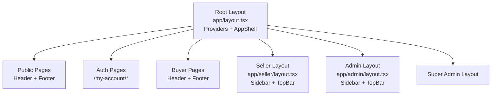

# Pages & Routing — MQ Shop

## 1. Tổng quan

MQ Shop sử dụng **Next.js App Router** — mỗi folder trong `app/` tương ứng với 1 route segment. Layout hierarchy cho phép shared UI (header, sidebar) theo nhóm trang.

---

## 2. Route Map

### 2.1 Public Pages (Guest accessible)

| Route | Page | Mô tả |
|-------|------|--------|
| `/` | Homepage | Banner carousel, featured products, promotions |
| `/shop` | Catalog | Product listing với filter, search, pagination |
| `/product/:slug` | PDP | Product detail page, variant selection, add to cart |
| `/shops/:slug` | Shop storefront | Public shop profile + products |
| `/about-us` | About Us | Giới thiệu platform |
| `/contact-us` | Contact | Form liên hệ |
| `/faqs` | FAQ | Câu hỏi thường gặp |
| `/privacy-policy` | Privacy Policy | Chính sách bảo mật |
| `/gallery` | Gallery | Showcase ảnh |

### 2.2 Authentication Pages

| Route | Page | Mô tả |
|-------|------|--------|
| `/my-account` | Login | Form đăng nhập |
| `/my-account/register` | Register | Form đăng ký (với referral code) |
| `/my-account/verify-otp` | Verify OTP | Xác nhận email OTP |
| `/my-account/lost-password` | Forgot Password | Request reset password |

### 2.3 Buyer Pages (Authenticated)

| Route | Page | Mô tả |
|-------|------|--------|
| `/cart` | Cart | Giỏ hàng (localStorage + server sync) |
| `/checkout` | Checkout | Đặt hàng (single shop) |
| `/orders` | My Orders | Danh sách đơn hàng buyer |
| `/account` | Account | Thông tin tài khoản |
| `/wallet` | Wallet | Số dư ví, lịch sử giao dịch |
| `/transactions` | Transactions | Chi tiết giao dịch |
| `/wishlist` | Wishlist | Sản phẩm yêu thích |
| `/mlm/network` | MLM Network | Cây downline (tree view) |
| `/rma` | RMA | Yêu cầu trả hàng / hoàn tiền |

### 2.4 Seller Dashboard (`/seller/*`)

| Route | Page | Mô tả |
|-------|------|--------|
| `/seller` | Dashboard | Thống kê seller (revenue, orders) |
| `/seller/shop` | My Shop | Quản lý thông tin shop |
| `/seller/products` | Products | CRUD sản phẩm |
| `/seller/orders` | Orders | Xử lý đơn hàng (confirm → ship → deliver) |
| `/seller/inventory` | Inventory | Quản lý tồn kho |
| `/seller/promotions` | Promotions | Tạo/quản lý khuyến mãi |
| `/seller/settlements` | Settlements | Lịch sử settlement |
| `/seller/transactions` | Transactions | Giao dịch tài chính |
| `/seller/wallet` | Wallet | Ví seller |
| `/seller/reviews` | Reviews | Đánh giá sản phẩm + reply |
| `/seller/rma` | RMA | Xử lý yêu cầu trả hàng |
| `/seller/materials` | Materials | Marketing assets |
| `/seller/landing-cost` | Landing Cost | Tính giá vốn |

### 2.5 Admin Panel (`/admin/*`)

| Route | Page | Mô tả |
|-------|------|--------|
| `/admin` | Dashboard | Thống kê tổng quan platform |
| `/admin/users` | Users | Quản lý users |
| `/admin/staff` | Staff | Quản lý shop staff |
| `/admin/platform-staff` | Platform Staff | Quản lý admin/staff platform |
| `/admin/shops` | Shops | Duyệt/quản lý shops |
| `/admin/categories` | Categories | Quản lý danh mục |
| `/admin/products` | Products | Duyệt sản phẩm |
| `/admin/products-view` | Products View | Xem chi tiết products |
| `/admin/orders` | Orders | Tất cả đơn hàng |
| `/admin/inventory` | Inventory | Tồn kho toàn hệ thống |
| `/admin/transfers` | Transfers | Chuyển kho |
| `/admin/promotions` | Promotions | Duyệt/quản lý promotions |
| `/admin/banners` | Banners | Quản lý banner homepage |
| `/admin/marketing` | Marketing | Marketing assets |
| `/admin/finance` | Finance | Cấu hình phí sàn |
| `/admin/payouts` | Payouts | Seller payouts |
| `/admin/settlements` | Settlements | Settlement history |
| `/admin/transactions` | Transactions | Tất cả giao dịch |
| `/admin/wallet` | Wallet | Quản lý ví users |
| `/admin/mlm` | MLM | Cấu hình MLM ranks |
| `/admin/reviews` | Reviews | Moderate reviews |
| `/admin/rma` | RMA | Xử lý RMA |
| `/admin/customers` | Customers | Dữ liệu khách hàng |
| `/admin/audit-logs` | Audit Logs | Nhật ký hoạt động |
| `/admin/backups` | Backups | Backup/restore DB |
| `/admin/rbac` | RBAC | Quản lý permissions |
| `/admin/system` | System | Cấu hình hệ thống |
| `/admin/dsar` | DSAR | Data access/deletion requests |
| `/admin/landing-cost` | Landing Cost | Tính giá vốn admin |

### 2.6 Super Admin (`/super-admin/*`)

| Route | Page | Mô tả |
|-------|------|--------|
| `/super-admin` | Super Admin | Full system control |

---

## 3. Layout Hierarchy



### Layout Components

| Layout | File | Elements |
|--------|------|----------|
| Root | `app/layout.tsx` | All providers, fonts, global CSS |
| AppShell | `components/layout/AppShell` | Header, Footer, main content area |
| Admin | `app/admin/layout.tsx` | Sidebar navigation, auth guard |
| Seller | `app/seller/layout.tsx` | Seller sidebar, auth guard |

---

## 4. Navigation Guards

### Auth Guard

```tsx
// Pseudocode in layout
const { user, loading } = useAuth();
if (!loading && !user) redirect("/my-account");
```

### Role Guard

```tsx
// Admin layout
if (!user.roles.includes("ADMIN") && !user.roles.includes("SUPER_ADMIN")) {
  redirect("/");
}
```

### Permission Guard

```tsx
// Specific admin page
const { hasPermission } = useAuth();
if (!hasPermission("CONFIG_MLM")) redirect("/admin");
```

---

## 5. Redirects (next.config.ts)

| Source | Destination | Permanent |
|--------|-------------|-----------|
| `/register` | `/my-account/register` | No |
| `/admin/finance` | `/admin/payouts` | No |

---

## 6. URL Parameters & Query Strings

### Catalog (`/shop`)

| Param | Type | Mô tả |
|-------|------|--------|
| `q` | string | Search query |
| `category` | string | Category slug filter |
| `minPrice` | number | Giá tối thiểu |
| `maxPrice` | number | Giá tối đa |
| `sort` | string | Sắp xếp (price_asc, price_desc, newest) |
| `page` | number | Trang hiện tại |

### Orders

| Param | Type | Mô tả |
|-------|------|--------|
| `status` | OrderStatus | Filter theo trạng thái |
| `view` | buyer/shop | Góc nhìn (buyer purchases / seller inbox) |
| `page` | number | Trang |

---

## 7. Image Optimization

Next.js Image component với cấu hình:

- **Formats**: AVIF, WebP (auto-select)
- **Qualities**: 60, 70, 75, 80, 82
- **Remote patterns**: MinIO (localhost:9010, 9000), placehold.co, wildcard HTTPS
- **Dev**: `dangerouslyAllowLocalIP` enabled cho MinIO local
