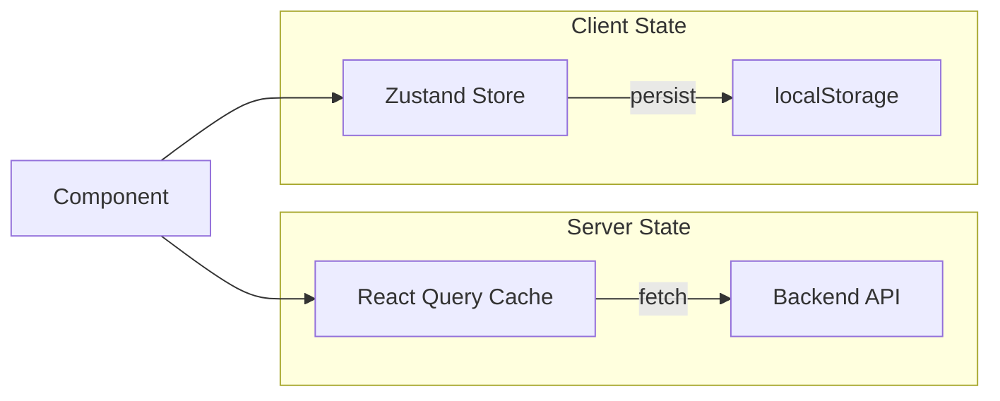
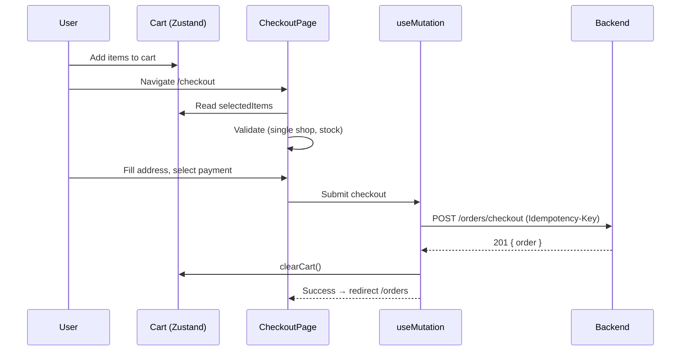
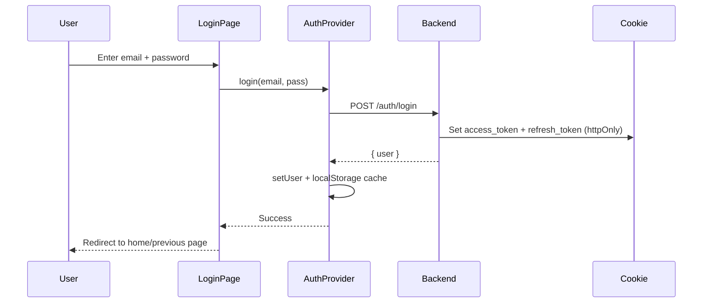

# State Management & Data Fetching — MQ Shop

## 1. Tổng quan Strategy

MQ Shop tách biệt state thành 2 loại:

| Loại | Tool | Mô tả |
|------|------|--------|
| **Server State** | TanStack React Query | Data từ API (products, orders, users...) |
| **Client State** | Zustand | UI state lưu local (cart, wishlist) |



---

## 2. TanStack React Query

### 2.1 Setup

```tsx
// components/providers/QueryProvider.tsx
<QueryClientProvider client={queryClient}>
  {children}
</QueryClientProvider>
```

### 2.2 Query Pattern

Mỗi domain có file riêng trong `lib/queries/`:

```
lib/queries/
├── catalog.ts       # Product listing, PDP, categories
├── orders.ts        # Order list, detail
├── wallet.ts        # Wallet balance, transactions
├── admin.ts         # Admin dashboard stats
├── inventory.ts     # Stock queries
├── finance.ts       # Finance config, payouts
├── settlements.ts   # Settlement history
├── promotions.ts    # Active promotions
├── reviews.ts       # Product reviews
├── rbac.ts          # Permission queries
├── compliance.ts    # DSAR queries
├── cs.ts            # Customer service queries
├── seller.ts        # Seller dashboard queries
└── utils.ts         # Query utilities (prefetch, invalidate)
```

### 2.3 Query Key Convention

```typescript
// Pattern: [domain, entity, ...params]
queryKey: ["orders", "list", { status, page, pageSize }]
queryKey: ["products", "detail", productId]
queryKey: ["wallet", "balance"]
queryKey: ["admin", "dashboard", "stats"]
```

### 2.4 Mutation Pattern

```typescript
// lib/queries/orders.ts
export function useCheckoutMutation() {
  const queryClient = useQueryClient();
  return useMutation({
    mutationFn: (data: CheckoutPayload) => ordersApi.checkout(data),
    onSuccess: () => {
      queryClient.invalidateQueries({ queryKey: ["orders"] });
      queryClient.invalidateQueries({ queryKey: ["wallet"] });
    },
  });
}
```

### 2.5 Mutation Feedback

File `lib/queries/mutation-feedback.ts` cung cấp utilities chung cho:
- Toast notification on success/error
- Loading state management
- Optimistic updates

### 2.6 Caching Strategy

| Query | staleTime | refetchInterval | Lý do |
|-------|-----------|-----------------|--------|
| Product catalog | 30s | — | Giá/stock thay đổi thường xuyên |
| Product detail | 60s | — | Vừa phải |
| Orders list | 0 (always stale) | — | Real-time accuracy |
| Wallet balance | 10s | 30s | Financial accuracy |
| Admin stats | 60s | 5min | Dashboard refresh |
| Categories | 5min | — | Ít thay đổi |
| Banners | 5min | — | Ít thay đổi |
| User profile | 0 | — | Always fresh after action |

---

## 3. Zustand Stores

### 3.1 Cart Store (`lib/stores/cart-store.ts`)

**Persist**: localStorage (key: `mq-cart-v2`)

```typescript
type CartState = {
  items: CartLine[];
  selectedVariantIds: string[] | null;  // Session only (not persisted)
  addItem: (product, qty?) => boolean;
  removeItem: (variantId) => void;
  updateQuantity: (variantId, qty) => void;
  clearCart: () => void;
  setSelectedVariantIds: (ids) => void;
};
```

**CartLine structure:**

| Field | Type | Mô tả |
|-------|------|--------|
| variantId | string | ID variant (unique key) |
| productId | string | Product ID |
| shopId | string | Shop ID |
| shopName | string? | Tên shop |
| sku | string | SKU code |
| name | string | Tên sản phẩm |
| unitPrice | number | Giá bán |
| originalPrice | number? | Giá gốc (nếu giảm giá) |
| image | string | URL ảnh |
| quantity | number | Số lượng |
| slug | string? | Product slug |
| variantOptions | Record? | Options (Màu, Size...) |
| inStock | number? | Tồn kho khả dụng |

**Business Rules:**
- Cart items phải cùng 1 shop (multi-shop blocked tại checkout)
- Persist qua page reload (localStorage)
- `selectedVariantIds` = items user check trên cart page (session only)
- `addItem` returns false nếu variant/shop invalid

### 3.2 Wishlist Store (`lib/stores/wishlist-store.ts`)

**Persist**: localStorage

- Add/remove product to wishlist
- Check if product is in wishlist
- Sync với server khi authenticated

### 3.3 Custom Hook: `useCart()`

Derived state tính toán từ store:

| Property | Mô tả |
|----------|--------|
| items | Tất cả items trong cart |
| selectedItems | Items được chọn (hoặc all) |
| itemCount | Tổng số lượng |
| subtotal | Tổng tiền |
| selectedSubtotal | Tổng tiền items được chọn |
| shopId | Shop ID của cart (single-shop) |
| shopIds | Distinct shop IDs |
| selectedShopIds | Shop IDs trong selection |
| formatSubtotal() | Format tiền tệ |
| checkoutItems() | Payload cho checkout API |
| checkoutSelectedItems() | Payload chỉ selected items |

---

## 4. Context Providers

### 4.1 AuthProvider (`components/providers/AuthProvider.tsx`)

```typescript
type AuthContextValue = {
  user: AuthUser | null;
  loading: boolean;
  isAuthenticated: boolean;
  hasRole: (role: Role) => boolean;
  hasPermission: (code: string) => boolean;
  hasAnyPermission: (codes: string[]) => boolean;
  login: (email, password) => Promise<AuthUser>;
  logout: () => Promise<void>;
  refreshUser: () => Promise<void>;
  setUser: (user) => void;
};
```

**Behavior:**
1. On mount: Read cached user from localStorage → fetch `/users/me`
2. If 401 → try refresh → if fail → clear user
3. Login: call API → set user + cache
4. Logout: call API → clear user + cache
5. Listen `mq:auth-logout` custom event (from API client 401 handler)

**Permission Check:**
- SUPER_ADMIN / ADMIN → always return true
- Other roles → check `user.permissions` array

### 4.2 CartProvider

- Hydrates Zustand store on client
- Provides `FlyToCartProvider` for add-to-cart animation

### 4.3 NotificationProvider

- SSE connection for real-time notifications
- Notification badge count
- Toast for new notifications

### 4.4 QueryProvider

- TanStack QueryClient configuration
- Default options (staleTime, retry, etc.)

### 4.5 ThemeProvider

- Dark/light mode toggle
- System preference detection

### 4.6 LanguageProvider

- Current locale state
- Translation function access
- Locale persistence

### 4.7 WishlistProvider

- Wishlist Zustand store hydration

---

## 5. Data Flow Diagrams

### 5.1 Checkout Flow



### 5.2 Auth Flow



---

## 6. Real-time Updates

### 6.1 Notifications (SSE)

```typescript
// lib/api/sse.ts
const eventSource = new EventSource(`${apiBase}/notifications/sse`, {
  withCredentials: true,
});

eventSource.onmessage = (event) => {
  const notification = JSON.parse(event.data);
  // Update notification count
  // Show toast
  // Invalidate relevant queries
};
```

### 6.2 Socket.io (Future/Optional)

- `socket.io-client` installed nhưng dùng cho features cần bidirectional real-time
- Ví dụ: live chat, real-time inventory updates

---

## 7. Error Handling

### Global Error Handling

```typescript
// lib/api/client.ts - ApiError class
class ApiError extends Error {
  status: number;      // HTTP status
  body: ApiErrorBody;  // Parsed error body
  code: string | null; // Business error code
}
```

### Query Error Handling

```typescript
// In component
const { data, error, isLoading } = useQuery(...);

if (error instanceof ApiError) {
  if (error.status === 403) return <Forbidden />;
  if (error.code === "INSUFFICIENT_STOCK") return <OutOfStock />;
}
```

### Mutation Error Handling

```typescript
const mutation = useMutation({
  mutationFn: ...,
  onError: (error) => {
    if (error instanceof ApiError) {
      toast.error(error.message);
    }
  },
});
```
